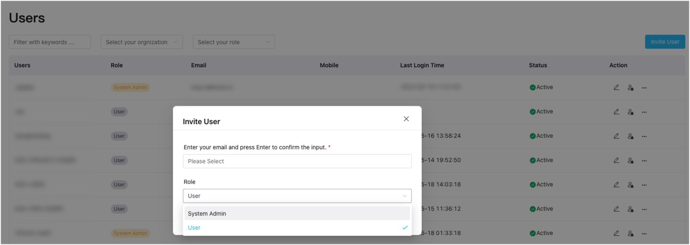
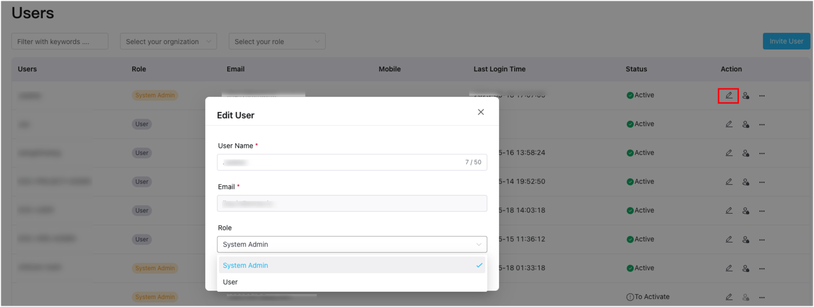

# Authorization

ECP implements RBAC (Role-Based Access Control) for access control. System administrator assigns roles to users, granting them specific permissions for resource access, which simplifies the complexity of permission management, making it more secure and easier to control.

## Roles and Permissions

ECP users are divided into four levels of roles to meet the permission requirements of enterprise customers and simplify the process of assigning role permissions. Each role in ECP has a subset of permissions from the role above it.

```
System admin > Organization admin > Project admin > Regular users
```

The role hierarchy is as follows:

- **System Admin**: Top-tier role with full permissions, granted by system admins, and can grant permissions to other roles, including system/organization/project admins, or regular users.

  The first system admin (superuser) is created when installing ECP, for details, see [Installing ECP on Kubernetes - Creating Superuser](../install/install_ecp_on_kubernetes.md#create-a-superuser).

- **Organization Admin**: Top-tier role within an organization, having full permissions. This role can grant permissions within its organization but cannot do so across different organizations.

- **Project Admin**: Top-tier role within a project, having full permissions, granted by system/organization admins. This role can grant permissions within its project but cannot do so across different projects.

- **Regular User**: Regular users can be added or invited to the organization by system/organization/project admins. They have viewing permissions for authorized projects.

You can refer to the table below for a comprehensive overview of role permissions:

<font size=1>

**Permissions and Roles**

| Permission\Role               | System Admin | Org Admin                 | Project Admin        | User |
| ----------------------------- | ------------ | ------------------------- | -------------------- | ---- |
| Organization Management       | Edit         | Edit (Organization Level) | View                 | -    |
| Project Management            | Edit         | Edit (Project Level)      | Edit (Project level) | -    |
| User Management               | Edit         | Edit (Organization Level) | Edit (Project level) | -    |
| Operation Audit               | Edit         | View (Organization Level) | View (Project level) | -    |
| System Settings               | Edit         | -                         | -                    | -    |
| License                       | Edit         | -                         | -                    | -    |
| User Authorization            | Edit         | Edit (Organization Level) | Project-level Edit   | -    |
| Cloud Cluster Management      | Edit         | Edit                      | Edit                 | View |
| Edge Service Management       | Edit         | Edit                      | Edit                 | View |
| Monitoring                    | View         | View                      | View                 | View |
| Alerting                      | Edit         | Edit                      | Edit                 | View |
| Logging                       | View         | View                      | View                 | View |
| Tag Management                | Edit         | Edit                      | Edit                 | View |
| Edge Configuration Deployment | Edit         | Edit                      | Edit                 | View |

</font> 

## Grant Roles

In ECP, users can be granted roles during their creation process. As a system admin, you can log in and access the **Users** page under the **Administration** tab. From there, click on **Create User** (or **[Invite User](../system_admin/user_management.md#invite-user)**). Complete the necessary settings and assign the user as either an admin or a regular user.



## Edit Roles

For users that have already been created, you can modify their role assignment by clicking the edit icon under the **Action** column of the specific user. This allows you to adjust their permissions and assign them as either administrators or regular users based on your requirements.


