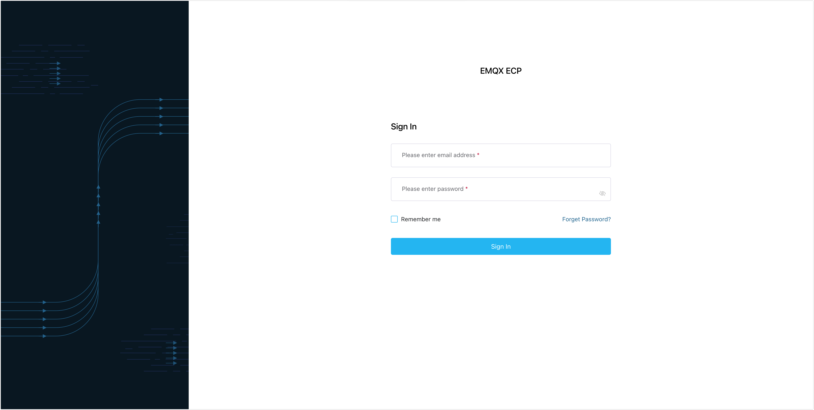
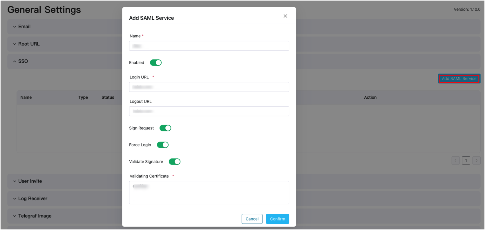

# Authentication

The ECP authentication system is an essential component for verifying user identities. It encompasses various functionalities such as user account management, authentication, authorization, and access control. These features collectively provide a reliable, secure, and user-friendly mechanism for authenticating users within the ECP platform. 

ECP offers two methods for authenticating user login: [basic authentication](#log-in-with-username-and-password) and [integration with third-party authentication](#integrate-with-third-party-authentication-systems) using the SAML protocol.

## Log in with Username and Password

Superusers can [create or invite](../system_admin/user_management.md) ECP admins or regular users. After these users are added, they can log in to ECP, with their email address and password.

You also have the option to check the **Remember me** checkbox, which enables the automatic filling of your login credentials for future logins.

## Reset Password

If you forget your password, click the **Forgot Password** button on the login page. You'll be guided to contact your system admin or reset your password through email.

## Integrate with Third-Party Authentication Systems

ECP also supports integration with SAML-based third-party authentication systems.

[SAML (Security Assertion Markup Language)](https://en.wikipedia.org/wiki/Security_Assertion_Markup_Language) is an XML-based open standard protocol used for exchanging authentication and authorization data in cross-network communications. SAML aims to facilitate secure communication and enable Single-Sign-On (SSO) for user authentication across various network resources. 

### Configure in ECP

1. Log in as system admin. 

2. Click **System Settings** -> **General Settings** -> **SSO**.

3. Click the **Add SAML Service** button. In the popup dialog box, set as follows:

   - Input a **Name** for the SSO configuration.
   - Toggle the **Enabled** switch to enable SSO.
   - Input the **Login URL**, which is the login address of the third-party authentication system.
   - [Optional] Input the **Logout URL**, which is the logout address of the third-party authentication system.
   - [Optional] Toggle the **Sign Request** switch to enable request signing. ECP will automatically generate a signature if enabled.
   - [Optional] Toggle the **Force Login** switch to require users to enter their username and password every time they log in through the third-party SSO.
   - [Optional] Toggle the **Validate Signature** switch to enable signature validation. Upload the public key file exported from the third-party authentication system, encrypted in Base64 format.
   - [Optional] Toggle the **Auto Bind IdP User** switch to enable auto bind with third-party authentication system. If enabled, the email address used by the third-party authentication system will be auto bound to the user account on ECP side. When the user log into ECP uses SSO, the user account on ECP side will be automatically created or activated. If not enabled, when a user logs into ECP for the first time using SSO,  the user is required to manually fill out the registration information to complete user account creation on ECP side. 
   - Click **Confirm** to finish the setting. 

