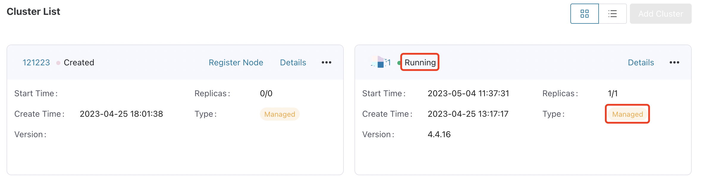

# Add EMQX Clusters

ECP supports adding existing EMQX clusters. ECP supports management for EMQX v4 Enterprise Edition (4.4.6 and above) and EMQX v5 Enterprise Edition (5.6.0 and above).

## Add an Existing Cluster

1. Log in to the ECP platform as a system admin, organization admin, or project admin. In **Workspace - Data Integration - Data Access** page, click **Add Cluster**.

2. Provide a name for the cluster in the **Cluster Name** field. The name should be between 1-200 characters long and can include "\_" and blank spaces.

3. If you try to add an EMQX v5 cluster, fill in the **Cluster Address** (i.e. EMQX dashboard access address). You can also input the **Cluster Address** later by **Edit** operation.

4. Click **Confirm** to finish the adding process. The newly-created clusters will be listed in the **Cluster List** panel with the status **Created**. 

5. Click **Register Node** and follow the instructions on the cluster registration guide page to register the cluster node. 

   

6. Select the CPU architecture in the **CPU Architecture** field, amd64, arm, and arm64 are supported. Follow the steps on this page to finish adding the existing cluster.

    

7. Log in to the virtual machine hosting the EMQX cluster, execute the commands provided on the registration guide page in sequential order.

   ```bash
   # Download EMQX Agent
   sudo curl -L -f --output /usr/local/bin/emqxee-agent https://[emqxee-agent]
   
   # Update EMQX Agent permission
   sudo chmod +x /usr/local/bin/emqxee-agent
   
   # Start EMQX Agent
   sudo /usr/local/bin/emqxee-agent start
   
   # Register on ECP
   sudo /usr/local/bin/emqxee-agent register --url https://[emqxee-agent] --registration-token bf2779e5176446cd8e18fde81d826497
   ```

8. Upon returning to the **Workspace - Data Integration - Data Access** page, you will find that the newly added existing cluster is now in the **Running** status. 

9. If an EMQX v4 cluster is added for management, an **Enter Dashboard** button will display. Click it to view the EMQX v4 dashboard. If the **Enter Dashboard** button is not visible, please make sure `cluster.agent` section is correctly configured in ECP configuration file and the MQTT broker configured in it can be accessed by the agent.

10. If an EMQX v5 cluster is added for management, an **Enter Dashboard** button will display if the **Cluster Address** has been configured. Click it to directly view the EMQX v5 dashboard in a new window.


## Cluster Status

Managed EMQX cluster can be in the following states:

| Status      | Description                                                  |
| ----------- | ------------------------------------------------------------ |
| Created     | Cluster with no node registered yet                          |
| Registering | Intermediate state during cluster node registration          |
| Running     | Normal running state of the cluster                          |
| Deleting    | Intermediate state  before cluster deletion completes        |
| Error       | Abnormal running state of the cluster, or network connection issue between agent and cluster or between agent and ECP |

For clusters in the state of Error, you can click the Error status icon to view possible cause.

<!--also the English for the status should be confirmed-->