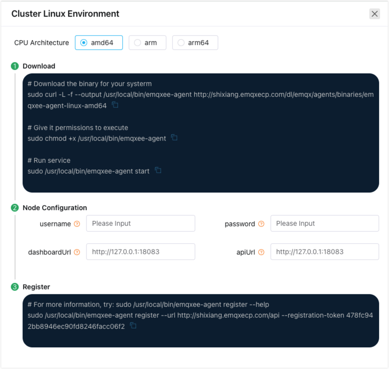

# Add EMQX Clusters

ECP supports adding clusters by creating (recommended) or adding existing EMQX clusters. It is recommended to add clusters by creating with ECP, which offers more extensive functionality and allows for license and connection quota sharing. 

There are functional differences between creating (**Hosted Clusters**) and managing clusters (**Managed Clusters**) on the ECP platform, as shown in the table below.

|Function|Hosted Clusters|Managed Clusters|
|:--------:|:----:|:----:|
|Start/Stop|✅|❌|
|Horizontal Scaling|✅|❌|
|Vertical Scaling|✅|❌|
|Update Network Type|✅|❌|
|Update Connection Limit|✅|❌|
|Upgrade/Downgrade|✅|❌|
|Cluster Transfer|✅|✅|
|Delete|✅|✅|
|Log|✅|✅|

## Create a Hosted Cluster

1. Log in to the ECP platform as a system admin, organization admin, or project admin. In **Workspace - Cluster** page, click **Add Cluster**.
2. For **Cluster Type**, keep the default setting, **New Cluster**.
3. Provide a name for the cluster in the **Cluster Name** field. The name should be between 1-200 characters long and can include "\_" and blank spaces.
4. Specify the maximum connection limit for the cluster in the **Connect Limit** field. Note that the limit is subject to the license quota and [EMQX Cluster Quota](../system_admin/resource_config.md#configure-emqx-cluster-quota).
5. Select the appropriate cluster specification based on your business requirements in the **Specification** section. For details on cluster specification, see [EMQX Cluster Quota](../system_admin/resource_config.md#configure-emqx-cluster-quota).
6. Set the desired number of EMQX nodes for the cluster in the **Replicas** field. A maximum of 7 nodes can be configured for a single cluster.
7. Specify the EMQX cluster version to be hosted by setting the **EMQX Image**.
8. Click **Confirm** to finish the creation process.


The newly-created clusters will be listed in the **Cluster List** panel with the status **Creating**. Wait till the status changes to **Running**, indicating the cluster is ready for production use. 


## Add an Existing Cluster

ECP also provides the capability to manage existing EMQX clusters. ECP supports the management of EMQX v4 (version 4.4.6 and above) and EMQX v5 (version 5.6.0 and above).

### EMQX V4 Managed Cluster

1. Log in to the ECP platform as a system admin, organization admin, or project admin. In **Workspace - Cluster** page, click **Add Cluster**.

2. Click to select **Existing Cluster** under **Cluster Type**.

3. Select **v4** under **Cluster Version**.

4. Provide a name for the cluster in the **Cluster Name** field. The name should be between 1-200 characters long and can include "\_" and blank spaces.

5. Click **Confirm** to finish the adding process. The newly-created clusters will be listed in the **Cluster List** panel with the status **Created**.   

6. Click **Register Node** and a cluster registration guide page will pop up. 

   

7. Select the CPU architecture in the **CPU Architecture** field, amd64, arm, and arm64 are supported. Follow the steps on this page to finish adding the existing cluster.

    

8. Log in to the virtual machine or container environment hosting the EMQX cluster, such as the container named `emqx-69f4249c-emax-ee-0` in the namespace `emqx-69f4249c`.

   ```bash
   # Check the Pod name
   $ kubectl -n emqx-69f4249c get pod                          
   
   NAME                     READY  STATUS   RESTARTS  AGE
   emqx-69f4249c-emax-ee-0  3/3    Running  0         28d
   
   # Enter the Pod
   $ kubectl -n emqx-69f4249c exec -it emqx-69f4249c-emqx-ee-0 -c emqx -- sh
   ```

8. Execute the commands provided on the registration guide page in sequential order.

   ```bash
   # Download EMQX Agent
   sudo curl -L -f --output /usr/local/bin/emqxee-agent https://[emqxee-agent]
   
   # Update EMQX Agent permission
   sudo chmod +x /usr/local/bin/emqxee-agent
   
   # Start EMQX Agent
   sudo /usr/local/bin/emqxee-agent start
   
   # Register on ECP
   sudo /usr/local/bin/emqxee-agent register --url https://[emqxee-agent] --registration-token bf2779e5176446cd8e18fde81d826497
   ```

9. Upon returning to the **ECP Workbench - Cluster** page, you will find that the newly added existing cluster is now in the **Running** status. 

### EMQX V5 Managed Cluster

1. Log in to the ECP platform as a system admin, organization admin, or project admin. In **Workspace - Cluster** page, click **Add Cluster**.

2. Click to select **Existing Cluster** under **Cluster Type**.

3. Select **v5** under **Cluster Version**.

4. Provide a name for the cluster in the **Cluster Name** field. The name should be between 1-200 characters long and can include "\_" and blank spaces.

5. Fill in the **Cluster Address** (i.e. EMQX dashboard access address) and dashboard login username and password.

6. Click **Confirm** to finish the adding process. The newly-created clusters will be listed in the **Cluster List** panel with the status **Created**.   

  

7. Click the **Details** button in the operation column to enter the cluster details, and then click the **Enter Dashboard** button. You will directly view the EMQX v5 dashboard in a new window.

  


## Cluster Status

You can start or stop a cluster as your business requirement changes. 

1. Log in as system admin, organization admin, or project admin. 
2. On the target cluster, click the more icon and select **Stop**/**Start**. 


EMQX cluster can be in the following states:

| Status             | Description                                                  |
| ------------------ | ------------------------------------------------------------ |
| Creating           | Intermediate state during the process of new cluster creation |
| Updating           | Intermediate state during cluster OM operations, such as horizontal or vertical scaling, network type modifications, connection number modifications, cluster upgrade or downgrade |
| Starting           | When starting the service                                    |
| Running            | Normal running state of the cluster                          |
| Stopping           | When stopping the service or an intermediate state after deleting a cluster |
| Stopped            | After stopping or deleting                                   |
| Syncing Status     | Intermediate state during horizontal or vertical scaling, cluster upgrade or downgrade, network type modifications, connection number modifications |
| Downgraded Running | One or more nodes of the cluster are unavailable, but the overall cluster is still usable |
| Error              | The most recent task executed by the cluster failed (can auto-recover), or a cluster fault or dirty data occurred (this state rarely appears)<!--shall we remove the dirty data part?--> |
| Nonexistent        | The task to create the cluster was not successfully issued   |

For clusters in the state of Error, you can click the more icon and click **Try Fix**. If the problem is successfully solved, the cluster state will be Running; or consider deleting the cluster or reaching out to EMQ's technical support.

<!--also the English for the status should be confirmed-->