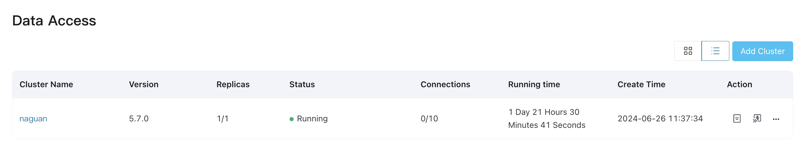
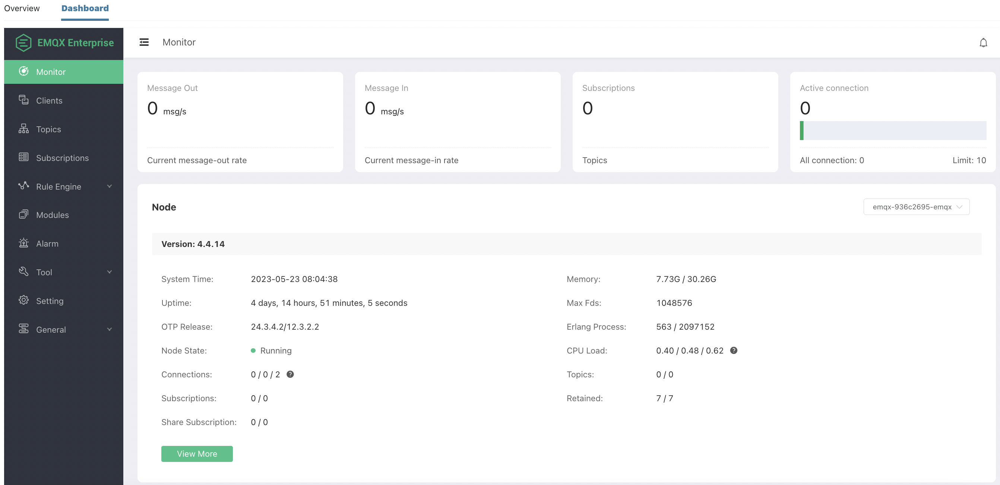

# View EMQX Cluster Details

In the **Data Access** panel, you can see the clusters managed within the current organization, you can choose to view them as cards or lists. 

Below is the explanation of each field:

- **Cluster Name**: Cluster name can be modified by **Edit** operation.
- **Version**: Indicate the EMQX version. 
- **Replicas**: Number of EMQX nodes configured in each cluster. 
- **Status**: Operational status of the cluster, could be **Created**, **Registering**, **Running**, **Deleting** and **Error**. 
- **Connections**: Indicate the current established connections and maximum number of connections that can be established. 
- **Running Time**: Indicate how long the cluster has running. 
- **Create Time**: Indicate when the cluster is created.

## Check Cluster Details via EMQX Dashboard

On the **Data Access** page, you can click on **Enter Dashboard** in the top-right corner to enter the EMQX Enterprise Edition Dashboard. This web-based control panel provided by EMQX allows users to monitor the operational status and statistical metrics of server nodes and clusters. 

EMQX Dashboard provides insights into client connectivity and subscription relationships. It also offers capabilities to configure and enable/disable plugins, manage HTTP API keys, perform hot configuration management for EMQX clusters, and conduct MQTT connection testing. 

For detailed guidance on managing and controlling EMQX Enterprise Edition, please refer to the [EMQX 4.4 Documentation](https://docs.emqx.com/zh/enterprise/v4.4/).
