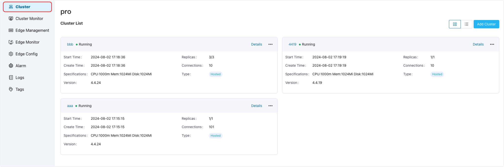

# Manage EMQX Clusters

## EMQX Clusters

In ECP, clusters refer to the EMQX clusters deployed on cloud servers, which serve as high-performance message broker for IoT devices. Built on the MQTT protocol, EMQX offers a lightweight, reliable, and scalable solution for communication between IoT devices. It excels in real-time, high availability, and easy implementation. For a comprehensive understanding of EMQX, please refer to the detailed documentation available on [EMQX Enterprise](https://docs.emqx.com/en/enterprise/v4.4/).

With ECP's cluster management features, users can efficiently managing multiple existing clusters, and perform various tasks like adjusting connections, transferring ownership, and deletion. The platform's user-friendly interface offers cluster information overview and monitor, alarm and log access for improved visibility.

## Access Cluster Workspace

After logging in, you can find the **Workspace** option in the ribbon area. Click on it to navigate to the **Workspace - Data Integration - Data Access** page. This page provides an overview of the EMQX clusters managed by ECP. 

:::tip
System admin, organization admin, project admin, and regular users all can access this page.

For the permission of each role, see [Permissions and Roles](../acl/authorize.md#roles-and-permissions).
:::

System admin, organization admin, and project admin can add an existing cluster to be managed by ECP. For details on how to add clusters, see [Add Clusters](./add_manage.md).

After clusters are added, they will appear in the Data Access panel, you can choose to view them in cards (default) or as lists. For a detailed explanation of these cluster details, see [View EMQX Cluster Details](./cluster_details.md).

## Functional Differences across Cluster Versions

The management functionalities for different EMQX clusters vary across cluster versions.

|        Function         | ECP v4 cluster | ECP v5 cluster |
| :---------------------: | :------------: | :------------: |
| Update Connection Limit |       ❌        |      ✅ *       |
|       Cluster Log       |       ✅        |       ✅        |
|     Cluster Monitor     |       ❌        |       ✅        |
|      Cluster Alarm      |       ❌        |       ✅        |
|    Cluster Transfer     |       ✅        |       ✅        |
|        Deletion         |       ✅        |       ✅        |

\* **Update Connection Limit** feature applies to EMQX v5.7.0 and above.

<!--Overall, I think we should state the difference between K8s and docker deployment-->
