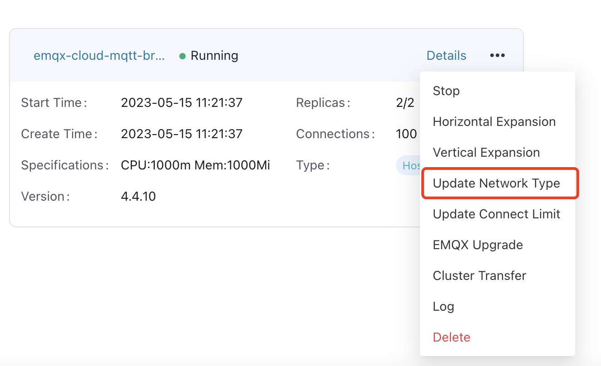

# Manage EMQX Clusters

ECP provides a comprehensive suite of management and operational services for EMQX cluster management, allowing you to centrally manage and operate all EMQX clusters on ECP.

:::tip

There are some functional differences between ECP deployments based on Kubernetes and those based on Docker. For details, see [Kubernetes vs. Docker Deployments](../install/introduction.md#feature-difference-between-kubernetes-and-docker-deployment).
:::

## Horizontal Scaling (Kubernetes Deployment)

Horizontal scaling refers to the increasing or decreasing of the number of cluster nodes. Currently, at most 7 nodes can be configured for each cluster. 

1. Log in as system admin, organization admin, or project admin. 
2. On the target cluster, click the more icon and select **Horizontal Scaling**, choose the node number as per your needs. 

## Vertical Scaling (Kubernetes Deployment)

Vertical scaling refers to the expansion or reduction of node specifications. The specifications you can choose from are set in the [resource quota](../system_admin/resource_config.md#configure-emqx-cluster-quota) ranging from the smallest to the largest specifications. 

1. Log in as system admin, organization admin, or project admin. 
2. On the target cluster, click the more icon and select **Vertical Scaling**, choose the specification as per your needs. 

 

## Update Network Access Mode (Kubernetes Deployment)

**Update Network Type** is a feature to assist network administrators in managing and configuring accessible addresses for EMQX. ECP supports three network types, see the table below to learn the details about these network types.

|   Network Type   |          Description          | Network Access                          |
| :----------: | :--------------------: | :----------------------------------------------------------- |
|  ClusterIP   | Kubernetes Internal Network Address | For Kubernetes internal network access, with Kubernetes internal domain name and port provided by ECP |
|   NodePort   |        Local Area Network IP        | Access with the IP address of the local network or VPC where Kubernetes is located can use the local IP and port provided by ECP for access |
| LoadBalancer |         External IP         | Access with Public IP or LoadBalancer's network address.  If it's a public IP, you can access ECP in any region.   For load balancers, contact our technical support. |

### Operation Steps

#### Cluster IP

ECP automatically generates Kubernetes internal service domain names and ports upon cluster creation. To view the Cluster IP and Kubernetes internal port, click on the Cluster name (or Cluster ID), or **Details** to access the **Cluster / Details** page.

#### Node Port

To access ECP within your local area network:

1. Log in as system admin, organization admin, or project admin. 
2. On the target cluster, click the more icon and select **Update Network Type**. In the popped-up dialog box, set as follows:

   - **Network Type**: Select **Node Port**. 

   - **External Network Protocol**: Specify the network protocol, ECP supports MQTT-SSL, MQTT-TCP, MQTT-WS, and MQTT-WSS. Multiple protocols can be added. 
3. Click **Update** to confirm the settings. 

To view the local network IP and port, click on the Cluster name （or Cluster ID), or **Details** to access the **Cluster / Details** page."

#### Load Balancer

To access ECP with public IP:

1. Log in as system admin, organization admin, or project admin. 
2. On the specific cluster, click the more icon and select **Update Network Type**. In the popped-up dialog box, set as follows:

   - **Network Type**: Select **Load Balancer**. 
   - **Annotations**: Use annotations to configure the load balancer. For detailed steps, see [Resource Configuration - Use Annotations to Configure Load Balancing](../system_admin/resource_config.md#use-annotations-to-configure-load-balancing).
   - **Protocol and Port**: Choose the network protocol and mapping port that you want to map to the outside, 
3. Click **Update** to confirm the settings. 

To view the external IP and port, click on the Cluster name (or Cluster ID), or **Details** to access the **Cluster / Details** page.

## Update Connect Limit (Kubernetes Deployment)

You can dynamically modify the number of connections in the cluster according to business needs:

1. Log in as system admin, organization admin, or project admin. 
2. On the specific cluster, click the more icon and select **Update Connect Limit**. The change will take effect immediately. 

However, please be noted that:

1. The number of connections is limited by the total number of connections allowed by the license. 
2. If you are using the LoadBalancer network type, please avoid modifying the number of connections if not necessary, otherwise, it will cause the LoadBalancer's IP address to change.
   

## Upgrade (Kubernetes Deployment)

For ECP-created clusters, ECP offers cluster upgrade services, ensuring zero downtime during the process. <!--需要技术评审-->

1. Log in as system admin, organization admin, or project admin. 
2. On the target cluster, click the more icon and select **EMQX Update**. In the popped-up dialog box, select an image version. Choosing a version lower than the current one initiates a downgrade; a higher version triggers an upgrade. You can view the current version on the cluster card. 
3. Click **Confirm** to finish the settings.

During the upgrade/downgrade, the cluster's status will appear as **Updating**, which may cause temporary business interruptions. Once all nodes are updated, the status will change to **Running**, signaling that business operations can resume without interruption."

## Cluster Transfer

For easier management, ECP provides a feature for transferring EMQX clusters across projects.

1. Log in as system admin, organization admin, or project admin. 
2. On the target cluster, click the more icon and select **Cluster Transfer**. In the popped-up dialog box, select the target project. 
3. Click **Confirm** to finish the settings. The changes will take effect immediately. The cluster will be relocated from the current project and appear under the new one.

## View Cluster Logs

ECP offers a unified log feature. 

1. Log in as system admin, organization admin, or project admin. 

2. On the target cluster, click the more icon and select **Log**. 

You will be directed to the **Log** page, where you can view the log level, generated time, and log messages. For more information on logs, see [Logs](../log/introduction.md).

## Delete Clusters

For unused clusters, it's advisable to delete them to save IT resources. 

1. Log in as system admin, organization admin, or project admin. 

2. On the target cluster, click the more icon and select **Delete** and confirm the action. ECP will first stop the cluster before proceeding with the deletion.
