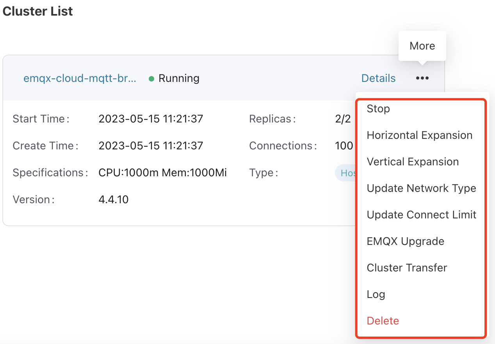

# Manage EMQX Clusters

ECP provides a comprehensive suite of management and operational services for EMQX cluster management, allowing you to centrally manage and operate EMQX clusters on ECP.

:::tip

There are some functional differences across EMQX cluster versions. For details, see [Functional Differences across Cluster Versions](./introduction.md#functional-differences-across-cluster-versions).
:::

## Update Connect Limit

You can dynamically modify the number of connections in the cluster according to business needs:

1. Log in as system admin, organization admin, or project admin. 
2. On the specific cluster, click the more icon and select **Update Connect Limit**. The change will take effect in a moment. 

:::tip 

- This feature applies to EMQX v5.7.0 and above.
- The number of connections is limited by the total number of connections allowed by the license. 
- The license quota on ECP will be restored once unregistration or cluster deletion completes, and the connections assigned to EMQX cluster will be reclaimed then. Please reset the EMQX license via **Reset License** from EMQX dashboard.

:::

## Cluster Transfer

For easier management, ECP provides a feature for transferring EMQX clusters across projects.

1. Log in as system admin, organization admin, or project admin. 
2. On the target cluster, click the more icon and select **Cluster Transfer**. In the popped-up dialog box, select the target project. 
3. Click **Confirm** to finish the settings. The changes will take effect immediately. The cluster will be relocated from the current project and appear under the new one.

## View Cluster Logs

ECP offers a unified log feature. To use this feature for managed clusters, enable and specify logs location when registering cluster node.

- parameter for enabling log collection: `--emqx-log-collection-enabled`
- parameter for cluster log directory path: `--emqx-log-collection-dir /opt/emqx/log`. If the cluster is installed via docker, please mount the log directory on the host machine into the container, and use the directory path on the host machine in the parameter.

Then on the target cluster, click the more icon and select **Log**. You will be directed to the **Log** page, where you can view the log level, generated time, and log messages. For more information on logs, see [Logs](../log/introduction.md).

## Delete Clusters

If a cluster no longer needs to be managed by ECP, you can delete it.

1. Log in as system admin, organization admin, or project admin. 
2. On the target cluster, click the more icon and select **Delete** and confirm the action. ECP will try to remove the cluster. Please note that only the management relationship between ECP and EMQX cluster will be terminated, but the EMQX cluster itself will not be destroyed.

:::tip 

- When deleting clusters of version 5.7.0 and above, the connections quota needs to be restored. If the cluster status keeps "Error", the deletion might fail due to inability to release connections quota. If troubleshooting connection issues doesn't restore the cluster, you can click the more icon and select **Re-register** to attempt re-registration of the cluster and bring the cluster back to normal status before proceeding with deletion.

:::

## Monitor Cluster

ECP provides the status overview for managed clusters on the **Workspace - Maintenance - Monitoring** page. For details, see [Monitor EMQX Clusters](../monitor/monitor_cluster.md)

:::tip 

- Monitoring on clusters feature applies to EMQX v5.

:::

## View Cluster Alarms

ECP provides the alarm management for cluster rules and connectors on the **Workspace - Maintenance - Alarm** page. 

To notify cluster alarms by email or Webhook, enable "Push EMQX Alarm" when creating notification.

For other details of alarm, see [Alarms](../monitor/alarm_rules.md))

:::tip 

- Cluster alarms feature applies to EMQX v5.

:::