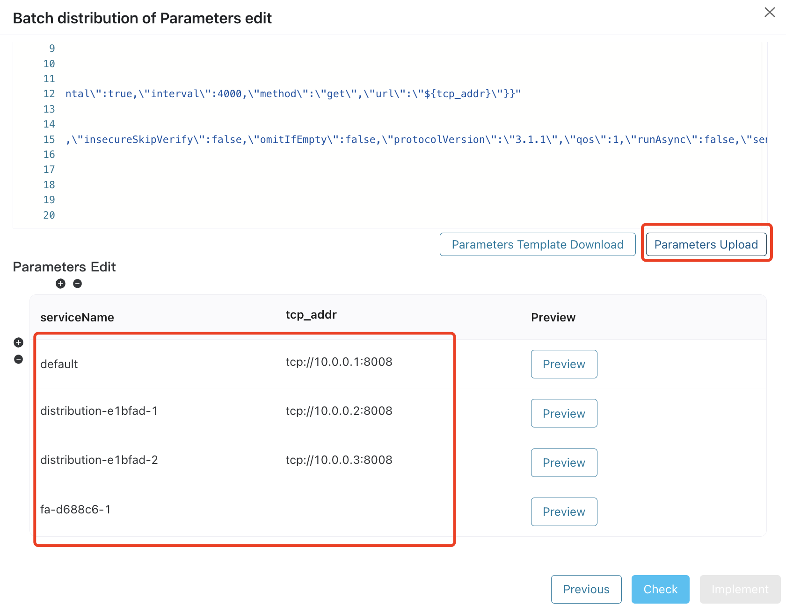
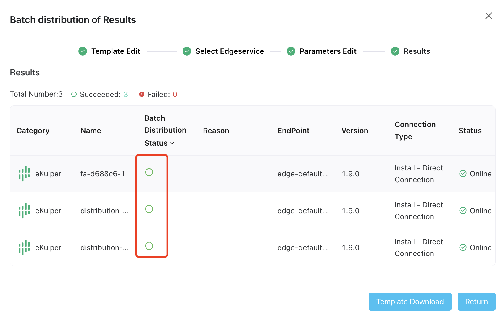

# Batch Configuration Distribution

In the edge computing environment, various software runs on edge devices, each requiring configurations tailored to specific applications and business requirements. 

With ECP, you can simultaneously transmit identical or similar configurations to multiple edge device software. This approach helps administrators apply rapid, consistent, and reliable configuration strategies, minimizing configuration errors and redundant tasks, thereby boosting the stability and reliability of the edge computing environment.

:::tip
ECP will set some restrictions for system protection purposes. For specific usage restrictions, please refer to [System Usage Restrictions](../others/known_limitations.md) and [Version Compatibility](../others/version_limitations).
:::

## Clone the Configuration of Selected Edge Service 

ECP allows creating a configuration distribution template from a specific edge service.

To create a template:

1. Log in as system admin, organization admin, or project admin. 
2. On **Workspace** - **Edge Service**, click the more icon under the **Action** column of the target instance, select **Clone**. 
3. A dialog box pops up, abstracting the current instance's configuration into a template.


## Choose Function

Select either  `Data Acquisition` or  `Data Processing` to deliver the configuration to other NeuronEX.


## Edit Template

Use **$ {}** to parameterize relevant Json tags, numbers, strings, or other texts. 

For example,  `tcp://127.0.0.1:1883` can be parameterized into `tcp_addr`:


The original and parameterized configurations look as follows:

Original:

```
"mqtt": "{\"stream1\":{\"insecureSkipVerify\":false,\"protocolVersion\":\"3.1.1\",\"qos\":1,\"server\":\"tcp://127.0.0.1:1883\"}}"
```

Parameterized:

```
"mqtt": "{\"stream1\":{\"insecureSkipVerify\":false,\"protocolVersion\":\"3.1.1\",\"qos\":1,\"server\":\" ${tcp_addr} \"}}"
```

After the edit, click **Next** to select the target edge services.

## Select Edge Service Instances

You can filter by name, EndPoint, Version, or [tags](./batch_tag.md), then click to check the target instances. 


## Edit Parameters

This feature allows the assignment of values to parameters for multiple edge services at once, enhancing configuration efficiency.

1. ECP generates a downloadable parameter template file based on the template parameters and the selected edge service.
2. Click **Parameter Template Download**, and update it locally, for example:


3. Upload the parameters to ECP. In this example:

   - The default value for  `tcp_addr` is set to `tcp://10.0.0.1:8008`.
   - The `tcp_addr` value for Proxy-eKuiper is set to `tcp://10.0.0.2:8008`; 
   - The `tcp_addr` value for config-test-83bd0f-1 is set to `tcp://10.0.0.3:8008`; 
   - The `tcp_addr` value for sss-fc2c45-1 has not been set and will use the default value. That is, 'default' acts as the fallback. If any parameter of any edge service is not explicitly assigned, the value set in 'default' will be used.

   

4. Preview the configuration and verify the template and parameters' validity using the **Check** function.


6. Then click **Implement** to initiate the configuration deployment. 

## Monitor Distribution Process

You can view the distribution progress on this page, where the "grey circle" indicates ongoing execution, "✅" indicates successful execution, and "❌" indicates execution failure, along with the reason for failure. <!--灰圈也需要给出icon-->



2. Click **Template Download** to download the configuration template and parameter configurations for future reuse.
3. To view the historical operations of edge configuration distribution, navigate to **Administration** -> [**Audit**](../system_admin/operation_audit.md).


