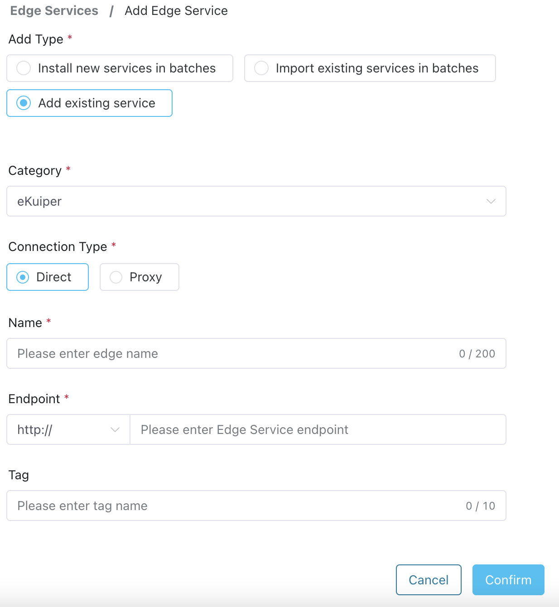

# Managed Edge Services

ECP supports [Add an existing edge service](#add-an-existing-edge-service), or [Batch Import Existing Edge Services](#batch-import-existing-edge-services) via CSV files.

## Add an existing service

ECP manages edge services and supports `Managed - Direct Connection` mode and `Managed - Agent` mode. To add an edge service under [Direct Connection Mode](#direct-connection-mode), the ECP and edge service need to be in the same network or VPC.

### Direct Connection Mode

Direct connection mode generally refers to the scenario where the cluster and all edge services are within the same local area network and can access each other.

1. Log in as system admin, organization admin, or project admin. 
2. Click the **Add Edge Service** button to enter the **Add Edge Service** page.
3. Choose **Add existing service** for **Add Type**.
4. For **Category**, choose **NeuronEX**.
5. Choose **Direct Connection** for the **Connection Type**;
6. Give a name to the edge service; it should be 1 - 200 characters, and also support "-" and blank spaces. 
7. Enter the access address of the edge service. HTTP and HTTPS protocols are supported;
8. Optionally add tags to facilitate future management. For details, see [Tags](./batch_tag.md).
9. Click the **Confirm** button to finish the creation. The newly-added edge service is now displayed in the **Edge Service** section. 

 

### Agent Mode

If the ECP cannot directly access the edge service through the IP address, the edge service needs to be added through agent mode. For specific operation steps, please refer to [Manage edge services by Agent](./edge_agent_management.md).

## Batch Import Existing Edge Services

ECP supports batch importing of existing edge services in CSV file format. 

- Log in as system admin, organization admin, or project admin. 
- Click the **Add Edge Service** button to enter the **Add Edge Service** page.
- Choose **Import existing services in batches** for the **Add Type**.
- Import the prepared .csv file. **Note**: The file size should be less than 100 MB. 

After the import, the imported edge services will automatically be displayed in the **Edge Service** panel. Note that only data in a valid format will be imported, and the system will flag any incorrectly formatted entries.

The following table provides an overview of the column names of the .csv file and their corresponding explanations:

| Column    | Explanation                       |
| --------- | --------------------------------- |
| category  | Edge service type                 |
| name      | Edge service name                 |
| nodeType  | Direct                           |
| endpoint  | Edge service address              |
| scheme    | http/https                   |
| tagName   | Tag name, optional                |

:::tip
Batch importing existing edge services only supports the `Direct Connection Mode`.
:::
