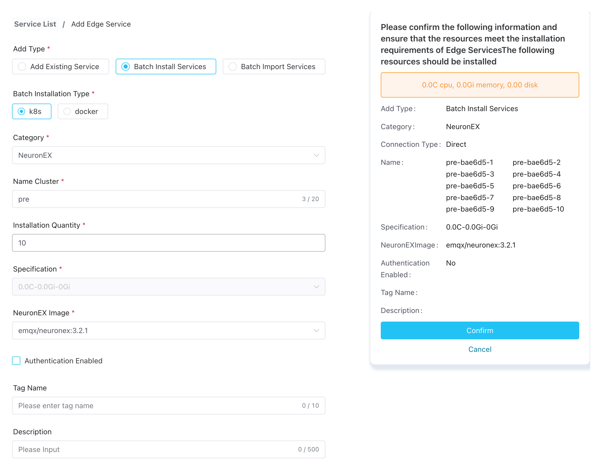

# Host Edge Services By Kubernetes

Based on the ECP platform deployed by Kubernetes, if the hardware of the edge service supports the deployment of Kubernetes containers, edge services can be installed in batches on the ECP platform, shortening the installation and deployment time of edge services, and improving deployment efficiency and consistency.

## Prerequisites

Before batch installation of edge services, you need to complete the following preparations:

- Configure [Kubernetes Connection Setting](../system_admin/resource_config.md#kubernetes-connection-setting) on ECP
- Add [Edge Service Image List](../system_admin/resource_config.md#edge-service-image-list)
- Add [Edge Service Setting](../system_admin/resource_config.md#edge-service-setting-kubernetes)

## Batch Install Edge Services

1. Log in as system admin, organization admin, or project admin. Navigate to Workspace - Service List page.

2. Click the Add Edge Service button to enter the Add Edge Service page.

3. Choose Install new Services in batches for Add Type, choose docker type for Batch Installation Type.

4. For Category, now only NeuronEX.

5. Enter the name prefix of the edge service, and the system will automatically generate a unique service name based on the name prefix; 1-20 characters, and supports "-" and spaces.

6. **Install Number** can be used that the ECP supports a maximum of 200 services at a time and is not greater than the license quota balance.

7. Specifications are the quotas configured in System Management - > System Configuration - > Resource Configuration - > Kubernetes Deployment Mode - > Edge Service Configuration.

8. Select the image where the edge service needs to be installed.

9. [Optional] Install the NeuronEX instance and choose whether to enable authentication. For detailed information, please view [Edge Service Authentication](./e2c.md).

10. [Optional] You can choose to add labels to edge service instances to facilitate subsequent maintenance.

11. ECP will automatically generate an information overview of this installation on the right side of the page based on the above settings. You can confirm it here. If the information is confirmed, you can click the **Confirm** button to install batch edge services.

## Check the installation progress

After clicking Confirm, the batch installation results dialog box will pop up, you can view it here:

- Statistics on total number of installations, number of successful installations, number of failed installations and ongoing installations;
- For installation failures, you can view the reason for the installation failure in the **Cause** column;

Click **Back** to return to the **Edge Services** page, and the newly installed edge service will appear in the Edge Services section of the page.

In addition, ECP will record all the information of this batch installation, and the system/organization/project administrator can view it in [Operation Audit](../system_admin/operation_audit).

:::tip
For usage restrictions on batch installation, please refer to [System Usage Limitations](../others/known_limitations) and [Version Compatibility Limitations](../others/version_limitations).
:::
