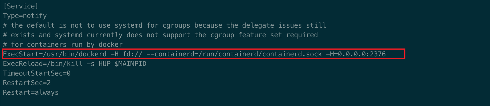
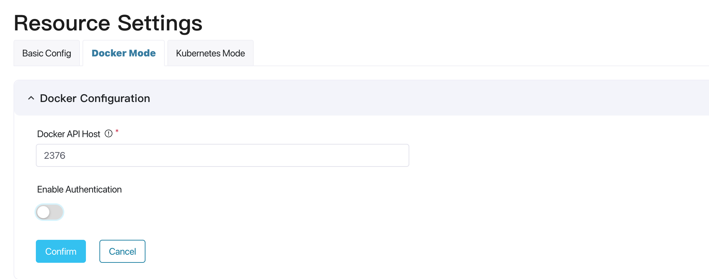
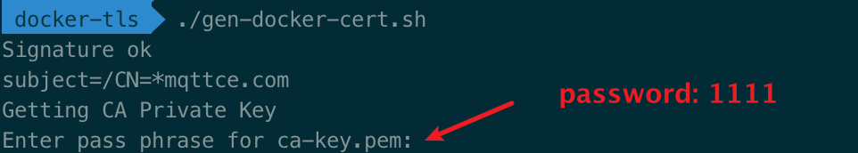
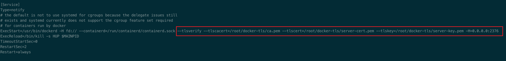
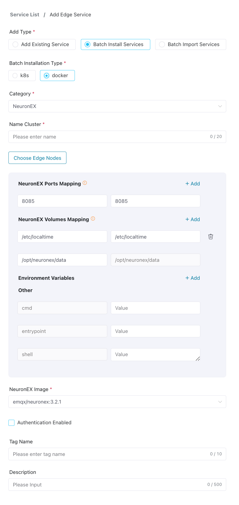
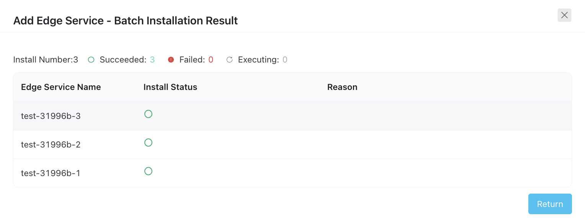

# Host Edge Services By Docker

Based on the ECP platform deployed by Docker, if the hardware of the edge service supports the deployment of Docker containers, edge services can be installed in batches on the ECP platform, shortening the installation and deployment time of edge services, and improving deployment efficiency and consistency.

## Prerequisites

Before batch installation of edge services, you need to complete the following preparations:

- [Configure Docker Environment](#configuration-docker-environment)
- Configure [Docker Configuration](../system_admin/resource_config.md#docker-configuration) on ECP
- Add [Edge Service Image List](../system_admin/resource_config.md#edge-service-image-list)
- Add [edge node](#edge-node-management), the edge service will be installed on the edge node

### Configuration Docker Environment

edge service is deployed by Docker, so you need to install Docker on the edge node.

After the installation is complete, you need to open the remote access port of the Docker API. The ECP platform manages the life cycle of the edge service through the Docker API, and supports two modes of Docker API to enable TLS authentication and not enable TLS authentication.

#### Not enable TLS authentication

1. Find the docker service configuration file, the default is: `/usr/lib/systemd/system/docker.service`, you can see the location of the file through the `systemctl status docker` command.
   
2. Modify the ExecStart parameter and add parameters as shown below:
   ```shell
     ExecStart=/usr/bin/dockerd  -H fd:// --containerd=/run/containerd/containerd.sock  -H=0.0.0.0:2376
   ```
   
3. Restart the docker service
   ```shell
   systemctl daemon-reload && systemctl restart docker
   ```
4. Configure Docker connection configuration without TLS authentication method on ECP
   

#### Enable TLS authentication

1. If the Docker API enables TLS authentication, the edge node deployed as the server needs to configure the CA certificate, server certificate and server private key of the Docker API. ECP as the client needs to configure the CA certificate, client certificate and client private key of the Docker API. For specific configuration methods, please refer to [Docker TLS authentication](https://docs.docker.com/engine/security/https/).

   1. You can download the certificate file and script from [this link](https://github.com/emqx/emqx-ecp-docs/tree/main/ecp/resource/docker-tls)
      :::tip Note
      This certificate is for testing only.
      Please use a self-signed certificate in a production environment.
      :::
   2. Modify the IP address in extfile.cnf to the IP address exposed by the edge node that deploys the Docker Engine service externally. This IP address is also the IP address that needs to be entered in ECP when adding [edge nodes](#edge-node-management).
      
   3. Execute the gen-docker-cert.sh script to generate the server certificate: server-cert.pem, the default password: `1111`;
      
   4. Copy the generated `server-cert.pem` certificate file and `ca.pem`, `server-key.pem` files to the specified directory of the edge node, such as: `/root/docker-tls/ca.pem`, `/root/docker-tls/server-cert.pem`, `/root/docker-tls/server-key.pem` directory.

2. Find the docker service configuration file, the default is: `/usr/lib/systemd/system/docker.service`, you can see the location of the file through the `systemctl status docker` command.
   

3. Modify the ExecStart parameter and add parameters as shown below:
   ```shell
     ExecStart=/usr/bin/dockerd  -H fd:// --containerd=/run/containerd/containerd.sock  --tlsverify --tlscacert=/root/docker-tls/ca.pem --tlscert=/root/docker-tls/server-cert.pem --tlskey=/root/docker-tls/server-key.pem -H=0.0.0.0:2376
   ```
   
4. Restart the docker service
   ```shell
   systemctl daemon-reload && systemctl restart docker
   ```
5. Configure Docker connection configuration with TLS authentication method on ECP
   upload the certificate file `ca.pem`, `cert.pem`, `key.pem` to ECP.
   

### Edge Node Management

Through edge node management, you can add, edit, view and delete edge nodes.

#### Edge Node Registration

Only after the Docker node is registered can the edge service be deployed on the specified Docker node through ECP.

1. Select **Organization**; **Project**;
2. Click **Node Management**, and click **Create Edge Node**;
3. Enter the name, IP address, and description of the edge node.


#### Edge Node List Management

1. Select **Organization**; **Project**;
2. Click **Edge Management**, select **Edge Node Management**;
3. Select the node to be managed in the list, you can **edit**, **delete**, **view**, the view button indicates the list of edge services on the node;


#### List of edge services on the edge node

After clicking the **View** button on the right of an edge node in the edge node list, you can see the edge service list on the node.
You can see information such as the status of these edge services in the list.


## Batch Install Edge Services

1. Log in as system admin, organization admin, or project admin. Navigate to Workspace - Edge Service page.

2. Click the Add Edge Service button to enter the Add Edge Service page.

3. Choose Install new Services in batches for Add Type, choose docker type for Batch Installation Type.

4. For Category, now only NeuronEX.

5. Enter the name prefix of the edge service, and the system will automatically generate a unique service name based on the name prefix; 1-20 characters, and supports "-" and spaces.

6. Select one or more **edge nodes**, and ECP will deploy an edge service instance of the selected **type** on each edge node.

7. Set the configuration parameters of the edge service. If not modified, the parameters in the global configuration will be used by default.

8. Select the image where the edge service needs to be installed.

9. [Optional] Install the NeuronEX instance and choose whether to enable authentication. For detailed information, please view [Edge Service Authentication](./e2c.md).

10. [Optional] You can choose to add labels to edge service instances to facilitate subsequent maintenance.

11. ECP will automatically generate an information overview of this installation on the right side of the page based on the above settings. You can confirm it here. If the information is confirmed, you can click the **Confirm** button to install batch edge services.



## Check the installation progress

After clicking Confirm, the batch installation results dialog box will pop up, you can view it here:

- Statistics on total number of installations, number of successful installations, number of failed installations and ongoing installations;
- For installation failures, you can view the reason for the installation failure in the **Cause** column;



Click **Back** to return to the **Edge Services** page, and the newly installed edge service will appear in the Edge Services section of the page.

In addition, ECP will record all the information of this batch installation, and the system/organization/project administrator can view it in [Operation Audit](../system_admin/operation_audit).

:::tip
For usage restrictions on batch installation, please refer to [System Usage Limitations](../others/known_limitations) and [Version Compatibility Limitations](../others/version_limitations).
:::
