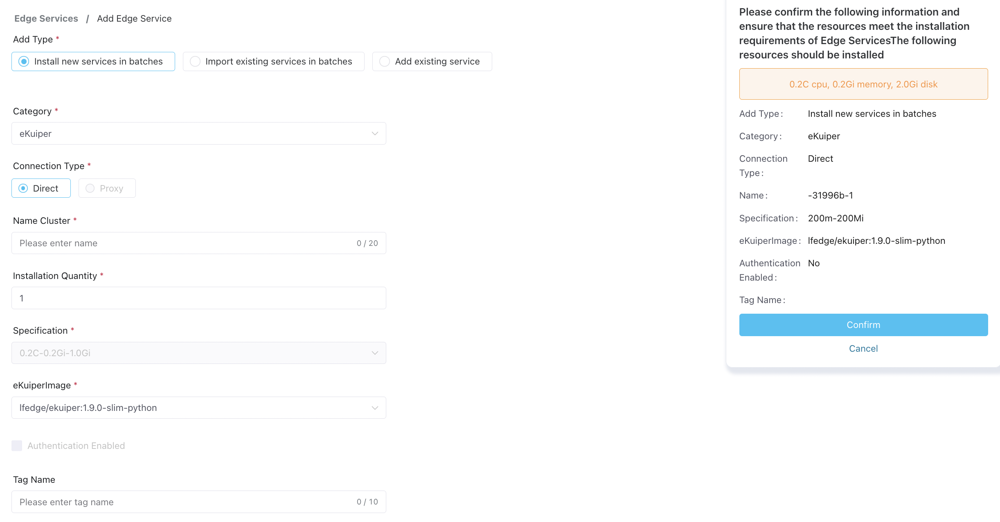

# Install Edge Services in Bulk

Batch installation is especially advantageous when ECP and edged services are within the same Kubernetes environments. With batch installation, you can effectively minimize deployment effort and reduce installation time.

For the initial deployment of edge services, you can utilize ECP's batch installation feature to streamline the process of installing Neuron and eKuiper in batch.

## Installation

1. Log in as system admin, organization admin, or project admin. Navigate to **Workspace - Edge Service** page. 

2. Click the **Add Edge Service** button to enter the **Add Edge Service** page.

3. Choose **Install new Services in batches** for **Add Type**, chose **docker** type for **Batch Installation Type**.

4. For **Category**, now only **NeuronEX**.

5. **Connection Type** is set to **Direct** by default and cannot be changed.

6. In the **Name Cluster** field, give a name prefix for the edge service, the system will automatically generate a unique service name based on the name prefix; it should be 1 - 20 characters, and also support "-" and blank spaces. 

7. In the **Choose Nodes** field, you can chose one or many docker node to install. 

8. You can view the default specification for the service, set up the **Ports Mapping**、**Volumes Mapping**、**Environment Variables** and startup command.

9. Then in the **NeuronEXImage** field, choose the image version to install. 

   **Note**: If NeuronEX is to be installed, please also specify whether authentication is enabled by clicking the **Authentication Enabled** checkbox. For details about authentication in NeuronEX, see [Authenticate Edge Services](./e2c.md).

10. Add tags to facilitate future management. For details, see [Tags](./batch_tag.md).

11. With the information you've provided, the system will create a summary page showing resource needs and your selected configurations. After reviewing these, click **Confirm** to complete the setup. 

## Monitor Installation Process

A dialog box will subsequently appear, showcasing the installation progress. Here you can observe:

- The total count of services installed, those successfully created, ones that failed, and those currently in process.
- For any failed instances, the Reason column will provide information on the cause of failure.

Click **Return** to close this page and return Workspace - Edge Service page. The newly created edge services are now displayed in the **Edge Service** section. 

System/Organization/Project admins can review these operations in the [System Administration - Audit](../system_admin/operation_audit). 

:::tip

For usage restrictions on batch installations, please refer to [Known Limitations](../others/known_limitations) and [Version Compatibility](../others/version_limitations).
:::