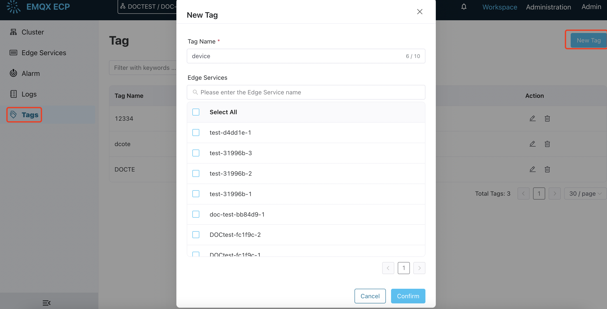
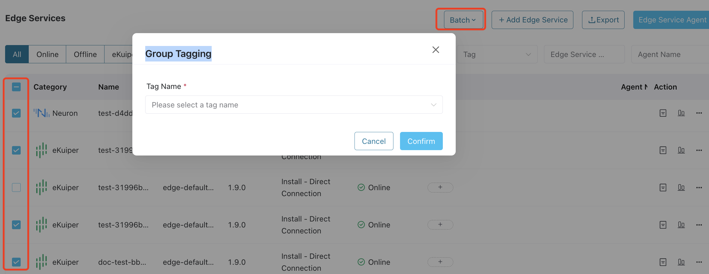
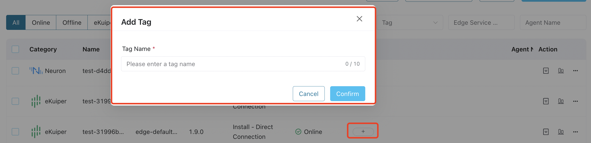

# Tags

ECP provides a tagging feature to classify, organize, and filter edge services. It allows you to group edge services for efficient management, facilitating operations such as managing edge services and batch deployment of edge configurations.

## Create Tags

Log in as system admin, organization admin, or project admin. Click **Workspace** in the ribbon area and switch to the **Workspace** page. Navigate to the **Tags** page, where you can see the tag name, the number of associated services, and operations, and you can perform a fuzzy search based on the tag name.

1. Click the **New Tag** button and a dialog box will pop up.

2. Fill in the tag name, it should be 1-10 characters, and also support "-"

3. Click to check the edge services you want to associate with the tag in the table.

4. Click **Confirm** to finish the setting. 

   

## Manage Tags

For the created tags, you can click the edit icon to edit the tag name or associated edge services. 

Or you can click the delete icon to delete a tag. Note: The associated edge services must be removed before you can delete the tag. 

## Use Tags for Batch Management

You can also use the **Tagging** feature for batch management in the **Workspace - Edge Service** page. 

To add tags for multiple edge services: 

1. Check the boxes corresponding to the edge services you wish to tag.
2. Navigate to **Batch** in the **Edge Services** panel, and select **Tagging**.  
3. In the popup dialog box, input a name for the tag. It should be 1-5 characters, and also support "-". Press the Enter key to confirm the input. Or you can select an existing tag. 
4. Click 'Confirm' to finish the setting. 

:::tip
A maximum of 10 tags can be assigned to a single service, for details, see [Known Limitations](../others/known_limitations).

:::

Services that have been tagged will automatically display the assigned tag names under the **Tag** column, where you can also add click the + button to add more tags to the service. 

