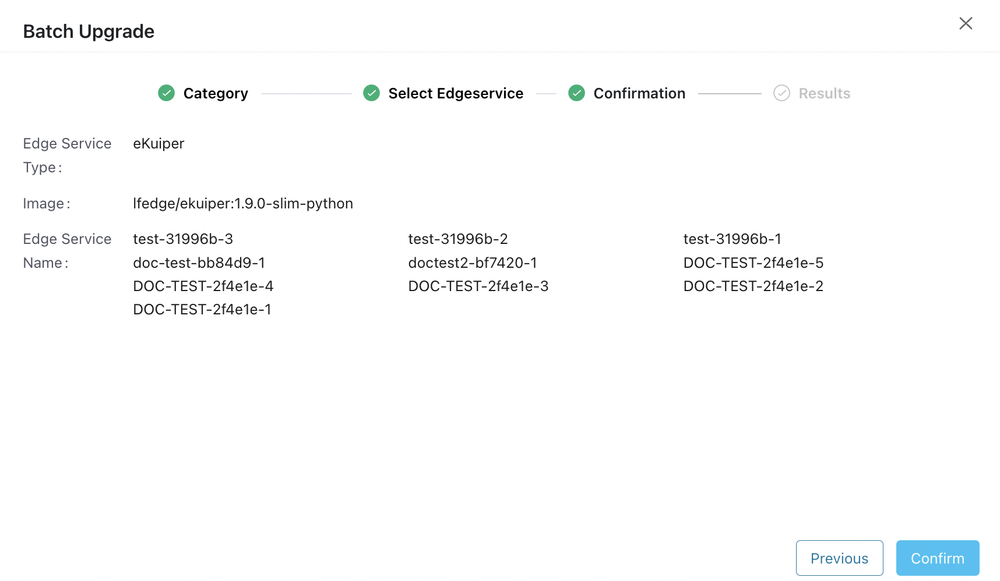

# Upgrade Edge Services

ECP supports the upgrading of edge services either on an instance level or collectively in batches. This functionality further streamlines the process and convenience of managing edge services, ensuring they're always running the latest, most efficient versions.

## Upgrade One Edge Service Instance

To upgrade one edge service instance:

1. Log in as system admin, organization admin, or project admin. 
2. On the target instance, click the more icon and select **Upgrade**. 
3. In the popup dialog box, select the target image version and click **Confirm** to finish the setting. 

## Upgrade in Batches

To upgrade multiple edge service instances simultaneously: 

:::tip
For the compatibility and restrictions of batch upgrades, see [Known Limitations](../others/known_limitations) and [Version Compatibility](../others/version_limitations).
:::

1. Log in as system admin, organization admin, or project admin. 

2. Then click **Batch** -> **Upgrade** in the **Edge Services** panel. 

3. In the popup dialog box, select the edge service product to be upgraded, and the corresponding image version.  Then click **Next**. 

   

4. Click to check the instances to be upgraded in batch. Click **Next**. 

   

4. Click **Implement** to finish the setting. 

## View the Upgrade Process

View the upgrade progress. Here you can observe:

- The total count of services to be upgraded, those upgraded created, ones that failed, and those currently in process.
- For any failed instances, the **Reason** column will provide information on the cause of failure.

