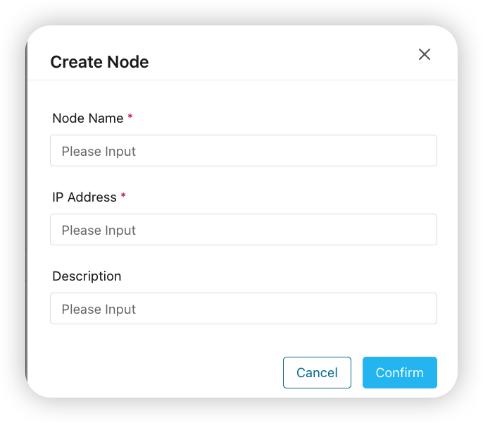
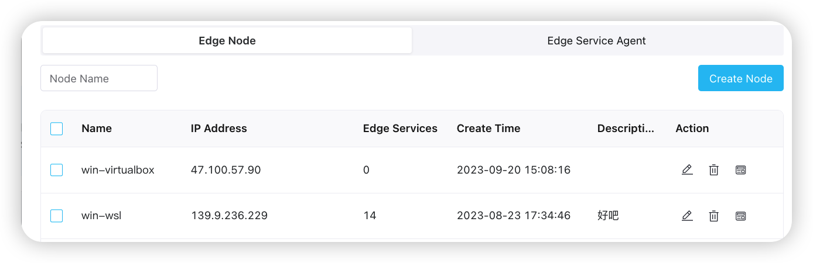
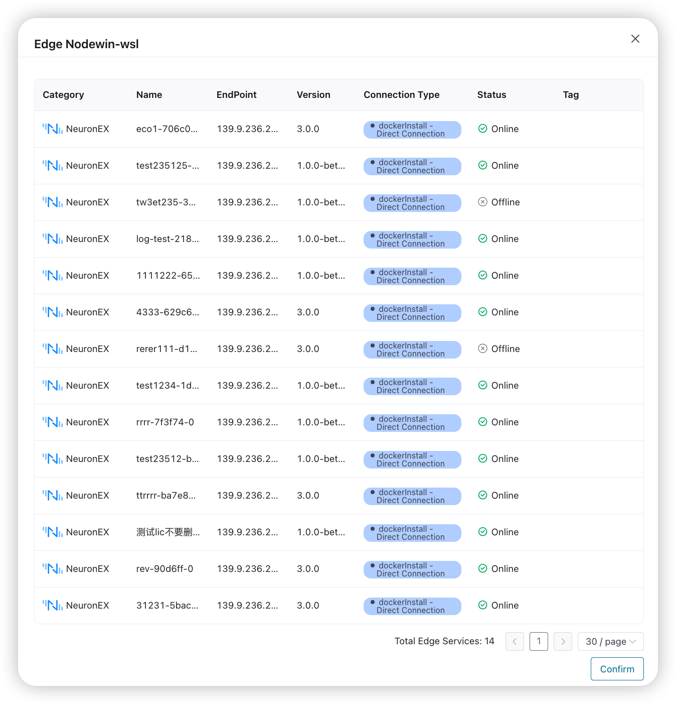

# Edge Node Management

## Edge Node Registration
Only after the Docker node is registered can the edge service be deployed on the specified Docker node through ECP.

1. Select **Organization**; **Project**;
2. Click **Edge Manage**, select **Edge Node**, and click **Create Node**;
3. Enter the name, IP address, and description of the edge node.

## Edge Node List Management
1. Select **Organization**; **Project**;
2. Click **Edge Manage**, select **Edge Node**;
3. Select the node to be managed in the list, you can **edit**, **delete**, **view**, the view button indicates the list of edge services on the node;

## List of edge services on the edge node
After clicking the **View** button on the right of an edge node in the edge node list, you can see the edge service list on the node.
You can see information such as the status of these edge services in the list.

 

