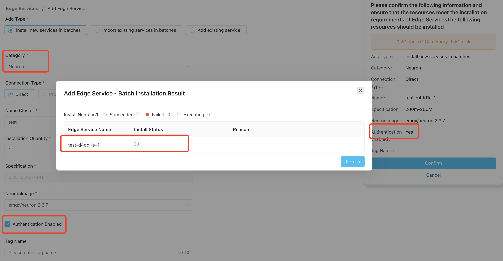
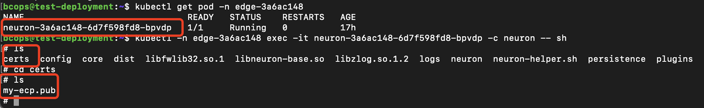

# Authenticate Edge Services

Before you can manage edge services using ECP, you must first complete the necessary authentication configuration if authentication is enabled on the edge service side. 

ECP supports authentication at the Neuron, eKuiper and NanoMQ side. The setup process for both is quite similar. This guide will walk you through how to set up authentication using Neuron and eKuiper as an example. If you're planning to establish authentication for NanoMQ, you can simply apply the same steps outlined in this guide.

For Neuron, ECP supports hosting Neuron services or managing Neuron services. For hosted Neurons, authentication should be activated during creation. For managed Neurons, authentication should be enabled via the Neuron configuration file.

For eKuiper, ECP supports authentication for managing eKuiper services only. Authentication should also be enabled via the eKuiper configuration file.

## Authentication on Hosted Neurons

For Neuron services created via ECP, you have the option to enable authentication by selecting the **Authentication Enabled** checkbox. If this option is activated, ECP will place the RSA public key file into the designated folder within Neuron. For additional information about the RSA public key, refer to the [RSA Signature Authentication](#rsa-signature-authentication) section.



## Authentication on Managed Neurons

If authentication is enabled at the managed Neuron side, you can configure as follows: 

  1. Log in to ECP as system admin, organization admin, or project admin. 
  2. Download the public key file: On the **Administration** page, navigate to **System Settings** -> **Resource Settings**. Click to expand the **Edge Service Setting**, and download the key file under **Authentication Configuration**. 
 2. Then Log in to the container or virtual machine where Neuron is located, and upload the downloaded public key file to the `certs` directory in the Neuron installation directory.   

 <!--::: tip-->
 <!--关于 Neuron 认证的详情说明请参考 Neuron 帮助文档，[生成公私钥](https://neugates.io/docs/zh/latest/http-api/jwt.html#%E7%94%9F%E6%88%90%E5%85%AC%E7%A7%81%E9%92%A5) 感觉不需要这块信息-->

## Authentication on Managed eKuipers

If authentication is enabled at the managed eKuiper side, you can configure as follows: 

1. Log in to ECP as system admin, organization admin, or project admin. 
2. Download the public key file: On the **Administration** page, navigate to **System Settings** -> **Resource Settings**. Click to expand the **Edge Service Setting**, and download the key file under **Authentication Configuration**. 
3. Then Log in to the container or virtual machine where eKuiper is located, and upload the downloaded public key file to the `etc/mgmt` directory in the eKuiper installation directory. 

::: tip
To enable or disable authentication for an already managed eKuiper, please delete the eKuiper service from ECP side first, then update its authentication way and re-add the eKuiper back into ECP.
:::

## Test the Authentication Setting

To verify the authentication configuration, try [adding an existing edge service](./batch_import.md#add-an-existing-edge-service). If the authentication is correctly set up, the Neuron service or eKuiper service should be added successfully. You can then click on the service to view its details.


## RSA Signature Authentication

**RSA** (**Rivest–Shamir–Adleman**) is a public-key cryptosystem that is widely used for secure data transmission. It uses a key pair consisting of a public key for encryption and a private key for decryption. 

- Public Key: For encryption, it is shared openly and usually stored by the data provider, such as Neuron.
- Private Key: For decryption, it must be kept secret and is stored on ECP.

The authentication flow is as follows:


### RSA Key Pair Management on ECP

ECP automatically generates key pairs during installation. If key generation fails, reinstallation will be prompted.

If you need to manage the generated key pairs manually, you can obtain the key pair information as follows:

- For K8S deployment, suppose you are in the `emqx-ci-dev` namespace, you can use the command below to view the RSA key pair:

  ```bash
  $ kubectl get ns 
  # Get namespace emqx-ci-dev
  
  $ kubectl get pod -n emqx-ci-dev 
  # Get the POD information in the namespace and find the ECP container name
  
  $ kubectl -n emqx-ci-dev exec -it emqx-bc-main-658b5f5fd6-74vnd -c emqx-bc-main -- sh 
  # Enter the container
  
  $ ls 
  # View the key pair
  ```

  

- For Docker deployment, assume you are using the container ID `717aee745efb`, you can use the command below to view the RSA key pair:

  ```bash
  $ docker ps 
  # Get POD information, find the ECP container ID '717aee745efb'
  
  $ docker exec -it 717aee745efb -- sh 
  # Enter the container
  
  $ ls 
  # View the key pair
  ```
