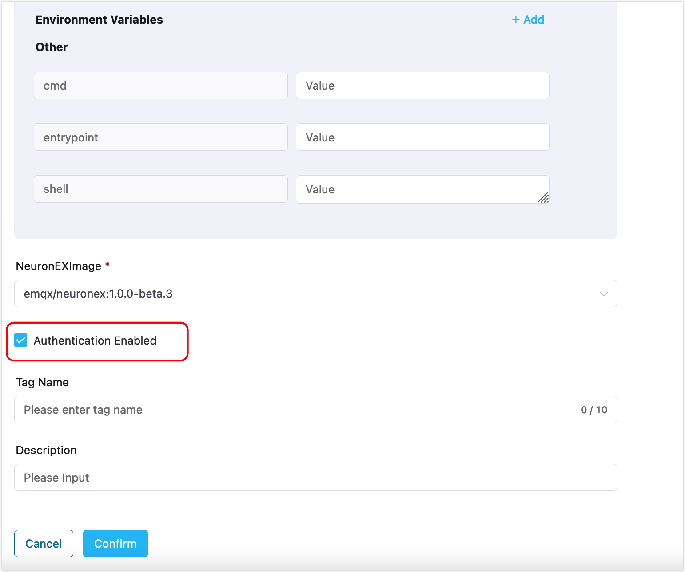
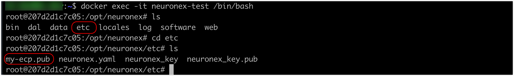
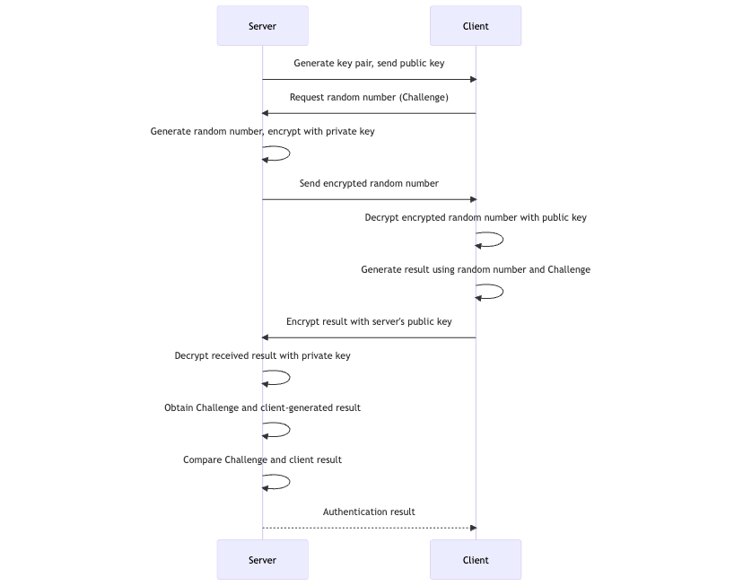

# Authenticate Edge Services

Before you can manage edge services using ECP, you must first complete the necessary authentication configuration if authentication is enabled on the edge service side. This guide will walk you through how to set up authentication for NeuronEX.

ECP supports hosting NeuronEX services or managing NeuronEX services. For hosted NeuronEX, authentication should be activated during creation. For managed NeuronEX, authentication should be enabled via the NeuronEX configuration file. 

## Authentication on Hosted NeuronEX

For NeuronEX services created via ECP, you have the option to enable authentication by selecting the **Authentication Enabled** checkbox. If this option is activated, ECP will place the RSA public key file into the designated folder within NeuronEX. For additional information about the RSA public key, refer to the [RSA Signature Authentication](#rsa-signature-authentication) section.



## Authentication on Managed NeuronEX

If authentication is enabled at the managed NeuronEX side, you can configure as follows: 

1. Log in to ECP as system admin, organization admin, or project admin. 
2. Download the public key file: On the **Administration** page, navigate to **System Settings** -> **Resource Settings**. Click to expand the **Managed Edge Service Authentication Configuration**, and download the key file by clicking **Public Key Export**. 
3. Then Log in to the container or virtual machine where NeuronEX is located, and upload the downloaded public key file to the `etc` directory in the NeuronEX installation directory. 
     

## Test the Authentication Setting

To verify the authentication configuration, try [Add Existing Edge Services](./batch_import.md#add-an-existing-edge-service). If the authentication is correctly set up, the NeuronEX service should be added successfully. You can then click on the service to view its details.


## RSA Signature Authentication

**RSA** (**Rivest–Shamir–Adleman**) is a public-key cryptosystem that is widely used for secure data transmission. It uses a key pair consisting of a public key for encryption and a private key for decryption. 

- Public Key: For encryption, it is shared openly and usually stored by the data provider, such as NeuronEX.
- Private Key: For decryption, it must be kept secret and is stored on ECP.

The authentication flow is as follows:



### RSA Key Pair Management on ECP

ECP automatically generates key pairs during installation. If key generation fails, reinstallation will be prompted.

If you need to manage the generated key pairs manually, you can obtain the key pair information as follows:

- For K8S deployment, suppose you are in the `emqx-ci-dev` namespace, you can use the command below to view the RSA key pair:

  ```bash
  $ kubectl get ns 
  # Get namespace emqx-ci-dev
  
  $ kubectl get pod -n emqx-ci-dev 
  # Get the POD information in the namespace and find the ECP container name
  
  $ kubectl -n emqx-ci-dev exec -it emqx-bc-main-658b5f5fd6-74vnd -c emqx-bc-main -- sh 
  # Enter the container
  
  $ ls 
  # View the key pair
  ```

  

- For Docker deployment, assume you are using the container ID `717aee745efb`, you can use the command below to view the RSA key pair:

  ```bash
  $ docker ps 
  # Get POD information, find the ECP container ID '717aee745efb'
  
  $ docker exec -it 717aee745efb -- sh 
  # Enter the container
  
  $ ls 
  # View the key pair
  ```
