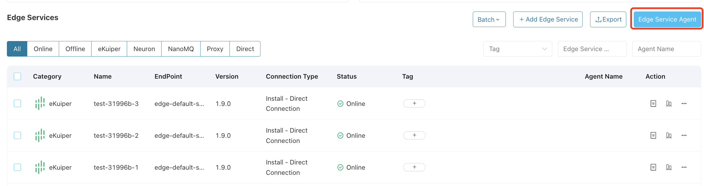

# ECP Edge Agent

The ECP Edge Agent is a robust edge-end software designed to register and manage edge software on the ECP platform, even in the absence of a cloud-edge network connection. It operates on edge devices, facilitating improved management and coordination of edge applications while ensuring high security and operational stability for system data.

## Install ECP Edge Agent

Before utilizing the ECP Edge Agent, it must be installed within your edge network. It is crucial to ensure it can connect to the ECP platform via an edge gateway. For detailed instructions, refer to [Install ECP Edge Agent](../install/install_edge_agent.md) for more details.

## Manage ECP Edge Agents

To manage ECP Edge Agents, log in as system admin, organization admin, or project admin. Navigate to **Workspace** - **Edge Services**. Click **Edge Service Agent** in the **Edge Services** panel.

 

In the popup dialog box, you can add, edit, or delete edge services. Note that any added agents can be utilized within edge services that operate in [proxy mode](./batch_import.md#add-an-existing-edge-service).<!--不太理解这句话 已经添加的边缘代理可以被用在[代理模式](batch_add_one.md#代理模式)的边缘服务内。-->
