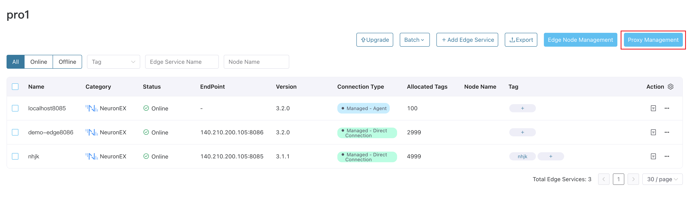
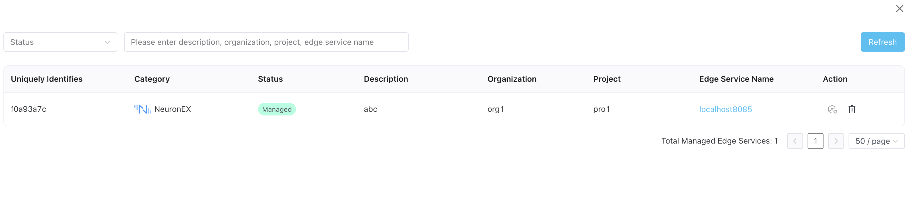
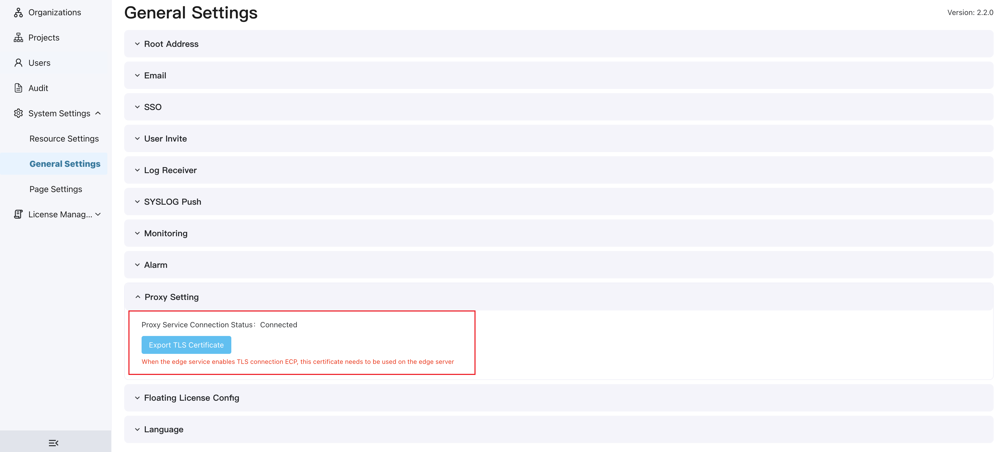

# Managed Edge Services by Agent

If the IP of the edge service NeuronEX is not fixed, or NeuronEX is in its own VPC or LAN, ECP cannot actively obtain the IP information of edge service NeuronEX, and the direct connection mode to import the edge service will no longer be applicable. ECP provides an agent management method to manage and access NeuronEX in the above scenario.

## Configure Agent Service

In the agent management mode, the MQTT protocol is used to communicate between ECP and NeuronEX. NeuronEX serves as an MQTT client and connects to ECP's built-in MQTT proxy server NanoMQ. ECP communicates with NeuronEX through the MQTT proxy server to realize the management of NeuronEX.

The process for NeuronEX agent management to access ECP (without turning on SSL/TLS) is as follows:

1. [Configure MQTT proxy service on the ECP side](#configure-the-mqtt-proxy-service-on-the-ecp-side)
2. [NeuronEX agent function configuration](#neuronex-agent-function-configuration)
3. [Edge Proxy Management](#edge-proxy-management)
4. [Agent managed edge service](#agent-managed-edge-service)

### Configure the MQTT proxy service on the ECP side
After the ECP installation is completed, the MQTT proxy service has been started by default and no additional configuration is required. The default port of the MQTT proxy service is 31883, and the IP is the server where the ECP is located.

### NeuronEX agent function configuration
On the NeuronEX side, click **Administrator** -> **System Configuration**. 
- Select to Enable Agent.
- the ECP Service Address is configured as `[IP of the server where the ECP is located]:31883`, and the username and password are `admin` and `public` by default. 
- Description will be a brief description of the NeuronEX and displayed in the ECP agent management page.

For the configuration of the agent management function on the NeuronEX side, please refer to [NeuronEX Agent Configuration](https://docs.emqx.com/en/neuronex/latest/admin/sys-configuration.html#agent-configuration).

### Edge proxy management
Log in to ECP as the system/organization/project administrator, click **Workspace** -> **Edge Management** to enter the edge service page, click the **Agent Management** button on the right side of the page to open **Edge Agent Management** window.



You can view all NeuronEX agents registered to ECP in this window. Agents that have not yet been managed by ECP are displayed as "unmanaged", and the actual online status is also displayed. You can manage or delete this NeuronEX agents.



## Enable SSL/TLS in Agent Service

The default agent server of ECP uses the TCP protocol for data transmission. If you want to use a more secure transmission method, you can configure it appropriately and enable SSL/TLS. The following will take the example of ECP deployed with Docker using the built-in NanoMQ to explain the configuration steps in detail. You can also refer to the [NanoMQ Docker Deployment Document](https://nanomq.io/docs/en/latest/installation/docker.html) for a more complete introduction.

1. Prepare the server-side SSL certificate files used by NanoMQ, including the CA file (cacert.pem), the server certificate file (cert.pem), and the server certificate key file (key.pem), and save them to the configs/nanomq subdirectory of the installation file directory.

2. Prepare the client-side SSL certificate files used by ECP and NeuronEX, including the CA file (cacert.pem), the client certificate file (client-cert.pem), and the client certificate key file (client-key.pem), and save them to the configs/main subdirectory of the installation file directory.

3. Enter the directory where the installation file is located and modify the mqtt part in the docker-compose.yaml file. The specific content that needs to be modified is as follows:

   - Mount the certificate file to the NanoMQ container in `volumes`. Please make sure the path in the container should be under directory `/etc/certs`.
   - Configure SSL/TLS related environment variables in `environment`
       - NANOMQ_TLS_ENABLE is set to true to enable TLS.
       - If NANOMQ_TLS_VERIFY_PEER is set to false, it means NanoMQ does not verify the client certificate. If it is set to true, it means that the client certificate needs to be verified. Please set it according to actual needs.
       - NANOMQ_TLS_FAIL_IF_NO_PEER_CERT If set to false, NanoMQ allows the client to not send a certificate or to send an empty certificate. If set to true, it means that the client will be refused to connect without a certificate. Please set it according to actual needs.


```
  mqtt:
    container_name: emqx-ecp-nanomq
    image: ${IMAGE_REGISTRY}/${IMAGE_NANOMQ}-full
    restart: always
    hostname: ecp-nanomq
    ports:
      - ${MQTT_EXTERNAL_PORT}:1883
      - 38883:8883
    volumes:
      - ${ECP_CONFIG_DIR}/nanomq/nanomq.conf:/etc/nanomq.conf
      - ${ECP_CONFIG_DIR}/nanomq/cacert.pem:/etc/certs/cacert.pem:ro
      - ${ECP_CONFIG_DIR}/nanomq/cert.pem:/etc/certs/cert.pem:ro
      - ${ECP_CONFIG_DIR}/nanomq/key.pem:/etc/certs/key.pem:ro
    environment:
      NANOMQ_TLS_ENABLE: 'true'
      NANOMQ_TLS_VERIFY_PEER: 'false'
      NANOMQ_TLS_FAIL_IF_NO_PEER_CERT: 'false'
    networks:
      emqx-ecp-network:
        aliases:
          - node1
```

5. Modify the main section in the docker-compose.yaml file. The specific content that needs to be changed is as follows:
    - Mount the certificate file in `volumes` to the ECP main container. In the example, the certificate files are mounted to the `/bc/certs` directory of the container.

```
  main:
    container_name: emqx-ecp-main
    image: ${IMAGE_REGISTRY}/${IMAGE_ECP_MAIN}
    restart: always
    depends_on:
      postgres:
        condition: service_healthy
      mqtt:
        condition: service_started
      emqxagentdlproxy:
        condition: service_started
    environment:
      - GIN_MODE=release
      - ECP_DEPLOYMENT_MODE=docker
    volumes:
      - ${ECP_MAIN_VOLUME}:/bc/assets/files
      - ${ECP_CONFIG_DIR}/main/main.yaml:/bc/configs/conf.yaml
      - ${ECP_CONFIG_DIR}/main/cacert.pem:/bc/certs/cacert.pem:ro
      - ${ECP_CONFIG_DIR}/main/client-cert.pem:/bc/certs/client-cert.pem:ro
      - ${ECP_CONFIG_DIR}/main/client-key.pem:/bc/certs/client-key.pem:ro
    networks:
      - emqx-ecp-network
```

6. Modify the mqtt section in the ECP configuration file configs/main/main.yaml:
    - `useSSL` is set to true to enable TLS.
    - The port in `addr` is set to 8883.
    - `verifyCertificate` indicates whether to verify the NanoMQ side certificate. Please set it according to actual needs.
    - `cacertFile`, `cacertFile`, `cacertFile` are respectively the path in the container to which the ECP certificate file is mounted. Please ensure that it is consistent with the path in the container specified in docker-compose.yaml in the previous step.

```
mqtt:
  useSSL: true
  addr: mqtt:8883
  username: "ecp-mqtt-cloud"
  password: "ecp-mqtt-cloud1!"
  maxReconnectInterval: 3
  connectTimeout: 8
  cleanSession: true
  verifyCertificate: false
  cacertFile: "/bc/certs/cacert.pem"
  certFile: "/bc/certs/client-cert.pem"
  keyFile: "/bc/certs/client-key.pem"
```

7. Restart the ECP service.

```shell
./emqx_ecp_ctl start
```

::: tip

To enable SSL/TLS in the agent management service, the NeuronEX agent configuration also needs to adjust the default port of the MQTT agent service to 38883. At the same time, SSL/TLS needs to be enabled and the corresponding certificate file needs to be filled in. For NeuronEX agent function configuration, please refer to [NeuronEX Agent Configuration](https://docs.emqx.com/en/neuronex/latest/admin/sys-configuration.html#agent-configuration).

:::

## Check Agent Service Status

On the **Administrator** page, click **System Settings** -> **General Settings**, and click to expand the **Agent Setting** section to check whether the agent service NanoMQ is connected normally. If TLS/SSL connection is enabled, the corresponding certificate file can also be exported for use on the NeuronEX side.

