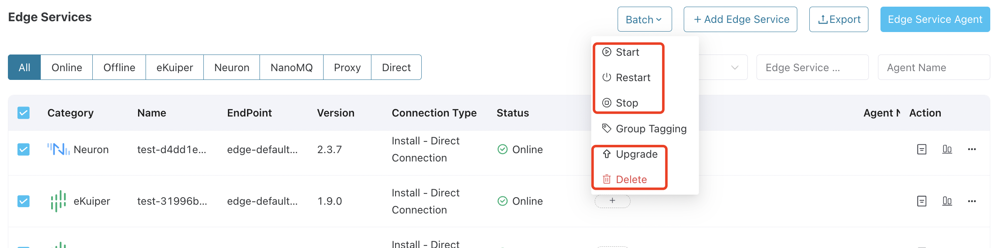

# Edge Service Management & Operations

ECP integrates the user interfaces of multiple versions of Neuron and eKuiper edge services, allowing for remote connectivity, configuration, monitoring, and management of individual edge services. Additionally, for deployments on Kubernetes, ECP provides a batch management feature for managing multiple hosted edge service instances collectively, further enhancing the efficiency and convenience of edge service management.

   

## Manage Edge Services

ECP supports managing Neuron, eKuiper, and NanoMQ on an instance level. 

### Manage Neuron Instance

ECP consolidates the user interfaces of various versions of Neuron. This allows you to set up and manage multiple Neuron instances directly within ECP. Remote configuration of Neuron's northbound applications, southbound devices, groups, tags, drivers, subscriptions, and management plugins can all be easily handled. Moreover, you can monitor real-time data and manage license updates. 

For the function description of each interface configuration item, refer to the [Neuron Documentation](https://neugates.io/docs/en/latest/).

### Manage eKuiper Instance

ECP integrates user interfaces from various versions of eKuiper, allowing you to manage multiple eKuiper instances directly within the ECP platform. From here, you can remotely configure eKuiper's source tables, rules, extension plugins, files, algorithm packages, functions, and templates.

For the function description of each interface configuration item, refer to the [eKuiper Documentation](https://ekuiper.org/docs/en/latest/).

### Manage NanoMQ Instance

Manage multiple NanoMQ instances directly within the ECP platform. From here, you can import, edit and delete of NanoMQ instance.

For the function description of each interface configuration item, refer to the [NanoMQ Documentation](https://nanomq.io/docs/en/latest/).

### Manage Edge Services in Bulk (Kubernetes Deployment)

ECP offers the capability to manage multiple edge services simultaneously. This section introduces how to efficiently start, stop, restart, and delete multiple edge services in a batch manner.

:::tip
This feature is exclusively applicable to ECP deployed on Kubernetes and for edge services that are hosted within the ECP environment. For more details on the compatibility and restriction, see [Version Compatibility](../others/version_limitations).
:::

To manage the edge services in bulk:

1. Log in as system admin, organization admin, or project admin. 

2. On the **Workspace** -> **Edge Services** page, navigate to the **Edge Services** panel. 

3. Click to check the target edge services, and select the operation and maintenance operations to be performed in batch, including **Start**, **Stop**, **Restart**, and **Delete**. 

   Note: The delete operation is irreversible, please proceed with caution.

All operations will be logged in the operation audit. To view these logs, navigate to the **Administration** page and click **Audit**. For detailed information about audit, see [Audit](../system_admin/operation_audit.md).

## Export Edge Services

ECP supports bulk export of edge service data. Operators can export all edge service information for a project into a single local CSV file. Both admins and regular users can execute this batch export feature. 

## Filter Edge Services

ECP enables the filtering of the edge services based on:

- Status filtering: Display only online or offline edge services.
- Product type filtering: Filter services by type, such as eKuiper or Neuron.
- Connection mode filtering: Show services based on their connection mode, either Direct or via Broker.
- Tag filtering: Select services using specific [tags](./batch_tag.md), for example, filter edge services with tags  `180` and `Quality Inspection Data Collection`.
- Fuzzy filtering: Search services with similar service names or agent names.

Multiple filters can be combined for a more refined search.

 

## Edit Instance Configurations

In ECP, edge services are either hosted by ECP or externally created but overseen by ECP. For ECP-hosted services, you can edit the **Name** by clicking the edit icon under the **Action** column. For externally managed services, the service name and endpoint can be edited.

## More Operation Actions

Additional operations and maintenance features are available under the **Action** column. 

- By clicking the detail icon, you can access a comprehensive view of the edge service. 

- By clicking the monitor icon, you can observe the operational status of the service. For more information on monitoring, refer to [Monitor Edge Services](../monitor/monitor_edge.md). 

- For viewing running logs of the instance, click the more icon and select Log.

- You can also delete the instance by clicking the delete icon.
  - If the instance is hosted in ECP, it will be completely removed. 
  - If it's managed by ECP, only its registration information in ECP will be deleted, leaving the edge instance unaffected.

