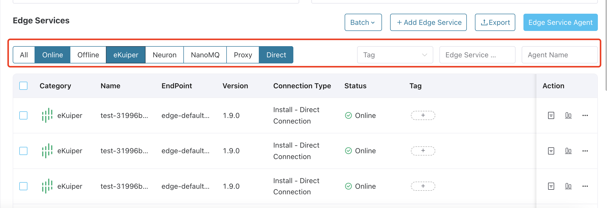

# Edge Service Operations

ECP integrates the user interfaces of NeuronEX edge services, allowing for remote connectivity, configuration, monitoring, and management of individual edge services. Additionally, for deployments on Kubernetes, ECP provides a batch management feature for managing multiple hosted edge service instances collectively, further enhancing the efficiency and convenience of edge service management.

   

## Manage Edge Services

ECP supports managing NeuronEX on an instance level. 

### Manage NeuronEX Instance

ECP consolidates the user interfaces of NeuronEX. This allows you to set up and manage multiple NeuronEX instances directly within ECP and configure data collection and data processing functions remotely.

- Data collection function includes configuration for northbound applications, southbound devices, groups, tags, drivers, subscriptions, and management plugins can all be easily handled. Moreover, you can monitor real-time data and manage license updates. 
- Data processing function includes configuration for source tables, rules, extension plugins, files, algorithm packages, functions, and templates.

For the function description of each interface configuration item, refer to the [NeuronEX Documentation](https://docs.emqx.com/en/neuronex/latest/).

## Export Edge Services

ECP supports bulk export of edge service data. Operators can export some or all edge service information for a project into a single local CSV file. Both admins and regular users can execute this batch export feature. 

## Filter Edge Services

ECP enables the filtering of the edge services based on:

- Status filtering: Display only online or offline edge services.
- Connection mode filtering: Show services based on their connection mode, either Direct or via Broker.
- Tag filtering: Select services using specific [tags](./batch_tag.md), for example, filter edge services with tags  `180` and `Quality Inspection Data Collection`.
- Fuzzy filtering: Search services with similar service names or agent names.

Multiple filters can be combined for a more refined search.

 

## Edit Instance Configurations

In ECP, edge services are either hosted by ECP or externally created but overseen by ECP. For ECP-hosted services, you can edit the **Name** by clicking the **Edit** icon under the **Action** column. For externally managed services, the service name and endpoint can be edited. Please note that only admins can perform the edit action. 

## Update Tag Point

If you want to update tag point for edge services either hosted by ECP or externally created but overseen by ECP, clicking the **Update Node Point** icon under the **Action** column. Hover over the  `?` tooltip to get information about already allocated tag point and total tag quota limited in the license, as well as tag point actually used in the NeuronEX. It is required that the updated tag point not less than the point used by the NeuronEX, and not exceed the tag quota of the license. Please note that only admins can perform the edit action. 

## View Edge Service Details

You can click the **Details** icon under the **Action** column to view the detailed information of the edge service. Both admins and regular users can execute this batch export feature. 

## View Edge Service Log

You can click the **Log** icon under the **Action** column to view the logs of the edge service. Both admins and regular users can execute this batch export feature. 

## Delete Edge Service

You can click the **Delete** icon under the **Action** column to delete a single edge service. You can also click **Batch** -> **Delete** to delete multiple edge services:

Additional operations and maintenance features are available under the **Action** column. 

- If the instance is hosted in ECP, it will be completely removed. 
- If it's managed by ECP, only its registration information in ECP will be deleted, leaving the edge instance unaffected.

Please note that only admins can perform the edit action. 

