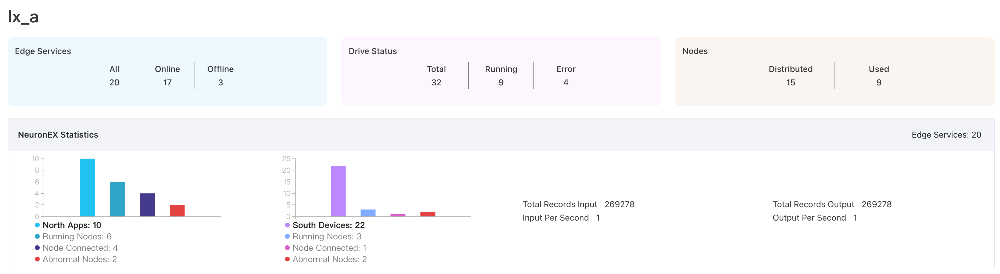

# Project Level Overview

After finishing creating the edge service instances or adding existing edge services, you can get a project-level overview of edge services.

## Basic Statistics

- Edge Services: The number of all or filtered edge services.
- Members: The number of members in the project.

## Neuron Statistics

- Neuron Services:  The number of Neuron instances managed in the system.
- North: Northbound statistical information
  - North Apps: The total number of northbound nodes in all Neuron instances.
  - Running Nodes: The total number of northbound nodes currently running in all Neuron instances.
  - Node Disconnected: The total number of disconnected or offline northbound nodes in all Neuron instances.
- South: Southbound statistical information
  - South Devices: The total number of southbound nodes in all Neuron instances.
  - Running Nodes: The total number of southbound nodes currently running in all Neuron instances.
  - Node Disconnected: The total number of disconnected or offline southbound nodes in all Neuron instances.
- Abnormal Node Display: Neuron instances in abnormal state. Click **More** to view all abnormal instances.

## eKuiper Statistics

The eKuiper statistics card provides insights into:

- eKuiper Services: Total number of eKuiper instances managed in ECP.
- Rules: Total number of rules across all eKuiper instances.
- Total Records Input: The total input data in all running eKuiper instances.
- Total Records Output: The total output data in all running eKuiper instances.
- Input Per Second: The average amount of data flowing into all running eKuiper instances per second.
- Output Per Second: The average amount of data flowing out of all running eKuiper instances per second.
- Error nodes: eKuiper instances in abnormal state. Click **More** to view the full list. 

Underneath these two cards, you'll find the edge service list. This provides details about each instance, including category, name, endpoint, version, connection type, status, tags, and agent name. Moreover, you can perform O&M actions per instance.
