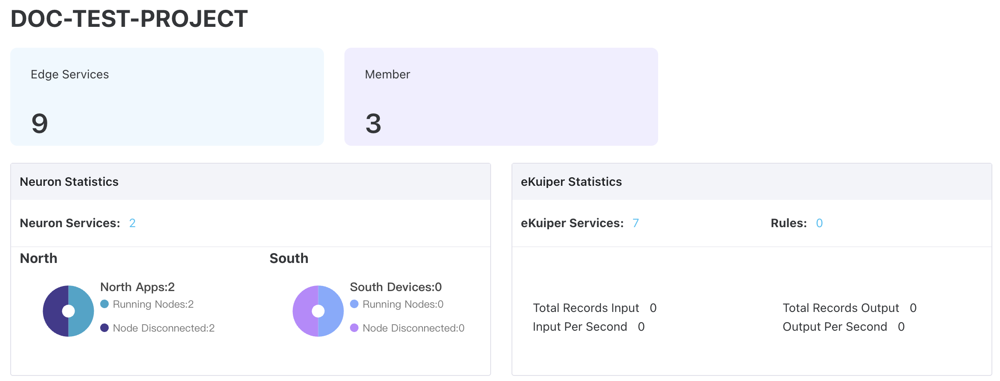

# Edge Service Monitoring

After finishing creating the edge service instances or adding existing edge services, you can get a project-level overview of edge services.

## Basic Statistics

- Edge Services: The number of all edge services, online edge services and offline edge services.
- Drive Status: The number of total nodes, running nodes and error nodes in the project.
- Rule Status: The number of total rules, running rules and stopped rules in the project.
- Tags: The number of tags which have been allocated to edge services and which have been used in edge services.

## NeuronEX Statistics

- Edge Services: The number of NeuronEX instances managed in the system.
- South: Southbound statistical information
  - South Devices: The total number of southbound nodes in all NeuronEX instances.
  - Running Nodes: The total number of southbound nodes currently running in all NeuronEX instances.
  - Node Connected: The total number of connected southbound nodes in all NeuronEX instances.
  - Abnormal Nodes: The total number of abnormal southbound nodes in all NeuronEX instances.
- North: Northbound statistical information
  - North Apps: The total number of northbound nodes in all NeuronEX instances.
  - Running Nodes: The total number of northbound nodes currently running in all NeuronEX instances.
  - Node Connected: The total number of connected northbound nodes in all NeuronEX instances.
  - Abnormal Nodes: The total number of abnormal northbound nodes in all NeuronEX instances.
- Data flow information
  - Total Records Input: The total input data in all NeuronEX instances.
  - Total Records Output: The total output data in all NeuronEX instances.
  - Input Per Second: The average amount of input data per second in all NeuronEX instances.
  - Output Per Second: The average amount of output data per second in all NeuronEX instances.

## Driver and Rule Lists

Underneath these two cards, you'll find the driver and rule lists for edge services, like list for not running drivers, list for abnormal drivers, list for not running rules. These lists provide name and type for each driver or rule, and details about instance it runs on, including edge service name, status, endpoint and version. You can filter edge services in the list by nam. Moreover, you can perform O&M actions per instance by clicking **Details** button from Action column.