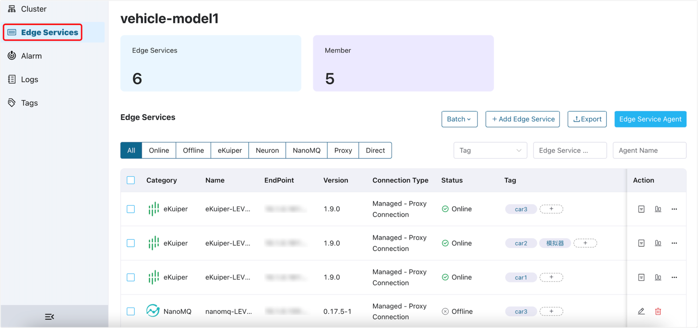

# Manage Edge Services

## Edge Service

Edge service NeuronEX can realize data collection, data preprocessing, edge computing and other capabilities. In many industrial scenarios, a large number of edge services need to be deployed to achieve data interconnection, global optimization and agile production.

ECP supports the batch creation and management of hundreds of edge service instances in Kubernetes, docker and other environments, and supports edge service configuration management and batch configuration distribution, and accelerate the rapid deployment and implementation of IIOT projects.

ECP supports the management of edge services through managed and hosted:
- **Managed**: Managed refers to the edge service created and deployed by users.
- **Hosted**: Hosted refers to the edge service created and deployed by the ECP platform. The hosted edge service supports deployment, start, stop, and upgrade by ECP.

Managed mode, ECP supports two methods: [Managed - Direct Connection](./batch_import.md) and [ Managed - Agent](./edge_agent_management.md). Users can choose the appropriate management method according to the actual scenario.

Hosting mode, ECP supports [Host Edge Services By Docker](./batch_intall.md) method.

There are functional differences between managed and hosted edge services, as follows:

|Function Category| Function Name | Hosted Edge Service | Managed Edge Service |
| :--------------| :-------| :----| :----|
|Edge Services Management|Edge Services NeuronEX Management|✅|✅|
||Edge Service Monitoring|✅|✅|
||Edge service alarm|✅|✅|
||Edge service log management|✅|✅|
||Edge service configuration delivery|✅|✅|
||Tags|✅|✅|
||Edge service installation|✅|❌|
||Edge service upgrade|✅|❌|
||Edge service start and stop control|✅|❌|

Please refer to the following chapters for the specific content of this chapter:

- [Managed Edge Services](batch_import)
- [Managed Edge Services By Agent](edge_agent_management)
- [Host Edge Services By Docker](batch_intall)
- [Upgrade Edge Services](batch_upgrade)
- [Edge Service Operations](edge_ops)
- [Edge Service Config Management and Delivery](edge_resource_management)
- [Edge Service Monitoring](edge_project_statistics)
- [Authenticate Edge Services](e2c)
- [Tags](batch_tag)
- [Edge Cloud Tunnel](edge_cloud_tunnel)

## Access Edge Services Workspace

After logging in, you can find the **Workspace** option in the ribbon area. Click on it to navigate to the **Workspace - Edge Services** page. This page provides an overview of the edge services hosted or managed by ECP and displays the current number of members in your organization. 

:::tip

System admin, organization admin, project admin, and regular users all can access this page, however, regular users do not have access to the administration page.

For the permission of each role, see [Permissions and Roles](../acl/authorize.md#permissions-and-roles).

:::

There are some functional differences between ECP deployments based on Kubernetes and those based on Docker. For details, see [Kubernetes vs. Docker Deployments](../install/introduction.md#feature-difference-between-kubernetes-and-docker-deployment).

 

