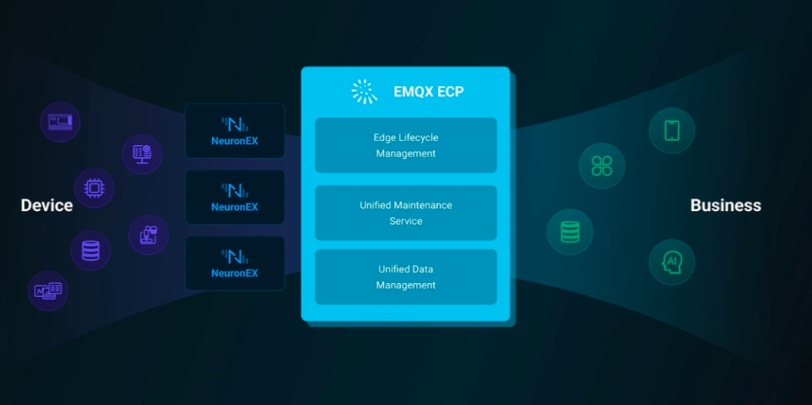
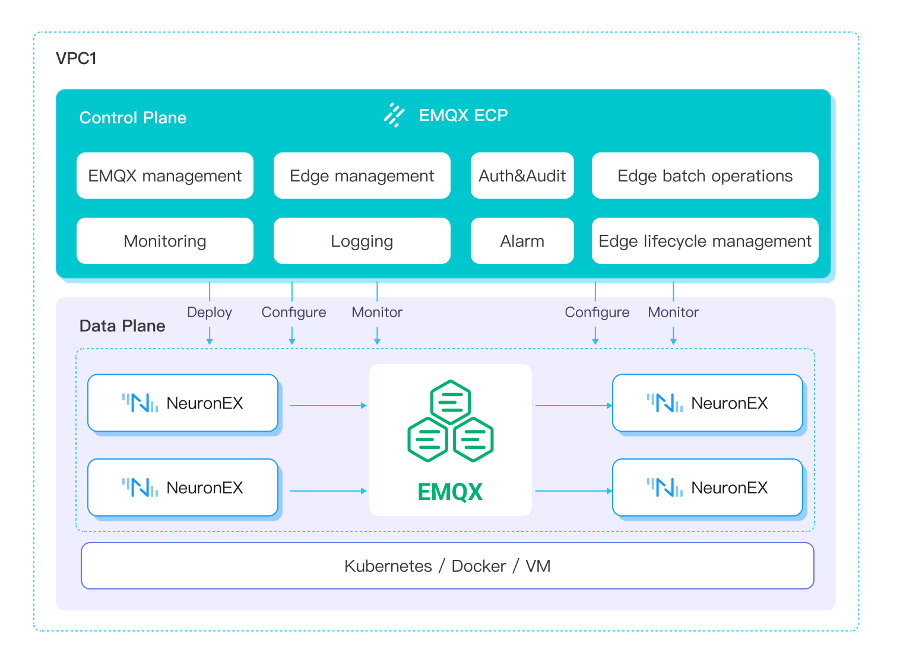

# Product Overview

## Introduction
EMQX ECP is a data platform for IIoT. It is designed to meet the requirements of large-scale data collection, processing, storage and analysis in industrial settings. ECP facilitates data interconnectivity in the industrial sector, driving data-driven production and operations.

## Product Benefits

- **Software-Defined Manufacturing**
    
    Software-Defined Manufacturing integrates digital technologies like the IOT, big data, and AI into the manufacturing process. It uses data as its core for production monitoring, decision optimization, and intelligent manufacturing, ultimately improving efficiency, quality, and sustainability.

- **Eliminating Data Silos**

    [Unified Namespace (UNS)](https://www.emqx.com/en/blog/unified-namespace-next-generation-data-fabric-for-iiot) is employed to unify the vast amount of factory data, enabling interoperability between OT and IT systems, connecting them from the edge to the cloud and effectively eliminating data silos.

- **Industrial Artificial Intelligence**

    Transfer manufacturing data to the cloud in real-time for AI/ML training.Deploy and apply the trained ML models to the factory floor from the cloud.

- **Real-time Analysis**

    Supporting real-time streaming data processing and forwarding, real-time edge-based raw data preprocessing, filtering, and analysis reduce latency, conserve bandwidth, and offload computational tasks from cloud platforms.

- **Cloud-Edge Collaboration**

    Seamlessly integrated with cloud platforms, it provides full lifecycle management of edge software, unified remote configuration, and management. Real-time remote monitoring allows for timely identification of operational anomalies to ensure system reliability.

- **Seamless Integration**

    It adapts to and integrates with on-site hardware, network infrastructure, and more. Whether it's servers, industrial PCs, or gateway hardware and various network environments, it can be deployed and used without being constrained by hardware manufacturers.

## Feature Overview

### Architecture

 

### Platform Features

 

[Edge Service Management](./edge_service/introduction.md)
- Remote Configuration Management

- Batch Deployment, Upgrades, Start-Stop

- Configuration Template and Algorithm Management

- Batch Configuration Distribution

- Dynamic Point Assignment Management

[EMQX Management](./cluster/introduction.md)
- EMQX Cluster Management

- EMQX Cluster Auto-Deployment

- EMQX Cluster Scaling

- EMQX Cluster Version Control

- Data Forwarding and Storage

[Unified Maintenance Service](./monitor/introduction.md)
- Edge Service Monitoring

- Health Monitoring and Anomaly Alerts

- Alert Management, Alert Rule Configuration

- Alert Notifications

- Unified Logging Service

[Enterprise-Level Services](./system_admin/introduction.md)
- Operational Auditing

- Tenant Isolation

- Management Based on Projects and User Roles

- Business Grouping

- Unified Authentication

## Key Concepts

 ECP encompasses several key concepts that are crucial to its operation and overall understanding:

1. **Cloud-end Software**: Applications deployed on cloud platforms or data centers to complete data aggregation and storage, unified operation and maintenance management, ECP and EMQX clusters, etc.
2. **Edge-end software**: Applications that run on the industrial edge to implement data collection and access, data preprocessing calculations and low-latency control, and are managed by ECP, here we refer to NeuronEX, etc.
3. **EMQX Cluster**: In ECP, clusters refer to the EMQX clusters deployed on cloud servers, which serve as high-performance message broker for IoT devices. 
4. **NeuronEX**: NeuronEX is an Industrial Edge Data Hub that focuses on real-time industrial data access and intelligent analysis, enabling you to swiftly gain business insights and enhance operational efficiency and sustainability.
5. **Organization**: This facilitates enterprise-level multi-tenant functionality through organization management. This means that one system can support multiple tenants, each operating independently and managed separately by the system administrator.
6. **Project**: The project feature of ECP empowers users to fine-tune resource management within their organizations. System admins, organization admins, project admins, and regular users. Authority design and implementation are based on the RBAC model. 
7. **Roles**: ECP provides four roles: system administrator, organization administrator, project administrator and ordinary user. It designs and implements a permission system based on the RBAC model.
8. **Task**: A Task refers to a specific function or operation performed by the ECP. These tasks can run automatically in the background without user intervention. 
9. **Hosted**: Hosted refers to the edge service NeuronEX or EMQX cluster created and deployed by ECP, which is called a hosted NeuronEX service or a hosted EMQX cluster.

10. **Managed**: Managed refers to the edge service NeuronEX or EMQX cluster created and deployed by the user, and added to ECP for management, which is called managed NeuronEX service or managed EMQX cluster.

11. **Direct Connection mode**: Direct Connection mode means that the ECP platform can directly access edge services or EMQX clusters, that is, ECP, edge services and EMQX clusters are in the same network or VPC.

12. **Proxy mode**: Proxy mode means that the ECP platform cannot directly access and establish connection with edge services or EMQX clusters, that is, edge services or EMQX clusters do not have independent IPs. At this time, the edge node or EMQX cluster needs to actively initiate a connection to the ECP through a proxy service and establish connection. Then the ECP can communicate normally with the edge service or EMQX cluster.
