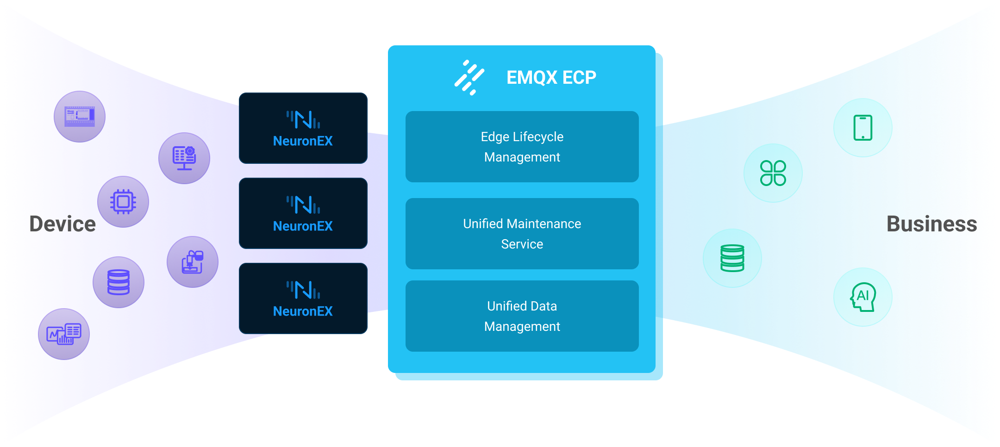

# Product Overview

## Introduction
EMQX ECP (EMQX Edge-to-Cloud Platform) is an advanced MQTT platform designed for edge-cloud collaboration. It equips you with efficient and effective control over your MQTT messaging services, bridging the gap between edge devices and cloud infrastructure. 

With ECP, you can effortlessly establish connections from edge to cloud. This empowers you to confidently roll out your IoT solutions and extract the utmost value from your IoT data. Dive into the full potential of IoT with EMQX ECP.

## Product Benefits

- **Edge-Cloud Collaboration**: One platform manages cloud-edge services for bidirectional data movement.

- **Multi-Tenancy Support**: Protect your data security with our multi-tenant architecture.

- **Multi-cluster Management**: Managing multiple clusters through project-based management and optimizing resource utilization using one floating license.

- **Flexible Deployment Options**: Run EMQX ECP on any cloud of your choice, whether it’s private, public, or hybrid cloud.

- **Enterprise-grade security**: RBAC, SSO, Link Encryption, and Operational logs with auditing ensure enterprise-grade security.

- **Ops Friendly**: Improve your operational efficiency with ECP’s powerful observability and alerting system.

## Feature List

|Features| Description | Feature List |
| :--------------| :----------------| -----------------|
|[Multi-tenant architecture](./system_admin/introduction.md)| ECP adopts a multi-tenant architecture to better protect your data security. This multi-tenant architecture enables organizations and projects to be seamlessly integrated, streamlining resource management across various levels. | Organization  Project |
|[Access Control](./acl/introduction.md)| ECP access control serves as a vital mechanism for restricting and managing the access privileges of different users or roles within the ECP platform. | Login authentication  Role based access control  User management |
|[EMQX cluster management](./cluster/introduction.md)|With ECP's cluster management features, users can efficiently handle multiple clusters, create new ones, onboard existing ones, and perform various tasks like troubleshooting, scaling, modifying network types, adjusting connections, upgrading/downgrading, transferring ownership, and deletion|Cluster life cycle management  Horizontal/Vertical expansion  Network access mode  Cluster upgrade  Cluster management  Logs and monitoring|
|[Edge Management Service](./edge_service/introduction.md)|ECP excels in efficiently managing various aspects of edge services as part of its primary functions. These include seamless deployment, streamlined management, flexible configuration, streamlined batch operations, and optimization for popular edge software such as Neuron, eKuiper, and NanoMQ.|Batch installation  Manage existing edge services with ECP Edge Agent  Authentication  Batch configuration distribution  Batch upgrade|
|[Logs and observability](./monitor/introduction.md)|ECP platform's logs and observability feature offers a comprehensive solution for managing and monitoring both cloud-based EMQX clusters and edge devices.|Logs  EMQX cluster monitoring  Edge Service monitoring  Alarms|
|[System Settings](./system_admin/system_managment.md)| The system settings in ECP constitute a crucial module within the platform, comprising three distinct sub-modules: resource allocation, universal settings, and customizing login page: | Resource setting  General setting  Customize login page |
|[Operation Audit](./system_admin/operation_audit.md)| ECP's Operation Audit ensures extensive monitoring of crucial user activities in the platform, including access logs, and potential anomalies, thus ensuring prompt discovery and mitigation of security issues. ||
|[License Management](./install/license_setting.md)|Install and update the license.||

## Key Concepts

 ECP encompasses several key concepts that are crucial to its operation and overall understanding:

1. **Cloud-end Software**: This refers to programs deployed on cloud computing infrastructure, including ECP and EMQX clusters.
2. **Edge-end software**: These are applications running on edge computing devices for connecting edge devices, such as sensors, programmable logic controllers (PLCs), and smart home devices. Key examples include Neuron, eKuiper, NanoMQ, and ECP Edge Agent.
3. **EMQX Cluster**: In ECP, clusters refer to the EMQX clusters deployed on cloud servers, which serve as high-performance message broker for IoT devices. 
4. **Neuron**: Neuron is a lightweight industrial protocol gateway software. It is open source based on the LGPL protocol. New drivers or application support can be added to Neuron through extended plug-ins.
5. **eKuiper**: eKuiper is a lightweight IoT edge analysis and stream processing open-source software implemented in Golang, which can run on various resource-constrained edge devices. The main goal of eKuiper is to provide a streaming software framework at the edge.
6. **NanoMQ**: NanoMQ is a next-generation lightweight, high-performance MQTT messaging server for IoT edge computing scenarios.
7. **ECP Edge Agent**: In the edge scenario, where the edge side has its own VPC or LAN that is separate from the ECP and EMQX clusters in the cloud, the edge side requires a proxy configuration to access the cloud services. To address this scenario, ECP provides the Edge Agent component.
8. **Organization**: This facilitates enterprise-level multi-tenant functionality through organization management. This means that one system can support multiple tenants, each operating independently and managed separately by the system administrator.
9. **Project**: The project feature of ECP empowers users to fine-tune resource management within their organizations. System admins, organization admins, project admins, and regular users. Authority design and implementation are based on the RBAC model. 
12. **Task**: A Task refers to a specific function or operation performed by the ECP. These tasks can run automatically in the background without user intervention. 

