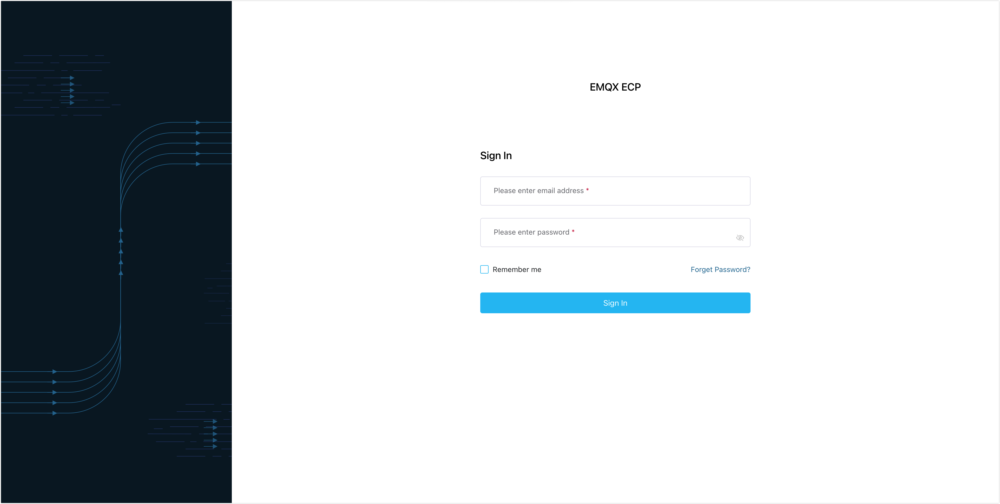

# Deploy with Kubernetes

This section introduces how to deploy ECP with Kubernetes. 

## Prerequisites

- Kubernetes: 1.22.0 or above
- [Helm](https://helm.sh/): 3 or above

## Get Installation Package

If you're interested in obtaining the installation packages for ECP and EMQX Edge Operator, please visit EMQ's website and follow the steps below:

1. Navigate to the [Contact Us](https://www.emqx.com/en/contact?product=emqx-ecp) page on the EMQ website.
2. Fill out the form with your relevant contact details, including your name,  company name, email address, country or region, and your phone number. 
3. In the text field, specify your interest in the ECP and EMQX Edge Operator installation packages. Be clear about your use case and requirements to ensure that you're provided with the most suitable resources.
4. After you've filled in all the necessary details, click **Submit**.

## Select a Storage Class

For the purpose of persisting ECP operational data, it's necessary to select an appropriate persistent volume storage class. **ECP highly recommends selecting a persistent volume located on shared storage to ensure ECP's availability even during a single node failure within the Kubernetes cluster**. <!--need to confirm-->

You can use the command below to identify the available storage classes in Kubernetes:

```bash
$ kubectl get storageclasses
```

## Install Dependencies

1. Run the command below to Install cert-manager. <!--这里需要需要解释下每个依赖项是做啥的-->

   ```bash
   $ helm repo add jetstack https://charts.jetstack.io
   $ helm repo update
   $ helm install cert-manager jetstack/cert-manager \
       --set installCRDs=true \
       --namespace cert-manager \
       --create-namespace \
       --version 'v1.11.0'
   ```

2. Run the command below to install telegraf-operator.

   ```bash
   $ helm repo add influx https://helm.influxdata.com
   $ helm repo update
   $ helm install telegraf-operator influx/telegraf-operator --create-namespace --version '1.3.10'
   ```

3. Run the command below to install EMQX Operator.

   ```bash
   $ helm repo add emqx https://repos.emqx.io/charts
   $ helm repo update
   $ helm install emqx-operator emqx/emqx-operator \
       --namespace emqx-operator-system \
       --create-namespace \
       --set installCRDs=true  \
       --version '1.0.11-ecp.2'
   ```

4. Run the command below to install EMQX Edge Operator.

   ```bash
   $ helm install edge-operator emqx/edge-operator \
      --version 0.0.5 \
      --namespace edge-operator-system \
      --create-namespace
   ```

5. Run the command below to install PostgreSQL and please select the storage class that supports shared storage. 

   ```bash
   $ helm repo add bitnami https://charts.bitnami.com/bitnami
   $ helm repo update
   $ helm -n emqx-ecp install emqx-ecp-postgresql bitnami/postgresql \
       --create-namespace \
       --version '12.1.14' \
       -f emqx-ecp-chart/postgres.yaml \
       --set global.storageClass=<StorageClassName>
   ```

## Install ECP

1. The installation package you receive will generally be named `emqx-ecp-install-<x.y.z>.tar.gz`, where `<x.y.z>` denotes version information.  Execute the following command to extract the installation, and the extracted contents will be in the `./emqx-ecp-chart` folder.

   ```bash
   $ tar -xzvf emqx-ecp-chart-<x.y.z>.tar.gz # decompress
   ```

2. Run the command below to install EMQX ECP and please select the storage class that supports shared storage. 

   ```bash
   $ helm -n emqx-ecp install emqx-ecp --set storage.storageClassName=<StorageClassName> emqx-ecp-chart
   ```

3. Wait till ECP is ready. 

   ```bash
   $ kubectl -n emqx-ecp wait --for=condition=Ready pods -l 'app=emqx-ecp-main'
   pod/emqx-ecp-main-76dcb6b5c4-2f7wp condition met
   ```

## Create a Superuser

Execute the command below to create a superuser. You will need this superuser account and password to log into ECP later, so please ensure they are stored securely.

```bash
$ ./emqx_ecp_ctl create-user
Please input username:          # should be emails
Please input password:          
Please input password again:    
Please input your name:         # Set a display name for your account, for example, ECPAdmin
```

## Log in to ECP 

You have now successfully deployed ECP with Docker. Open your web browser and enter `http://localhost:8082/` (replace `localhost` with your IP address if necessary) into the address bar to access the ECP platform. 



Log in with your superuser account, and you can now start to [create users](../system_admin/user_management.md), configure [access control rules](../acl/introduction.md), and begin to set up [organizations and projects](../system_admin/introduction.md). 