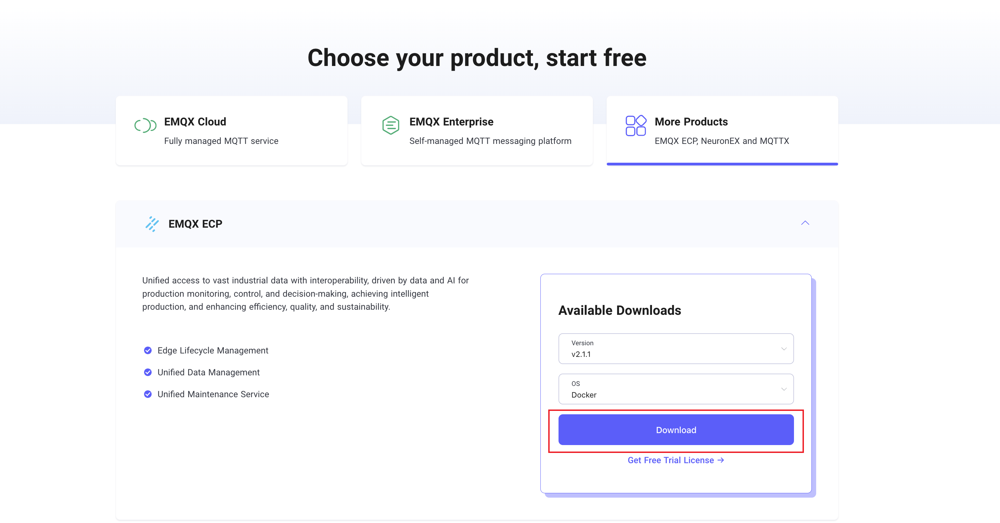
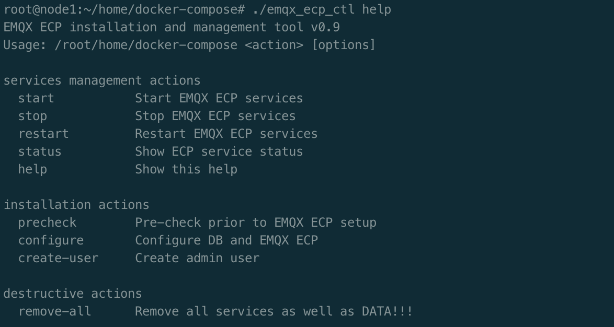

# Deploy with Docker

This section introduces how to deploy ECP with Docker. 

## Platform Support

EMQX ECP supports the following versions of operating systems: 

| OS             | Version          |
| :------------- | :--------------- |
| Ubuntu         | 20.04 or 22.04   |
| CentOS         | 7.0 or above     |
| Docker-Compose | 1.27.1 or above  |
| Docker         | 20.10.0 or above |

| Port               | Protocal      |
| :----------------- | :------------ |
|  8082              | TCP+UDP       |

## Get Installation Package

You can download the installation package from the [ECP product download](https://www.emqx.com/en/try?product=emqx-ecp) page on the EMQ website. Select the system as `docker` to download the ECP installation package.



## ECP Installation

Upload the downloaded installation package `emqx-ecp-docker-compose-installer-2.1.1.tar.gz` to the server, unzip it, and enter the unzipped directory. Then, execute the following steps to complete the ECP installation.

### Dependency Check
execute the following command to check the dependent components and docker version.
```shell
./emqx_ecp_ctl precheck
```
If the following content is output, the check is passed:


### Configure Environment
Execute the following command to configure the ECP installation environment.
```shell
./emqx_ecp_ctl configure
```
Press Enter to skip all, which means that the default ECP version is used, the image is obtained from the public docker image repository, and the persistent data storage path is `[current script path]/datavolumes/`.


### Start ECP Service
- If necessary, modify the configuration file `emqx_ecp.conf`.
    - If the `ElasticSearch` service already exists, the following configuration may be modified：
    ```shell
    # telegraf config
    TELEGRAF_EXTERNAL_PORT=10514
    EL_URL="https://elasticsearch:9200"
    EL_USERNAME="elastic"
    EL_PASSWORD="elastic"
    ```
:::tip Note
If ElasticSearch connection information is incorrectly configured, the logging function is unavailable, but other functions are not affected.
:::

- Execute the following command to start the ECP service.
    ```shell
    ./emqx_ecp_ctl start
    ```
:::tip Note
When starting the ECP service for the first time, you need to pull the software image from the public image repository, which may take some time. You can also [contact us](https://www.emqx.com/en/contact?product=emqx-ecp) to get the offline installation package.
:::

### Check Service Status
```shell
./emqx_ecp_ctl status
```


### Stop ECP Service
```shell
./emqx_ecp_ctl stop
```

### More Commands
You can use the `help` command to view more commands.
```shell   
./emqx_ecp_ctl help
```



## Create a Superuser

Execute the command below to create a superuser. You will need this superuser account and password to log into ECP later, so please ensure they are stored securely.

```bash
$ ./emqx_ecp_ctl create-user
Please input username:          # should be emails
Please input password:          
Please input password again:    
Please input your name:         # Set a display name for your account, for example, ECPAdmin
```

> **Notice**：
>
> If the version is greater than or equal to 2.3.0, it is also possible to register a superuser via the web home page.

## Log in to ECP 

You have now successfully deployed ECP with Docker. Open your web browser and enter `http://localhost:8082/` (replace `localhost` with your IP address if necessary) into the address bar to access the ECP platform. 


Log in with your superuser account, and you can now start to [create users](../system_admin/user_management.md), configure [access control rules](../acl/introduction.md), and begin to set up [organizations and projects](../system_admin/introduction.md). 
