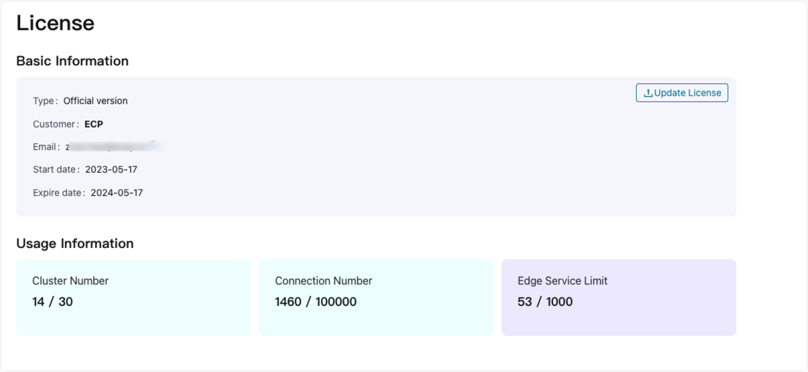
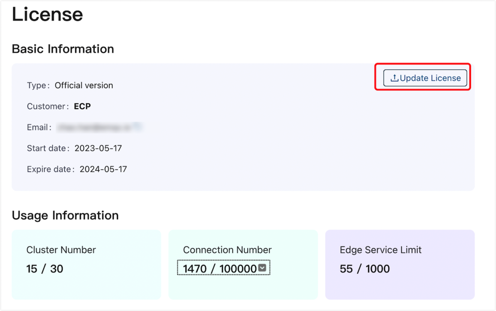

# Configure License

After completing the installation and deployment, it is necessary to configure the ECP license to utilize the full functionality of the ECP cloud-edge platform.

## ECP License

ECP utilizes a floating license mechanism that enables multiple EMQX clusters to share a centralized license and connection pool. This approach allows for efficient resource allocation across various stages (such as development, testing, and production) by eliminating the need for separate licenses and connection counts for each EMQX cluster. 

## Apply for License

ECP provides both trial and commercial licenses. The trial version allows customers to use the EMQX product suite free of charge for a 15-day period, with a concurrent connection limit of 10,000 connections. To request a trial license, please contact us using the sales email address, and we will promptly send it to you.

For commercial licenses, please contact EMQX sales for detailed information and assistance. They will provide you with the necessary details regarding commercial licensing options, pricing, and any additional information you may require.

1. Navigate to the [Contact Us](https://www.emqx.com/en/contact?product=emqx-ecp) page on the EMQ website.
2. Fill out the form with your relevant contact details, including your name,  company name, email address, country or region, and your phone number. 
3. In the text field, specify your interest in the ECP license. Be clear about your use case and requirements to ensure that you're provided with the most suitable resources.
4. After you've filled in all the necessary details, click **Submit**.

## Configure License

After the installation, Log in to ECP with the [superuser account](./install_ecp_on_kubernetes.md#create-a-superuser) created during the installation process. 

ECP provides two main tabs: **Administration** and **Workspace**.

- The **Administration** tab allows you to perform administrative tasks and system-level settings. Within this tab, you can create organizations and projects, configure resources, set up email servers, manage notifications, specify language preferences, and manage licenses.
- The **Workspace** tab is designed for operational tasks and managing specific functionalities of the ECP platform. Within this tab, you can manage EMQX clusters, oversee edge services, configure monitoring and alert rules, and access logs for troubleshooting and analysis purposes. 

To configure the license, click **License Management** on the left navigation menu. 

Below is the description of each field

- **Type**: Indicates whether it is a trial version or a commercial version.
- **Customer**: Customer name.
- **Customer Email**: Customer email address.
- **Start Date**: The date when the license becomes effective.
- **Expiration Date**: The date when the license expires.
- **Cluster Count**: The maximum number of clusters allowed by the license, along with the number of clusters already created.
- **Connection Count**: The maximum number of connections allowed by the license, along with the number of connections already established.
- **Edge Service Count**: The maximum number of edge services allowed by the license, along with the number of edge services already created and managed.

## Update License

To update the license, simply select and upload a new license file. The system will automatically update the following based on the new license:

- Subscription duration (for both ECP and EMQX) 
- Connection number
- EMQX Cluster number
- Edge services limit

This ensures that the license information accurately reflects the updated limits and durations, enabling proper management and utilization of EMQX clusters, edge services, and ECP functionalities within the revised license scope.

