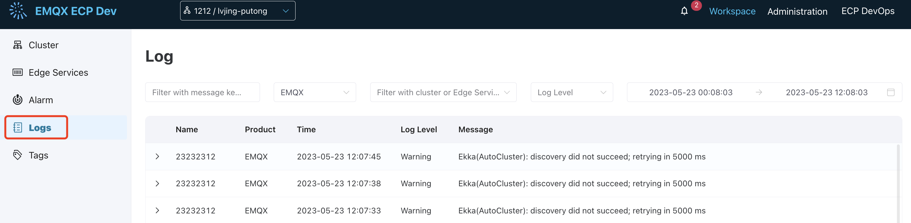
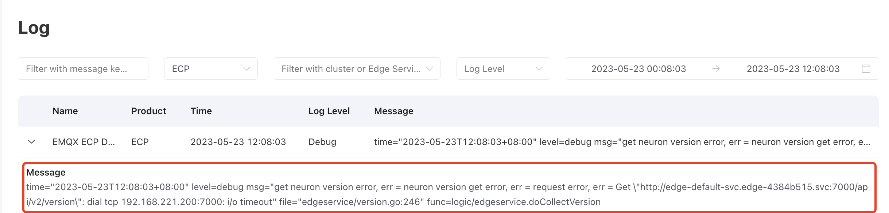
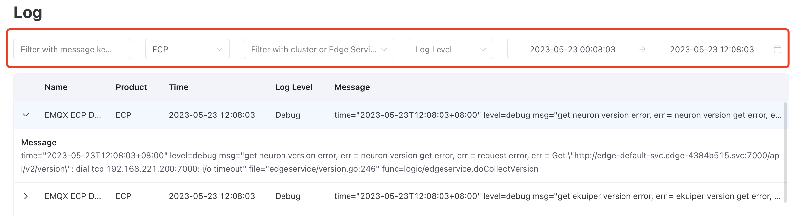

# Logs

ECP's unified logging capability allows for collecting, aggregating, storing, and querying operational logs from cloud clusters and edge services. By interfacing with external log servers Elasticsearch, ECP provides operation teams with a holistic record for tracking activities and assessing system performance.

ECP's unified logging feature offers the following benefits:

1. **Log Normalization**: This feature enables the consolidation of logs in different formats and from various cloud-edge products into a standardized format, easing management and query processes.
2. **Real-Time Collection and Storage**: ECP supports collecting, storing, and querying logs in real-time, thus enabling real-time analysis. 
3. **Data Visualization and Analysis**: ECP also provides an intuitive user face, so administrators can swiftly access and analyze real-time logs from multiple products on a single platform.

The log service is disabled by default. To start the log service, see [enable log services](../monitor/introduction.md#enable-log-service). Once enabled, ECP provides a project-level log viewing service. On the **Workspace** interface, you can enter the log service list by clicking on the **Logs** menu on the left. The unified log service provides the ability to query logs from EMQX, eKuiper, Neuron, and ECP.




## Log Levels

The ECP logging system adheres to [RFC 5424](https://www.ietf.org/rfc/rfc5424.txt) standards and categorizes logs into eight levels. From lowest to highest, these log levels are:

```
debug < info < notice < warning < error < critical < alert < emergency
```

Below is the log level currently available for ECP, EMQX cluster, Neuron, and eKuiper:

|Product|Log Level|
|:-------|:-----------------------------|
|ECP|debug, info, warning, error, alert, emergency|
|EMQX|debug, info, notice, warning, error, critical, alert, emergency|
|Neuron|debug, info, notice, warning, error|
|eKuiper|debug, info, warning, error|


## View Logs at the Project Level 

By navigating to **WorkSpace - Logs**, users can access a summary of the latest logs, each containing details such as service name, product, timestamp, log level, and a short message overview. Click on specific logs of interest to view more detailed information. These logs expedite the process of issue identification and troubleshooting, thereby enhancing overall system performance.



## Search and Filter

ECP provides advanced search and filtering options for logs, streamlining the process of identifying specific log entries. Users can filter logs by message body keywords, product type, cluster or edge service name, log level, and date range.

:::tip

When filtering logs across all product types, the most recent 100 entries will be displayed.

Log features only work on Neuron and eKuiper deployed on Kubesphere.

:::

For instance, to locate a critical log entry concerning an 'EMQX license' in the 'Production' cluster, created on '2023-04-18:



## View Logs at the Instance Level

ECP also provides instance-level log viewing capabilities. 

- For EMQX clusters, administrators can navigate to **Workspace - Cluster**, then click on the more icon of the target cluster and select **Logs**. 
- Similarly, for edge services, administrators can navigate to **Workspace - Edge Services**, then click on the more icon and select **Logs**. 

Upon selection, you will be redirected to the Logs page, where ECP automatically populates the cluster or edge service name for you.