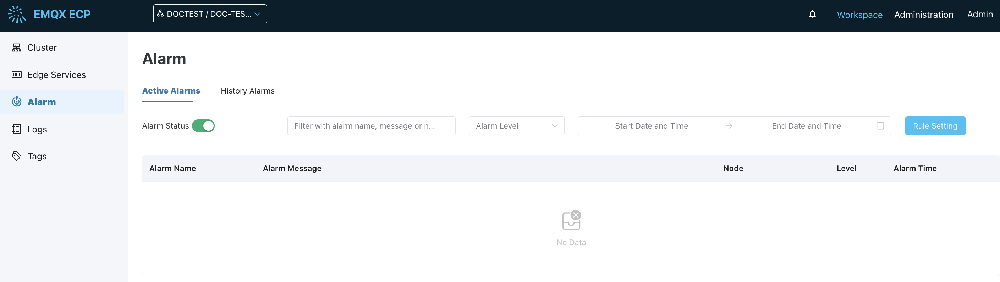
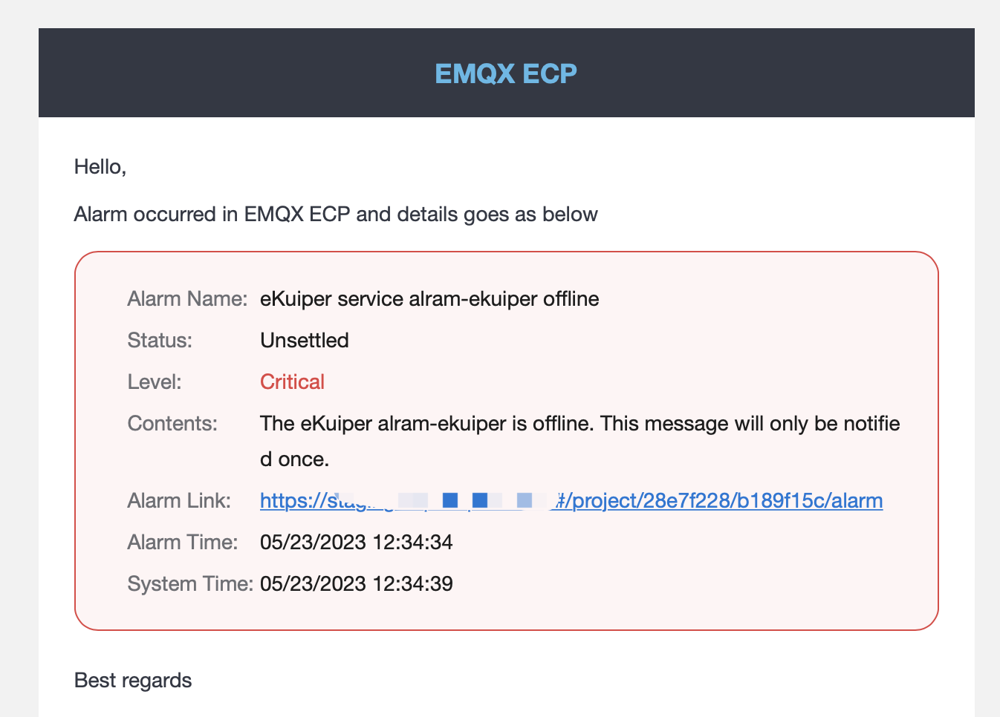

# Alarms

ECP provides an integrated monitoring and alert system that sends notifications about anomalies or malfunctions through email and WebHook. This system allows for the customization of notification scope and silence duration settings. Currently, ECP does not support customizing alarm rules.

Log in to ECP as either the admins or general user, you can check the number of unresolved alarms on the alarm icon in the top menu. Click on the icon or **Alarm** on the left navigation menu, you will be directed to the **Alarm** page, where you can view the details such as alarm name, message, associated node, alarm level, and time of alarm generation. 

## Enable Project-Level Alarm

You can also enable/disable the project-level alarms on the **Alarm** page by clicking the **Alarm Status** switch button. 

## Active and History Alarms

To streamline alarm management, ECP has provided 2 tabs on the **Alarm** page: **Active Alarms** and **History Alarms**:

- Active Alarms: Displays ongoing, unaddressed alarms, including details like alarm name, message, associated node, level, and time of occurrence.
- History Alarms: Contails alarms that have been addressed, or alarms that have persisted for over 24 hours will also be transferred to this tab.

You can also use the filtering feature of ECP to filter alarms by name, message, node, level, or generating time.

## Set Alarm Rules

Log in as system admins, organization admins, or project admins, navigate to **Workspace** -> **Alarm**, and click the **Rule Setting** button. 

### Set Email Notification

1. Click the **Email Notification** toggle switch to enable/disable email notifications. 

2. In case email notification is enabled, you can continue to set the recipients' addresses, at most 10 recipients can be added here. After the input, click **Confirm** to finish the recipient setting. Then when an alarm is triggered, a notification email will be automatically sent to the specified recipients' addresses.

   

### Set WebHook Notification

1. Click the **WebHook** toggle switch to enable/disable WebHook notifications. 

2. In case WebHook notification is enabled, you can continue to set the WebHook address in the **URL** field. After the input, you can click the **Test** button to test the connectivity.

3. Set the verification information in the **HTTP Headers** field. 

4. Click the JSON template preview to view the built-in JSON template. To customize the JSON template settings, see [System Level Configuration - Alarm](./introduction.md/#alarm). 

5. Click **Confirm** to finish the settings. Then when an alarm is triggered, a notification will be automatically sent to the specified addresses.

   

### Set Notification Scope and Resend Waiting Period

You can continue to set the notification scope and resend the waiting period:

- **Notification Scope**: ECP alarms can be critical alarms and general alarms, you can click to check the **Notify Critical Alarms Only** option, and then ECP will only send notifications for critical alarms.  
- **Resend Waiting Period**: ECP will only resend the notification for the same alarm after the waiting period. 

## Alarms Clearance

When an active alarm is addressed, ECP will send a recovery notification and move the alarm to the **History Alarms** page. 

Alarms that have been active for over 24 hours will be automatically transferred to the **History Alarms** page. 

## Alarm Storm

An alarm storm refers to a situation where a substantial amount of alarms is generated within a brief period, typically due to unforeseen issues or malfunctions impacting the host machine, Kubernetes platform, or applications. 

These alarms can be repetitive or even disruptive, potentially affecting the overall system stability. In the event of an alarm storm, ECP promptly sends a dedicated notification email and conducts an assessment of the existing alarm rules and thresholds.

Please refer to the table below, which outlines the strategies that ECP will employ to effectively address various types of alarms storms.

| Issue                                                        | Strategy                                                     |
| :----------------------------------------------------------- | :----------------------------------------------------------- |
| Recurring alarms from the same instance                      | Implement a silence duration strategy to control the alarm storm |
| Distinct alarms from the same instance                       | Implement a silence duration strategy to control the alarm storm |
| A simultaneous occurrence of a large number of distinct alarms from different instances | 1. If 30 alarms are issued within a minute, it is considered an alert storm 2. Upon occurrence of an alert storm, the project-level alarm switch is automatically deactivated, while sending an alarm storm notification email 3. Alarm list, email notifications, and WebHooks are concurrently deactivated <!--告警列表是？--> |
| Damage to underlying resources                               | The same as above                                            |
| Clearing of Alert Storm Alarms                               | A scheduled clearance strategy: Alarms that have persisted for over 24 hours are automatically removed from the current alarm list and moved to the historical alarm list |
