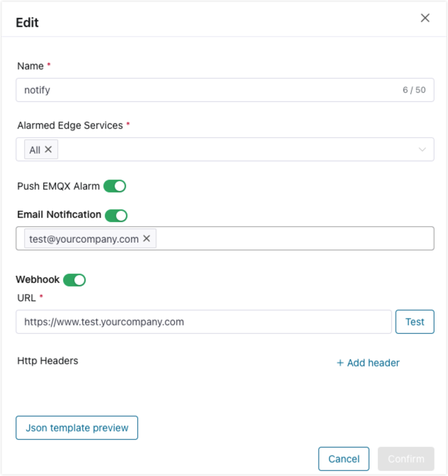

# Alarms

ECP provides an integrated monitoring and alert system that sends notifications about exceptions or malfunctions through email and WebHook. This system allows for the customization of notification scope and silence duration settings.

Log in to ECP as either the admin or general user, you can check the number of unresolved alarms from the alarm icon in the top menu. Clicking on the icon or **Alarm** on the left navigation menu, you will be directed to the **Alarm** page, where you can view the details such as alarm type, message, associated node, alarm level, and time of alarm generation time. 

## Active and History Alarms

To streamline alarm management, ECP has provided 2 tabs on the **Alarm** page: **Active Alarms** and **History Alarms**:

- Active Alarms: Displays ongoing, unresolved alarms, including details like alarm type, message, associated node, level, and time of occurrence.
- History Alarms: Displays alarms that have been resolved.


You can also use the filtering feature of ECP to filter alarms by type, message, node, level, or time.

### Historical Alarm Delete

ECP supports cleaning of historical alarms. In the **History Alarms** tab, click the **History Alarm Delete** button to choose to delete historical alarm records by time or number.

- **Delete by time**: All historical alarm records whose occurrence time exceeds the specified time range will be deleted.
- **Delete by number of items**: Delete the specified number of historical alarm records based on the alarm occurrence time, starting from the earliest. The maximum deletion limit for a single deletion operation is 50,000.


## Basic Alarm Settings

Log in as system admins, organization admins, or project admins, navigate to **Workspace** -> **Alarm**, and enter into the **Alarm rules and settings** tab. 


### Alarm Status

You can enable/disable the project-level alarms by clicking the **Alarm Status** switch button. 

### Notification Scope

Alarms are categorized into two levels: `Critical` and `Normal`. `Critical` is for alarms that require immediate attention, while `Normal` is for those that have limited impact on the production environment. 

When "Notify Critical Alarms Only" is checked, notifications will be sent for only critical alarms. Otherwise, notifications will be sent for all alarms.

'Notification' refers to sending alarms to the emails and Webhook configured in the 'Alarm Notification' card. All alarm events will still be displayed in the Active/History Alarms no matter which notification scope is chosen.

### Silence

You can configure the notification silence duration and the objects for which the silence duration applies.

If the silence duration applies to "Single alarm level", then ECP won't repeatedly send notifications for the same alarm within the silence duration period. Notifications will resume once the silence duration expires.

If the silence duration applies to "Edge service instance level", then any alarms generated on the same edge service within the silence duration period won't trigger repeated notifications. Notifications will resume once the silence duration expires.

Notification silence settings only affect alarms notification through emails and Webhooks. All alarm events will still be displayed in the Active/History Alarms.

## Alarm Rules Settings

Log in as system admins, organization admins, or project admins, you can also set for alarm rules on **Alarm rules and settings** tab.


ECP currently supports alarm rules triggered by edge services and those triggered by ECP itself. Rules triggered by edge services include NeuronEX driver exceptions, NeuronEX rule exceptions, and NeuronEX restarted event. ECP-triggered rules include NeuronEX offline event, email sending failures, and Webhook sending failures. For more details on these rules, please refer to the [Operations Management - Alarm Rules List](../monitor/rules.md).

You can set both the triggering conditions and rescovery conditions for each rule. The only exception is **NeuronEX restart** alarm rule, which you cannot set for either. You can set smaller triggering values if you want alarms to be more sensitive. Or you can set larger triggering values if you prefer to limit the frequency of alarms. Currently, the upper limit for triggering and recovery values is 10.

You can also set severity level for each rule as 'Critical' or 'Normal'. If the notification scope is set to "Notify Critical Alarms Only", alarms with level of 'Normal' will only be displayed in the Active/History Alarms tabs and won't be sent through emails or Webhooks.

## Alarm Notification Settings

Log in as system admins, organization admins, or project admins, you can also set for alarm notification on **Alarm rules and settings** tab.


ECP supports configuring one or more alarm notifications. Different alarm notifications are associated with different edge services by service tags. When alarms are triggered on these associated edge services, notifications will be sent to the corresponding email and Webhooks.



### Alarmed Edge Services

If "All" is selected, any alarms triggered on edge services within the project will be sent to the emails and Webhooks set in this configuration. Alternatively, one or more service tags can be chosen, and only alarms from edge services associated with these selected tags will be notified.

Please note: If the alarm is triggered on project level, such as email sending failure or Webhook sending failure alarms, notifications will be sent to emails and Webhooks in all notification configurations.

### Email Notification

1. Click the **Email Notification** toggle switch to enable notification by email. 

2. Enter recipients' addresses according to the email format and press Enter to confirm. At most 10 recipients can be added here.

3. When an alarm is triggered, a notification email will be automatically sent to the specified recipients' addresses.

   

### Webhook Notification

1. Click the **Webhook** toggle switch to enable notification by Webhook.
2. Set the Webhook address in the **URL** field, and click the **Test** button to test the connectivity.
3. Set the verification information in the **HTTP Headers** fields.
4. Click the JSON template preview to view the built-in JSON template. To customize the JSON template settings, refer to [Operation Management - System Level Configurations - Alarm](./introduction.md#system-level-configurations)
5. When an alarm is triggered, a notification will be automatically sent to the specified Webhook address.


## Alarms Move

When a triggered alarm meets its recovery conditions, the system automatically moves it from the Active Alarms to the History Alarms.

You can also check one or more alarms from the Active Alarms, then click the **Alarms Move** button to move them to the History Alarms.


## Alarm Storm

If several alarms occur on the same edge service instance within a short time, they will be silenced to reduce repetitive alarm notifications. You can balance the effectiveness and redundancy of alarms by configuring different silence duration periods, applying them to specific targets, and adjusting severity levels for alarm rules, based on your needs.

In cases where a substantial amount of alarms are generated within a short timeframe, typically due to unforeseen issues or malfunctions impacting the host machine, Kubernetes platform, or applications, this is considered an alarm storm.

These alarms can be repetitive or even disruptive, potentially affecting the overall system stability. In the event of an alarm storm, ECP promptly sends a dedicated notification email. However, it is also important for you to assess whether the threshold settings for alarm rules are correct and reasonable.

Please refer to the table below, which addresses the conditions triggering alarm storm, and the strategies ECP applies in case of an alarm storm.

| Condition                                                    | Strategy                                                     |
| :----------------------------------------------------------- | :----------------------------------------------------------- |
| 50 or more alarms are triggered within one minute in a single project | 1. Upon occurrence of an alert storm, the project suspends receiving alarm events.<br/>2. Active Alarms tab suspends receiving ongoing updates.<br/>3. The email and Webhooks notifications cease to be sent. |

After an alarm storm occurs, it will be prominently highlighted on the 'Alarms' page. Once you have resolved the system issues causing the alarms, clicking the 'Clear Alarm' button to restore the normal functionality of alarms for the current project.


## Custom Alarm

If your edge service wants to push other alarm information to the ECP during business processing, it can be achieved by integrating a custom alarm API. Log in to ECP as a system/organization/project administrator. In the **Alarm Rules & Notifications** tab of the **Alarm** page, you can view and copy the API information of the custom alarm, including the request URL and request  specified secret. If you need to reset the secret, please regenerate it through the "Refresh" button.

  

### Example

**POST** {custom alarm URL}

- Request Header

```
X-ECP-Alarm-Token: {Custom Alarm Secret}
Content-Type: application/json
```

- Request Content

   - The `message` field must be specified, the type is a string, indicating the specific content of the alarm, which will be displayed in the **Active Alarms/History Alarms** list on the page.
   - The `timestamp` field must be specified, the type is a string, indicating the timestamp of the alarm occurrence (in seconds). Alarm messages older than 10 minutes will not be received.
   - The value of the `severity` field must be 0 or 1. 0 indicates that the alarm level is **Normal**, 1 indicates that the alarm level is **Critical**. The `severity` field value will affect the notification scope of the alarm. Please refer to the "**Basic Alarm Settings > Notification Scope**" section above.
   - The `tag` field is an optional field, the type is string, indicating the tag name. If the `tag` field is specified, the push settings corresponding to the tag name will be used for alarm notification. Please refer to the "**Alarm Notification Settings**" section above. If the `tag` field is not specified or the specified tag name does not exist, the alarm will only be displayed in the **Active Alarms/History Alarms** list on the page and will not be pushed by email or Webhook.
   - The `uuid` field is an optional field, type is string, and represents the unique identifier of the alarm. If multiple custom alarms use the same `uuid`, these alarms will be regarded as the same alarm and are subject to the control of silence duration. Please refer to the "**Basic Alarm Settings > Silence**" section above. If the `uuid` field is not specified, ECP will randomly generate a unique identifier for each custom alarm.

```json
{
    "message": "message details for custom alarm",
    "timestamp": "1711433603",
    "severity": 1,
    "tag": "customTag",
    "uuid": "of9MHKAj",
}
```