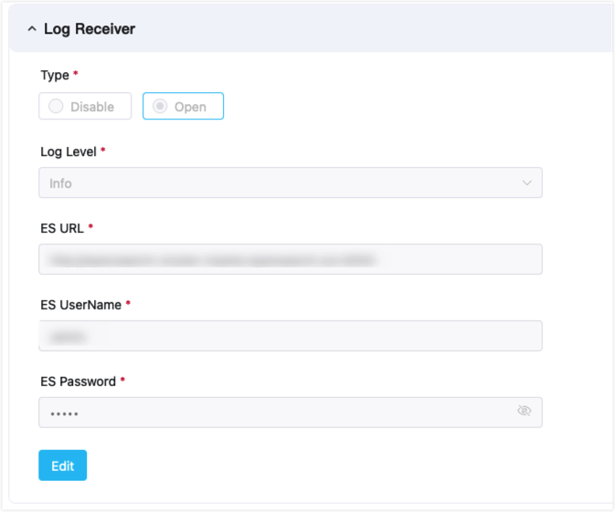

# Operation Management

ECP platform's logs and observability feature offers a comprehensive solution for managing and monitoring both cloud-based EMQX clusters and edge devices. 

By integrating with [Prometheus](https://prometheus.io/docs/introduction/overview/), the open-source renowned for monitoring and alerting, ECP achieves real-time collection, analysis, and monitoring of data and provides our users with precise resource management, performance tuning, and risk prediction. 

Departing from traditional methods, ECP strives for a seamless experience across cloud and edge environments, facilitating the management and monitoring of various components, including EMQX clusters, edge services, and network connections, with a single toolkit, leading to notable enhancements in the performance, reliability, and scalability of both cloud and edge computing.

## External Log Service Setup

ECP gathers log data by connecting to an external Elasticsearch log server, offering logging services. For edge services, the logs are collected into Elasticsearch server from Telegraf which is configured on ECP side.

Log service requires Elasticsearch and Telegraf. Telegraf has been included in the installation package, please install Elasticsearch on your own and follow the instructions to set Elasticsearch output plugin to Telegraf configuration file.

- `urls`  `username`  `password` refer to Elasticsearch HTTP server address, username and password for basic auth.

- `index_name` refers to the index name in Elasticsearch, which should always be <code v-pre>{{appname}}</code>.
- `health_check_interval` for Elasticsearch can be configured as needed.

```
[[outputs.elasticsearch]]
  urls = [ "http://elasticsearch-server:9200" ]
  username = "elastic"
  password = "elastic"
  index_name = "{{appname}}"
  health_check_interval = "10s"
  insecure_skip_verify = true
```

## System Level Configurations

Before using the log and monitoring feature, System Admins need to do some system-level settings. 

### Enable Log Service

To activate this service, sign in as the system administrator. Then, navigate to the **Administration** page. Select **System Settings** -> **General Setting** and expand the **Log Receiver** section, and select the **Open** radio button.

Within this section, you can set up the Elasticsearch information. Once the connection test succeeds , you can save the log receiver details and establish a connection to the external log data source.

- **Log Level**: Refers to the lowest severity level of the logs which are collected from edge services.
- **ES URL**: Refers to Elasticsearch service address.
- **ES Username**: Refers to Elasticsearch user name.
- **ES Password**: Refers to Elasticsearch user password.



### Monitor

The monitoring service within ECP permits individualized configuration of pull intervals and timeout rules for EMQX and NeuronEX.

- **EMQX Pull Interval**: Specifies the frequency (in seconds), at which the monitoring system collects EMQX metric data.
- **EMQX Pull Timeout**: Specifies the duration (in seconds), after which the monitoring system will declare a data pull unsuccessful if no response from EMQX is received.
- **NeuronEX Pull Interval**: Specifies the frequency (in seconds), at which the monitoring system collects NeuronEX metric data.
- **NeuronEX Probe Interval**: Specifies the frequency (in seconds), at which NeuronEX reports heartbeat to ECP.


### Alarm

ECP allows users to personalize the alarm template using the provided parameters. Here are the fields that can be incorporated into the alarm:

- ${name} (Mandatory): Specifies the alarm's name.
- ${contents} (Mandatory): Details the content of the alarm.
- ${alerttime} (Mandatory): Specifies when the alarm was triggered.
- ${level}: Identifies the alarm's severity as either critical or general.
- ${link}: Offers a link to the list of alarms.
- ${address}: Specifies the service address.
- ${systemtime}: Provides the current system time.

## Chapter Overview

This chapter covers the following topics:

- [Logs](../log/introduction.md)

  ECP's unified logging capability allows for collecting, aggregating, storing, and querying operational logs from cloud clusters and edge services. 

- [Monitor EMQX Clusters](https://docs.emqx.com/en/enterprise/v4.4/getting-started/dashboard-ee.html)

  You can track the system performance of EMQX clusters via the EMQX Dashboard. 

- [Monitor Edge Services](./monitor_edge.md)

- ECP provides the feature to view the edge services status on a project level or at the instance level. 

- [Alarms](./alarm_rules)

  The ECP Unified Alert Platform is a tool for monitoring and managing cloud-edge products. It collects and analyzes data to identify and alert users of system or application issues for prompt resolution. 
