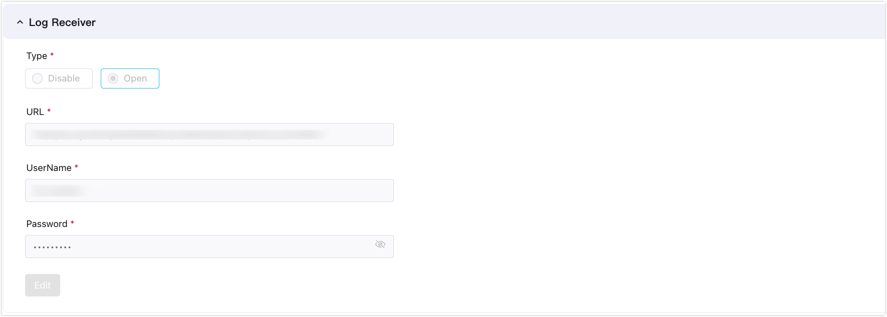
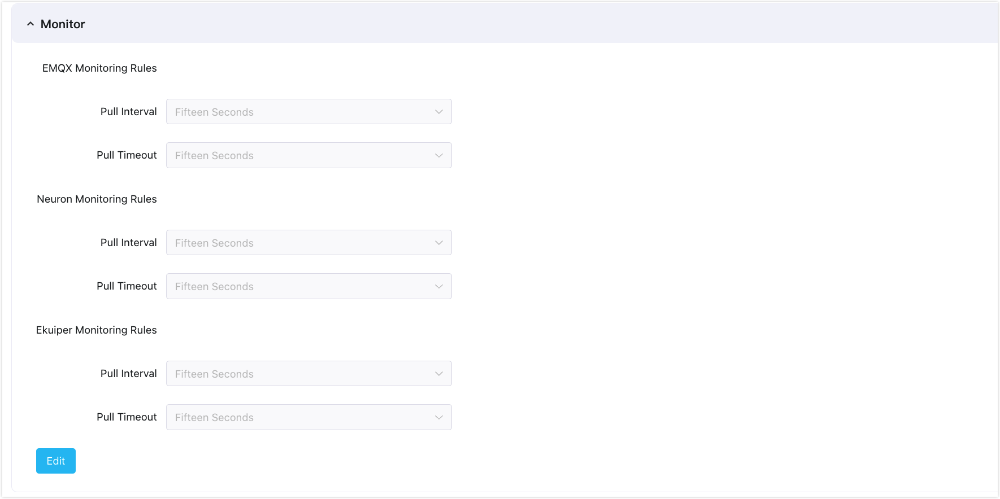

# Logs and Observability

ECP platform's logs and observability feature offers a comprehensive solution for managing and monitoring both cloud-based EMQX clusters and edge devices. 

By integrating with [Prometheus](https://prometheus.io/docs/introduction/overview/), the open-source renowned for monitoring and alerting, EMQX achieves real-time collection, analysis, and monitoring of data and provides our users with precise resource management, performance tuning, and risk prediction. 

Departing from traditional methods, ECP strives for a seamless experience across cloud and edge environments, facilitating the management and monitoring of various components, including EMQX clusters, edge services, and network connections, with a single toolkit, leading to notable enhancements in the performance, reliability, and scalability of both cloud and edge computing.

## System Level Configurations

Before using the log and observability feature, System Admins can do some system-level settings. 

### Enable Log Service

ECP gathers log data by connecting to an external Elasticsearch log server, offering logging services. To activate this service, sign in as the system administrator. Then, navigate to the **Administration** page. Select **System Settings** -> **General Setting** and expand the **Log Receiver** section. 

Within this section, you can set up the Elasticsearch address, as well as the username and password. Once the connection test succeeds, you can save the log receiver details and establish a connection to the external log data source.

:::tip

Once the log receiver has been set, it cannot be modified.

:::

### Monitor

The monitoring service within ECP permits individualized configuration of pull intervals and timeout rules for EMQX, Neuron, and eKuiper.

- **Pull Interval**: Refers to the frequency (in seconds), at which the monitoring system collects metric data.
- **Pull Timeout**: Specifies the duration (in seconds), after which the monitoring system will declare a data pull unsuccessful if no response is received.

### Alarm

ECP allows users to personalize the alarm template using the provided parameters. Here are the fields that can be incorporated into the alarm:

- **Name** (Mandatory): Specifies the alarm's name.
- **Content** (Mandatory): Details the content of the alarm.
- **Alert time** (Mandatory): Specifies when the alarm was triggered.
- **Status**: Displays the alarm's status as either cleared or uncleared.
- **Level**: Identifies the alarm's severity as either critical or general.
- **Link**: Offers a link to the list of alarms.
- **Address**: Specifies the service address.
- **System time**: Provides the current system time.

## Chapter Overview

This chapter covers the following topics:

- [Logs](../log/introduction.md)

  ECP's unified logging capability allows for collecting, aggregating, storing, and querying operational logs from cloud clusters and edge services. 

- [Monitor EMQX Clusters](https://docs.emqx.com/en/enterprise/v4.4/getting-started/dashboard-ee.html)

  You can track the system performance of EMQX clusters via the EMQX Dashboard. 

- [Monitor Edge Services](./monitor_edge.md)

- ECP provides the feature to view the edge services status on a project level or at the instance level. 

- [Alarms](./alarm_rules)

  The ECP Unified Alert Platform is a tool for monitoring and managing cloud-edge products. It collects and analyzes data to identify and alert users of system or application issues for prompt resolution. 
