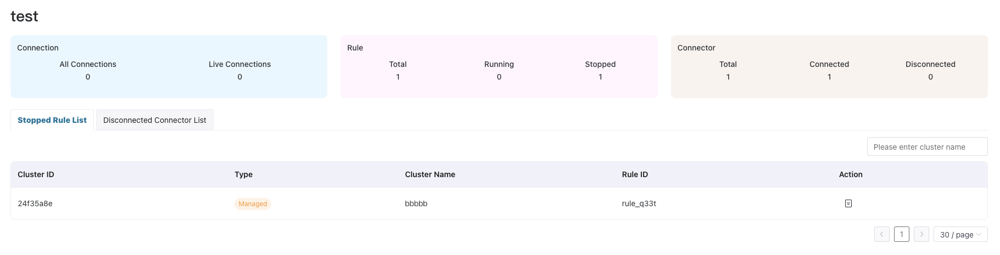
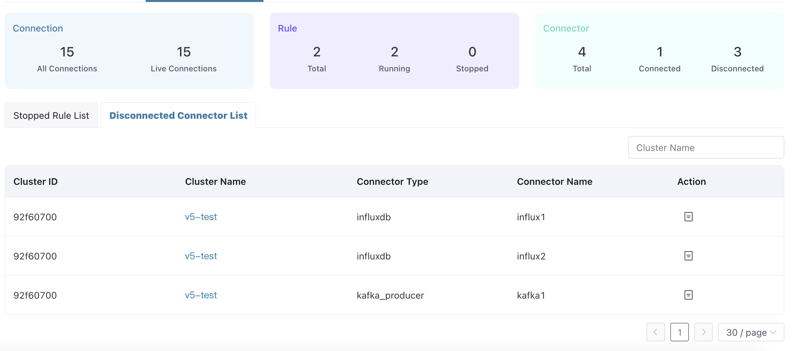
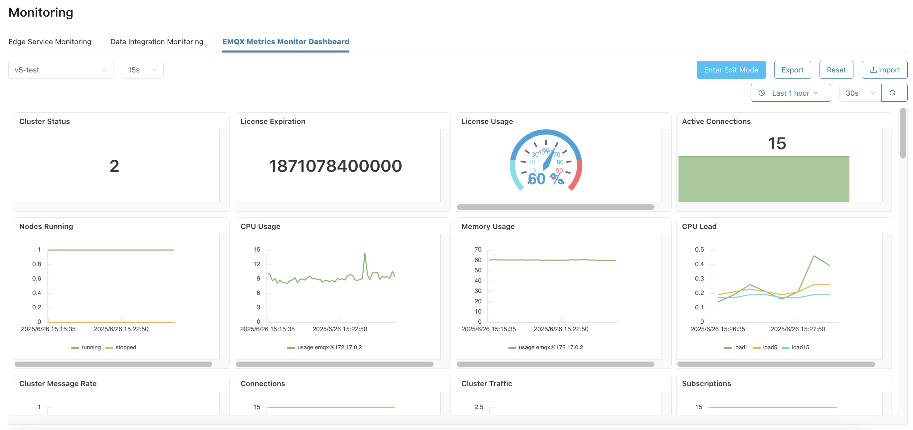
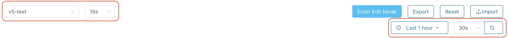
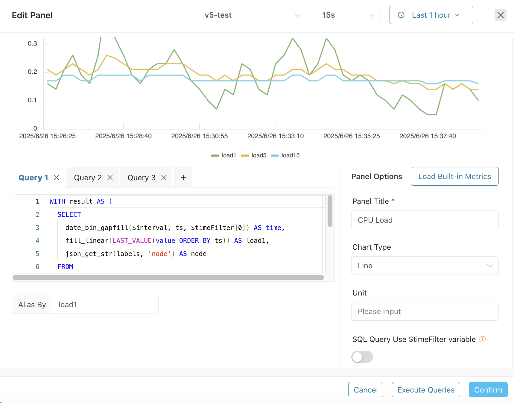

# Monitor EMQX Cluster

ECP provides two different monitoring approaches on the **Workspace - Maintenance - Monitoring** page to display the operational status and multi-dimensional metrics of EMQX managed clusters in the current project. Currently, only EMQX v5 monitoring data is displayed.

## Data Integration Monitoring

This page includes overall statistics of all v5 managed clusters in the project, as well as exception information in data integration.

### Basic Statistics

- Connection: The number of all connections and live connections of all clusters in the project.
- Rule: The number of total cluster rules, running rules and stopped rules in the project.
- Connector: The number of total cluster connectors, connected ones and disconnected ones in the project.

### Cluster Rule and Connector Lists

Underneath these cards, you'll find the details of stopped cluster rules and disconnected connectors lists. You can filter the lists by cluster name. Moreover, you can perform O&M actions per instance by clicking **Details** button from Action column.

## EMQX Metrics Monitor Dashboard

This page provides a monitoring dashboard based on EMQX v5 metrics. It includes 30+ core EMQX monitoring metrics by default, displayed in chart types such as line charts, stat charts, tables, and gauges. It also supports user-customized dashboard layout and content.

### View Dashboard
- From the dropdown list on the left side of the top operation bar, select the `Cluster` to view metrics from and the `Interval`. The interval determines the time interval between data points in the charts. You can set an appropriate interval based on the cluster's metric push period (default 10 seconds).
- From the right side of the top operation bar, select the `Time Range` for monitoring metric data and the `Dashboard Data Refresh Interval`.

### Edit Dashboard

- Click "Enter Edit Mode" on the right side of the top operation bar.
- From the "More" menu of existing panels, select "Edit" to modify the configuration of the panel. For specific configurations, please refer to the "Add and Configure Panels" section. Select "Copy" to duplicate the same panel in the dashboard. Select "Remove" to delete the panel from the dashboard.
- Drag the control point at the bottom-right corner of the panel to adjust the panel size. Drag the panel header to adjust the panel position. The dashboard grid system helps with alignment for a cleaner and more beautiful layout.
- You can also click the "Add Panel" button from the top operation bar to add new panels to the dashboard to display desired metric data. For specific configurations, please refer to the "Add and Configure Panels" section.
- Click "Save Dashboard" to apply dashboard modifications (including adding/removing panels, adjusting layout, changing panel configurations).

### Add and Configure Panels

The dialog editor has a chart display area at the top and the following layout below:

#### Left Side - Query Configuration Area:
- Query Tabs: Allow configuring multiple data queries for one panel. You can add new queries by clicking +.
- SQL Input Area: Enter datalayers SQL query statements for the currently selected tab. The following built-in variables can be used in SQL:
  - `$timeFilter`: Used to represent time range. For example: `WHERE $timeFilter(ts)` means the values in the column named ts must be within the time range specified in the dashboard/panel. Another example: `$timeFilter[0]` represents the start time of the time range specified in the dashboard/panel, `$timeFilter[1]` represents the end time of the time range, `date_bin(interval 1 minute, ts, $timeFilter[0])` will use the start timestamp of the specified time range to align the time window.
  - `$interval`: Used to represent time interval. If the specified time interval is 15 seconds, then `date_bin($interval, ts)` will have the same effect as the expression `date_bin(interval 15 second, ts)`.
  - `$cluster`: Used to represent cluster.
- Alias By: Specify a display alias for the query results of the current tab. This is useful for distinguishing different lines in line chart panels or different columns in tables. However, please note that if a line chart has multiple lines corresponding to the query results of the same tab, each line will automatically generate an alias based on the query content; specifying an alias may cause confusion in such case.

#### Right Side - Panel Options:
- Load Built-in Metrics: Load built-in metric panels based on the selected chart type to help users quickly build custom panel content.
- Panel Title: (Required) Specify a meaningful name for the panel.
- Chart Type: Choose how to display data. Currently supports:
  - Line (Line Chart): Suitable for showing trends in time-series data. SQL query results must contain a timestamp column and a numeric column. Values in other columns will be used as part of the line name.
  - Stat (Statistics Chart): Display a single key value in a prominent way. If the "Show Trend" toggle is enabled, the trend of corresponding data changes over time will also be displayed.
  - Table: Display detailed data in table format. When there are multiple query tabs in a panel, only the first query result is displayed by default. If the "Merge Tables" toggle is enabled, results from multiple query tabs will be merged and displayed in the same table.
  - Gauge: Intuitively display the comparison relationship between key values and target values in gauge format. "Min Range" and "Max Range" limit the target value range of the gauge.
- Unit: This information will be displayed on the chart or as a suffix to the value.
- SQL Query Uses $timeFilter Variable: If enabled, the input SQL statement must contain `$timeFilter` (e.g., `WHERE $timeFilter` or `AND $timeFilter`) to implement query conditions based on the dashboard time range.

### Bottom Operation Buttons:
- Cancel: Close the panel configuration dialog without saving any configuration.
- Execute Queries: Execute the currently configured SQL query based on the cluster, sampling interval, and time range specified at the top of the dialog, and preview the query results above the dialog to help users verify the correctness of the query.
- Confirm: Save panel configuration.

### Export Dashboard
- In non-edit mode, click the "Export" button from the right side of the top operation bar to export the current dashboard as a JSON file as a template for easy restoration of the dashboard.

### Import Dashboard
- In non-edit mode, click the "Import" button from the right side of the top operation bar to import the selected JSON template file, and the current dashboard will be overwritten with the content from the template file.

### Reset Dashboard
- In non-edit mode, click the "Reset" button from the right side of the top operation bar to reset the current dashboard to its initial default state.
