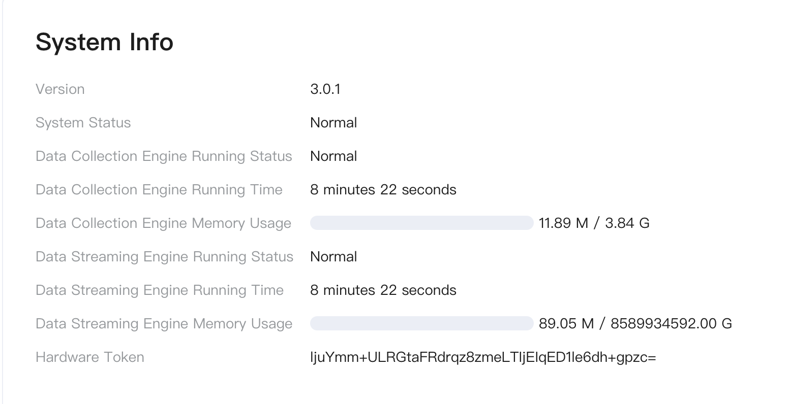

# Monitor Edge Services

ECP provides a comprehensive operating status overview on the Workspace - Edge Service page.

- For the Data Collection function, you can view the number of northbound applications, southbound devices, and disconnected or abnormal nodes.
- Fo rthe Data Processing function, you can view the total number of input/output records and the number of inputs/outputs per second.

For a detailed explanation of the fields, see [Edge Service - Project Level Overview](../edge_service/edge_project_statistics).

## NeuronEX System Information

ECP provides real-time system information queries for each NeuronEX instance.

Below is an explanation of each field on this page:

- Version number: the current version number of NeuronEX;
- Main system status: normal/abnormal;
- Number Mining Engine Running Status;
- Number of hours the engine has been running;
- The number of hours that the number mining engine has been running;
- Streaming Engine Running Status
- Streaming Engine Running Status; Streaming Engine Runtime;
- Streaming engine memory usage;
- Hardware flags;