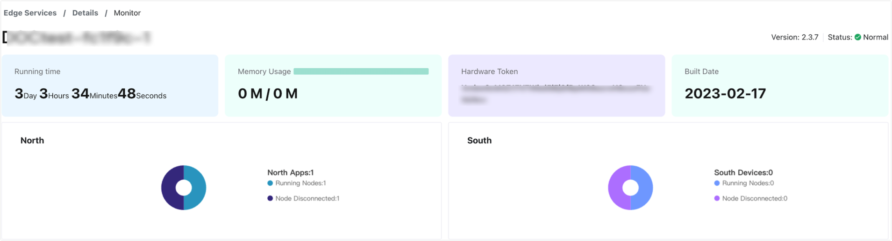
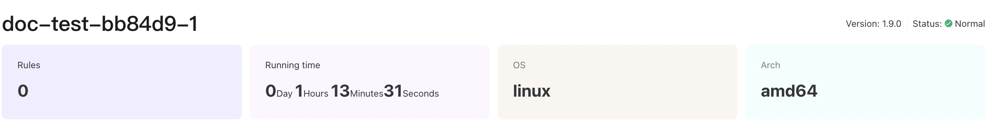

# Monitor Edge Services

ECP provides the feature to view the edge services status on a project level or at the instance level. 

## Monitoring at the Project Level

ECP provides a comprehensive operating status overview on the Workspace - Edge Service page.

For Neuron, you can view the number of deployed service instances, northbound apps, southbound devices, and disconnected nodes.

For eKuiper, you can view the number of deployed service instances, the total records input/output, and the input/output per second. 

For a detailed explanation of the fields, see [Edge Service - Project Level Overview](../edge_service/edge_project_statistics).

## Monitor Each Neuron Node

ECP provides real-time monitoring services for each Neuron instance. To view the instance level status, click the monitor icon under the Action column of the target node, then you will be directed to the **Details** -> **Monitor** page. 

Below is the explanation of each field:

1. Status: Normal/Abnormal; 

2. Running Time: The running time of this instance from the moment it was initiated to the present.

3. North: Northbound statistics, where you can find the total number of north apps.
   
   - Running Nodes: The number of northbound nodes running on this instance
   
   - Node Disconnected: The number of disconnected/offline northbound nodes in this instance
   
4. South: Southbound statistics, where you can find the total number of south devices.
   
   - Running Nodes: The number of southbound nodes running in this instance
   - Node Disconnected: The number of disconnected/offline northbound nodes in this instance

For detailed explanation of Neuron metrics, see [Neuron Document - Metrics](https://neugates.io/docs/en/latest/http-api/metrics.html)

## Monitor Each eKuiper Node

ECP provides real-time monitoring services for each eKuiper instance. To view the instance level status, click the monitor icon under the Action column of the target node, then you will be directed to the **Details** -> **Monitor** page. 

1. Version: Current version of eKuiper;
2. Service Status: Normal/Abnormal;
3. Rules: The total number of rules in this instance;
4. Running Time: The running time of this instance from the moment it was initiated to the present.
5. OS: The operating system currently running;
6. Arch: Hardware CPU architecture;

For detailed explanation of eKuiper metrics, see [eKuiper Document - Monitor with Prometheus](https://ekuiper.org/docs/en/latest/operation/usage/monitor_with_prometheus.html).