# Trace

[OpenTelemetry Tracing](https://opentelemetry.io/docs/concepts/signals/traces/) is a specification for tracing the flow of requests in distributed systems, used to track the flow of requests within distributed systems. 

ECP integrates OpenTelemetry tracing capabilities, enabling the tracking of link data across EMQX clusters and NeuronEX, while providing visualization tools for analyzing request performance and behavior patterns.

## Trace Setting

Log in to ECP as an administrator , you can view the Tracing Setting under **Administration** -> **System Setting** -> **General Settings**, which is the address of the [OpenTelemetry Collector](https://opentelemetry.io/docs/collector/getting-started), and the retention days to keep the traces data. Trial licenses retain only 1 day of traces data, while official licenses can adjust the data retention period as needed.

The Traces HTTP Address defaults to `[Root Address]:4318`.

The Traces gRPC Address defaults to `[Root Address]:4317`.

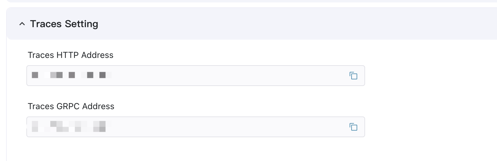

## Trace Function

After the traces data is uploaded to ECP, on the **Workspace** interface, click the **Maintenance** -> **Traces** menu on the left to enter the Traces page.

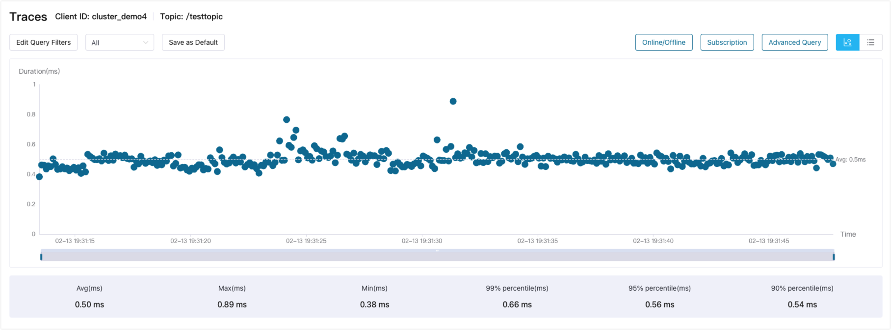

## EMQX Cluster Tracing

### EMQX Cluster Trace Configuration

By adding a trace configuration for the EMQX cluster, the traces data of the EMQX cluster can be sent to ECP. Then, you can [query the traces data of the EMQX cluster](#query-emqx-cluster-traces-records).

Login to the Web management page of the EMQX cluster, enter the **Management** -> **Monitoring** -> **Integration** page, select the **OpenTelemetry** tab, check the Traces function, and configure the OpenTelemetry Collector service address provided by ECP. Then, the traces data of the EMQX cluster can be sent to ECP.

- Endpoint: Input the OpenTelemetry Collector service address provided by ECP. Note: EMQX only supports the gRPC service address - `[Root Address]:4317`
- Trace Mode: Select "End-to-End".
- Cluster Identifier: Input a custom cluster identifier name to distinguish different EMQX clusters, making it easier to filter in ECP when querying.

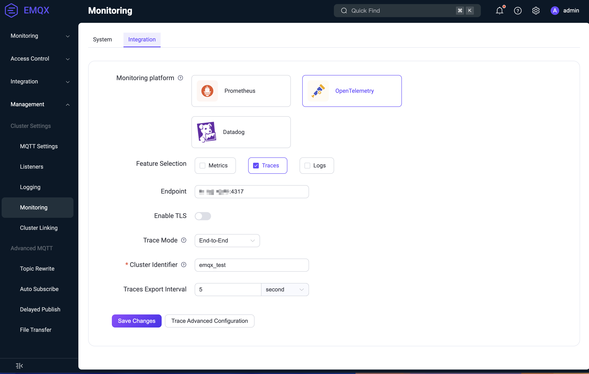

In the trace advanced configuration, you can configure the message types that EMQX can trace, including:

- Trace Connect/Disconnect
- Trace Subscribe/Unsubscribe
- Trace Message

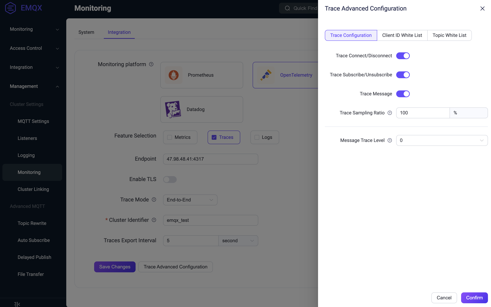

### Query for EMQX Cluster Traces Records

If EMQX has enabled end-to-end tracing and configured the OpenTelemetry Collector service address provided by ECP, you can find MQTT message tracing data for specified client IDs and topics, as well as corresponding online/offline records and subscription/unsubscription records in ECP.

Click the **Edit Query Filters** button, and choose 'Query by Client ID' or 'Query by Topic' for the query type. Specify a time range and enter or select the cluster identifier. Then, filter for the needed client IDs and topic names. The query results are visually displayed in a chart. You can view a bubble chart showing the distribution of message traces data over time and the overall duration. Similarly, you can also switch to a table view.

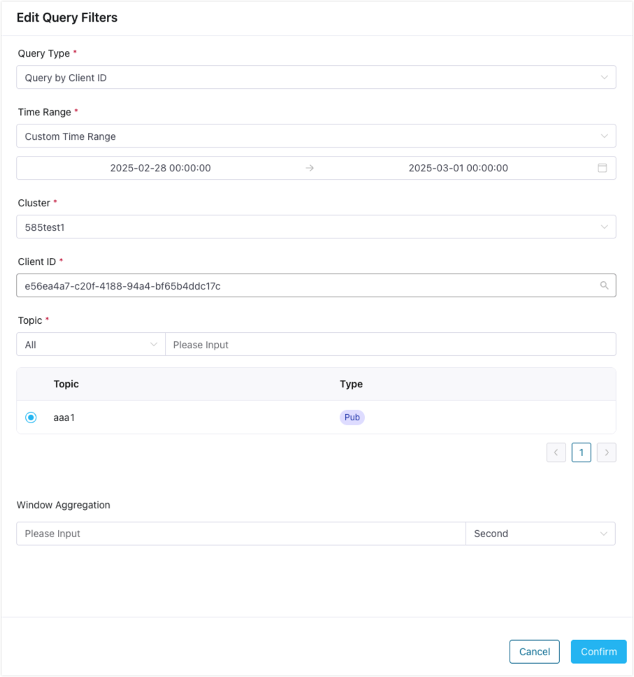

Click on a tracing record to view the details and observe the tracing situation. If there is an error in a tracing record, it will be highlighted in red in the chart, making it easy for you to quickly identify and troubleshoot the issue.

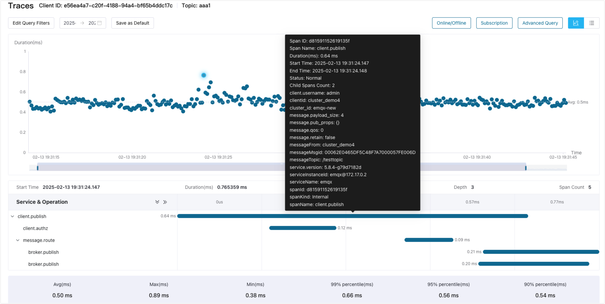

If there are too many tracing records within the query range to be displayed on the page at the same time, specify the window aggregation time before querying. An average duration trend chart aggregated by time will then be displayed. You can make a smaller range selection on the trend chart to view the tracing records within the selected range.

**Online/Offline** records display the connection and disconnection tracing data for the specified client ID within the corresponding time range. **Subscription** records display the subscription and unsubscription tracing data. Both further assists in the analysis of tracing behavior.

**Advanced Query** provides the ability to query all tracing data for one or more client IDs.

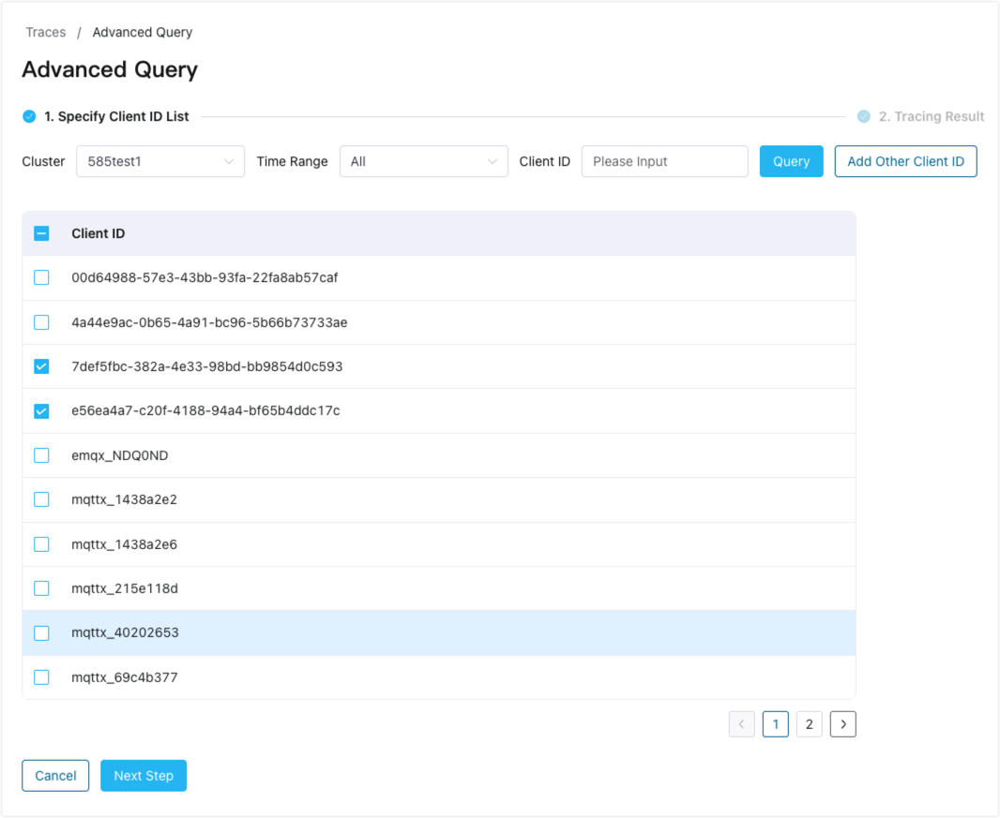

### Traces Data AI Analysis

This section describes how to use the large language model (LLM) to analyze tracing data.

#### 1) Configure LLM Model

Before using the AI analysis of tracing data, you need to first configure an LLM model in the **Administration** -> **System Settings** -> **General Settings** page under the **AI Assistant Setting** item. Add a model configuration information, including the LLM model provider, AI model, and API Base information. Currently, ECP supports the following model providers:

- DeepSeek
- SiliconFlow
- OpenAI
- Azure OpenAI
- xAI
- Anthropic

You can obtain the API Key from the official website of the model provider and add the model configuration and enable it in this page.

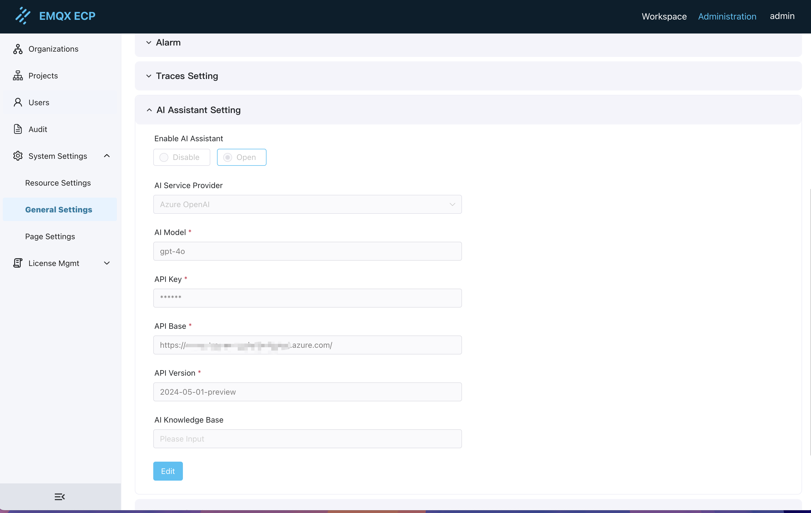

#### 2) Query Tracing Data

In the **Traces** -> **Advanced Query** page, you can view the tracing data for the selected client ID and time range.

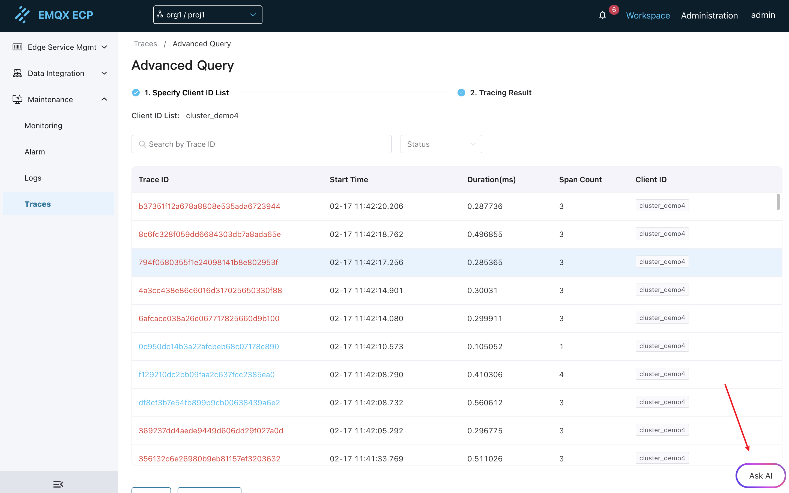

Click the **Ask AI** button, a dialog box will pop up. You can input the analysis requirements for the tracing data, and the AI assistant will provide an analysis result based on your question.

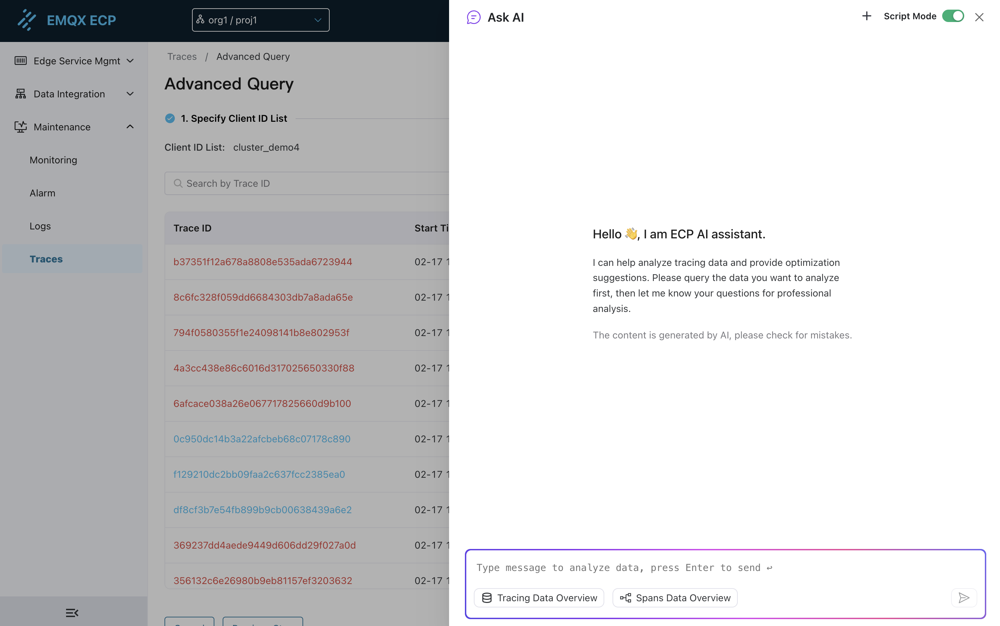

#### 3) Tracing Data Overview

Click the **Tracing Data Overview** button in the AI assistant input box, the AI assistant will provide an overall overview analysis based on the tracing data currently queried.

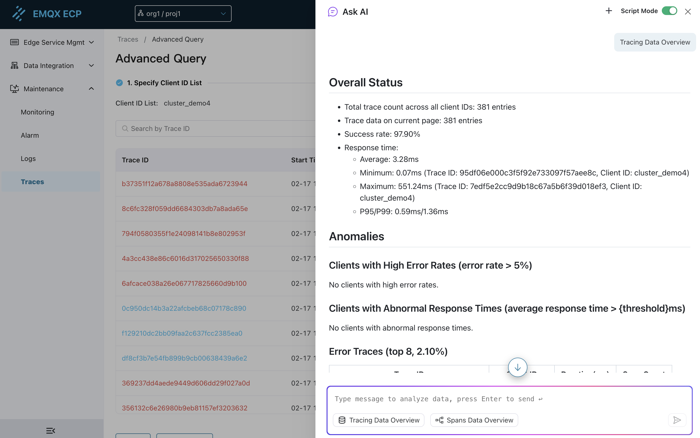

#### 4) Spans Data Overview

Click the **Spans Data Overview** button in the Ask AI input box, the AI assistant will provide an overview analysis based on the selected tracing data.

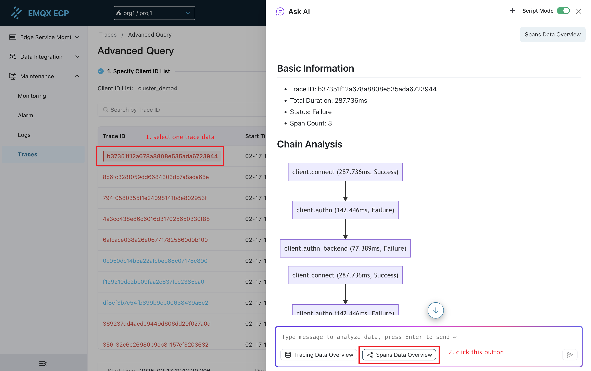

## Query for IIoT Tracing Records

If NeuronEX has enabled trace and configured the OpenTelemetry Collector service address provided by ECP, you can also find the corresponding tracing data in ECP. Furthermore, if the IIoT chain uses an EMQX cluster, the tracing data will include the full-chain information from NeuronEX to EMQX.

Click the **Edit Query Filters** button, and choose 'IIoT Full Chain Query' for the query type. Specify a time range and select the operation type. Optionally, provide the service name, span name, and attributes to locate the IIoT tracing data.

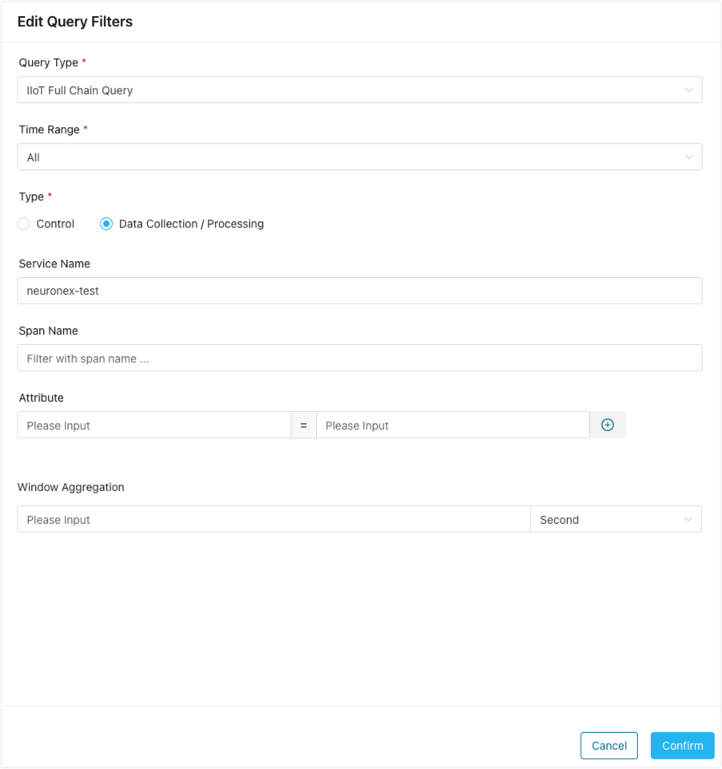