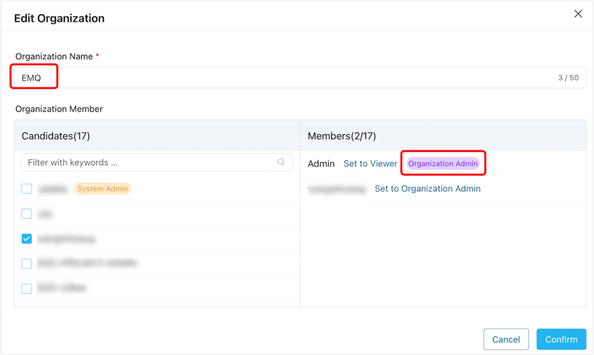
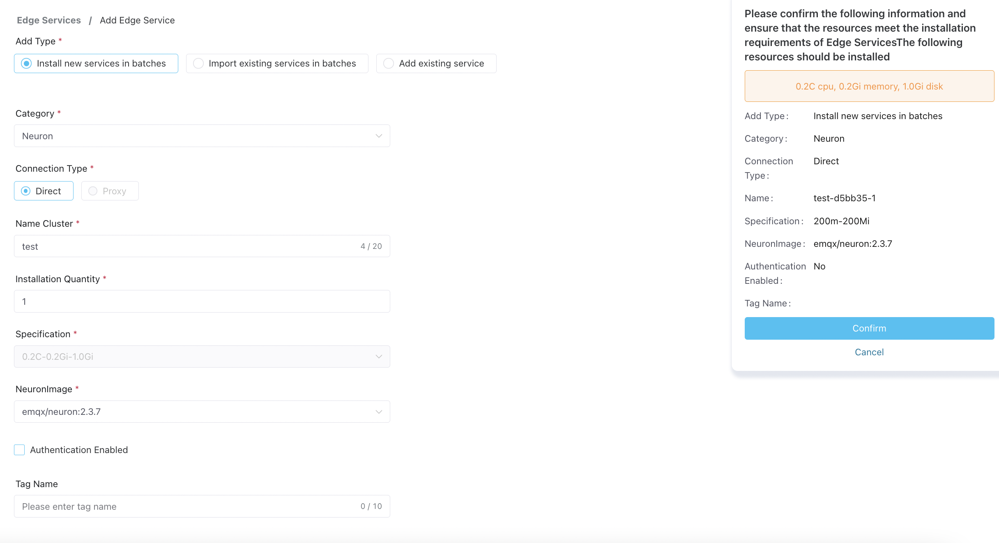

# Quick Start

ECP offers a Docker-based deployment to help users quickly set up ECP. In this chapter, users can experience the features and characteristics of ECP quickly through simple steps.

## ECP Installation
Please refer to the [Deploying ECP with Docker](../install/install_ecp_on_linux.md) section to prepare deployment resources and install ECP.

## Initializing Environment Configuration
After installing ECP, logging into the ECP Dashboard, you need to go through the following steps to initialize the environment configuration to ensure normal operation.

|     Step     | Description                                             |
| :----------| :-------------------------------------------------------|
|[Configure Root Address](../system_admin/general_config.md#configure-root-address)| Configure the access domain name. Edge services need to push status information through this address.|
|[Configure Email](../system_admin/general_config.md#configure-emails)| Optional. Configure the email server for sending alert emails.|
|[Configure License](../install/license_setting.md#configure-license)| ECP comes with a trial license after installation, and you can also apply for and upload a new license.|

## Manage edge services via ECP
After initializing environment configuration of ECP, this tutorial will help you experience the various functions of ECP by creating and managing edge services.

### Create organization/project

ECP enables enterprise-level multi-tenant management through organization/project management. Managing edge services NeuronEX and EMQX clusters need to be built on specific projects, so we first need to create organizations and projects.

1. Log in to the ECP as a system administrator and switch to the **Administration** interface.
2. Click **Organizations** on the left menu bar.
3. Click **Create Organization** button, and in the pop-up dialog box, make the following settings:

    - **Organization Name** fill in **EMQ**;
    - Select the organization member in the **Organization Member** column on the left and set it as **Organization Admin**;
    - Click **Create** to save the input content;

4. The new organization **EMQ** appears in the organization list.

Then switch to the **Projects** page and repeat the above steps to create a project.

After completing the creation of the organization and project, you can start creating and managing cloud EMQX clusters and edge services through ECP.

### Managed NeuronEX

Multiple edge services NeuronEX can be managed in various projects of ECP. Switch to the **Workspace** interface and switch to the organization **EMQ** and project **ECP** just created; click **Edge Management** on the left to enter the edge management page.

On this page, click **Add Edge Service** and make the following settings in the pop-up dialog box

- Add method select **Add existing service**
- Type selection **NeuronEX**
-Select **Direct** as the connection type
- Fill in the name **NeuronEX-1**
- Fill in the edge service address **[NeuronEX’s IP]:PORT**
- Click **Confirm** to manage NeuronEX.

:::tip
[Managed](../index.md#key-concepts) refers to the management of the existing edge service NeuronEX. After management, ECP will perform management and operation operations such as monitoring, alarming, logging, and configuration distribution for NeuronEX. To manage the edge service NeuronEX, you need to deploy NeuronEX first. For details, please refer to [NeuronEX Quick Start](https://docs.emqx.com/en/neuronex/latest/quick-start/quick-start.html).
:::

:::tip
When hosting the existing edge service NeuronEX, if NeuronEX has authentication turned on, authentication configuration is required. For details, please refer to [Authentication on Managed NeuronEX](../edge_service/e2c.md#authentication-on-managed-neuronex).
:::

After completing the management of edge services, you can start to manage and operate edge services through ECP, including configuring the data tags, monitoring alarms, logs and other operation and maintenance services, using the label system to group services, and using configuration batch delivery to configure multiple edge service instance. For detailed functions of edge services, please refer to [Edge Services Management](../edge_service/introduction).