# Quick Start

ECP provides a fast deployment method based on Kubernetes, which helps users quickly build the ECP cloud-edge integrated platform. In this chapter, users can experience the features and capabilities of ECP in just a few simple steps.

1. First, [install ECP](#install-ecp). Users need a cloud-native Kubernetes environment and an ECP installation package (You can contact EMQ for the installation package).
2. Then, log in to ECP to enter the **System Management** interface and [initialize the environment](#initialize-the-ecp-environment).
3. Finally, in ECP's **Workspace** interface, deploy EMQX cluster and edge services like Neuron and eKuiper with one click to start experiencing various [services and functions of ECP](#use-ecp-to-create-services).

## Install ECP

To install ECP, please refer to [Deploy ECP based on Kubernetes](../install/install_ecp_on_kubernetes.md).


## Initialize the ECP Environment

After installation, the following configurations need to be completed on ECP before you can leverage the centralized management power of ECP.

|     Step     | Description                                             |
| :----------| :-------------------------------------------------------|
|[Configure the license](#configure-the-license)|Prepare and install the ECP license.|
|[Configure Kubernetes connections](#configure-kubernetes-connections)|Connect ECP to Kubernetes, so ECP can manage, control, and authenticate Kubernetes resources.|
|[Configure storage classes](#configure-storage-class)|A storage class is a Kubernetes resource type used to specify the PV volume of storage resources assigned to the cluster during creation.|
|[Configure EMQX cluster image](#install-emqx-cluster-image)|Select the version of the EMQX cluster during installation and upgrade.|
|[Configure EMQX cluster specifications](#configure-emqx-cluster-specification)|Specify the resources for the EMQX cluster during installation and upgrade.|
|[Install the edge service image](#install-edge-service-image)|Select the version of the edge service during installation and upgrade.|
|[Configure edge service specifications](#configure-edge-instance-specification)|Specify the resources for the edge service during installation and upgrade.|


### Configure the License
1. Apply for a trial license via the [Contact Us](https://www.emqx.com/en/contact?product=emqx-ecp) page on the EMQ website. Skip this step if you already have a paid license.
2. Log in as [superuser](../install/install_ecp_on_kubernetes.md#create-a-superuser), switch to the **Workspace** interface, and click **License Management** on the left navigation menu.
3. Click **Update License** and upload the license obtained in Step 1; you can see the license details on this page. <!--confirm with the screenshot-->

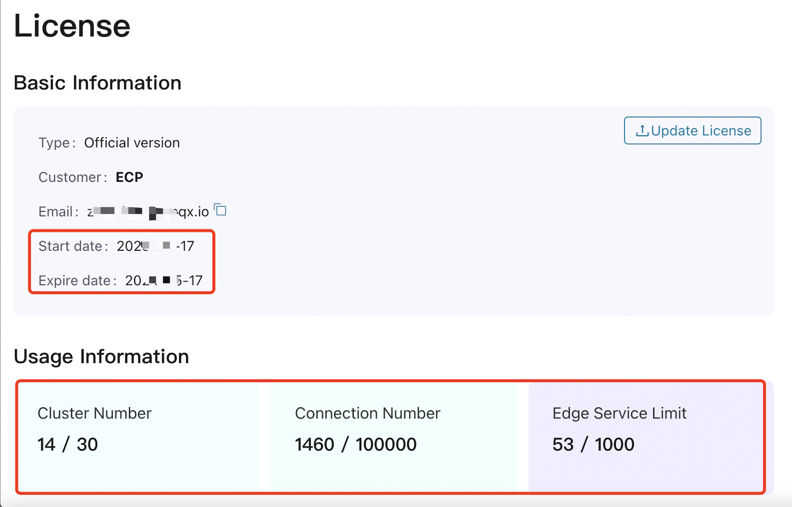


### Configure Kubernetes Connections

1. Log in to the Kubernetes master node.
2. In Kubernetes command line tool, run the command below to locate the default configuration file. Download the file to your local machine.

   ```
   ~/.kube/config
   ```

3. In the **Workspace** interface, click **System Settings** > **Resource Settings** on the left navigation menu. 
4. Then click on the **Kubernetes Connect Settings** and click **Create Kubernetes Connect**, upload the configuration file you downloaded in Step 2. ECP now can call the Kubernetes APIs and resources. 

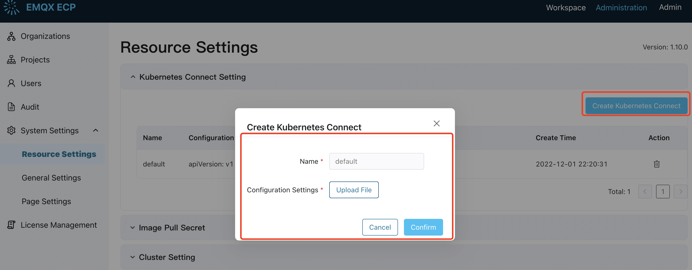

### Configure Storage Class

Configuring storage classes is an important step when setting up resource specifications for cloud clusters and edge services. This section takes EMQX cluster as an example to illustrate. 

1. Log in to the Kubernetes environment via the command line.

2. Use the following command to view the list of storage classes, including system-provided storage classes or self-built ones:

   ```
   kubectl get sc
   
   NAME                    PROVISIONER                      RECLAIMPOLICY  VOLUMEBINDINGMODE     ALLOWVOLUMEEXPANSION        AGE
   alicloud-disk-ssd       diskplugin.csi.alibabacloud.com  Delete         Immediate             true                        170d
   alicloud-disk-topology  diskplugin.csi.alibabacloud.com  Delete         WaitForFirstConsumer  true                        170d
   local-path              rancher.io/local-path            Delete         WaitForFirstConsumer  false                       169d
   ```

3. Go back to ECP and select one Storage Class for EMQX clusters (**Administration** -> **System Settings** -> **Resource Settings** -> **Cluster Setting** -> **EMQX Quota List**). Note: The Storage Class name should be identical to that on Kuberneets, set the storage size and whether to set it as a default option.

   

   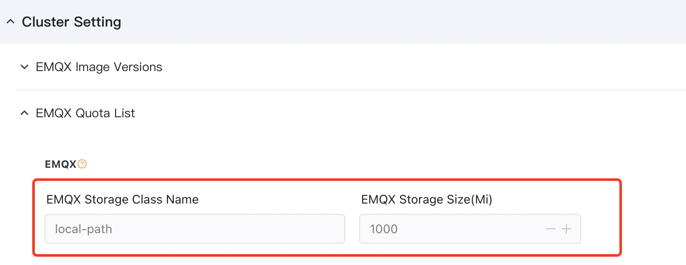

4. Save the settings, and the newly created storage class will take effect immediately.

### Install EMQX Cluster Image

This quick start guide will take EMQX 4.4.15 (`emqx/emqx-ee:4.4.15`) as an example to illustrate the process. 

On the ECP **Administration** page, click **System Settings** -> **Resource Settings** -> **Cluster Setting**. Input `emqx/emqx-ee:4.4.15` in the **Image** field, and choose whether to set it as a default option. Click **Confirm** to finish the setting. 

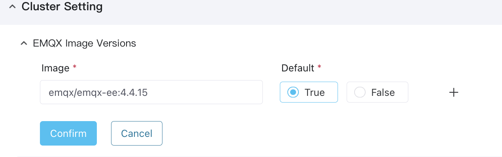

### Configure EMQX Cluster Specification

This quick start guide will configure an EMQX cluster with 1 CPU core, 1 GiB of memory, and 512 MiB of disc space, you can configure it as shown in the screenshot below:

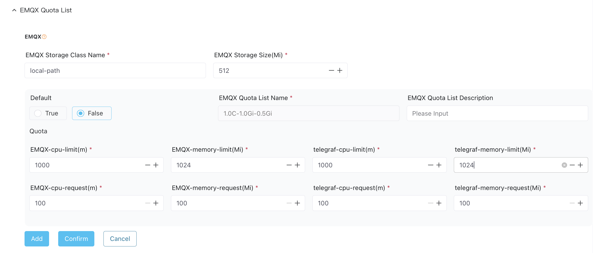

For a detailed explanation of each field, see [Resource Setting - EMQX Cluster Quota](../system_admin/resource_config.md#configure-emqx-cluster-quota)

### Install Edge Service Image

This quick start guide will use eKuiper 1.9.0  (lfedge/ekuiper:1.9.0-slim-python) and Neuron 2.3.7 (emqx/neuron:2.3.7) to illustrate the process. On the ECP **Administration** page, click **System Settings** -> **Resource Settings** -> **Edge Service Setting**. Select `lfedge/ekuiper:1.9.0-slim-python` from the drop-down list for eKuiper **Image**, and choose whether to set it as a default option. Click **Confirm** to finish the setting. Then select `emqx/neuron:2.3.7` from the drop-down list for Neuron **Image**, and choose whether to set it as a default option. Click **Confirm** to finish the setting. 

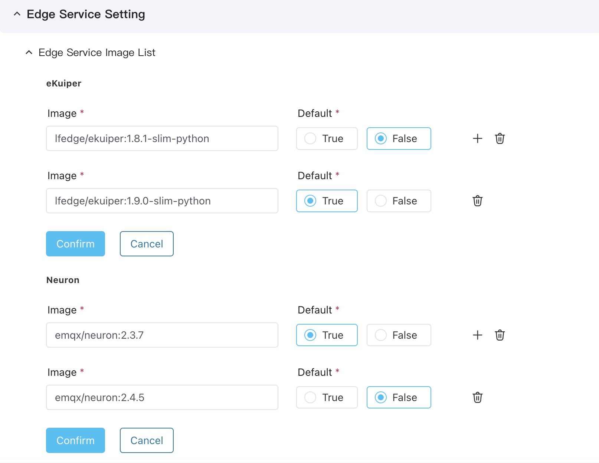

### Configure Edge Instance Specification

This quick start guide will configure both eKuiper and neuron instances with 1 CPU core, 1 GiB of memory, and 100 MiB of disc space, you can configure them as shown in the screenshot below:

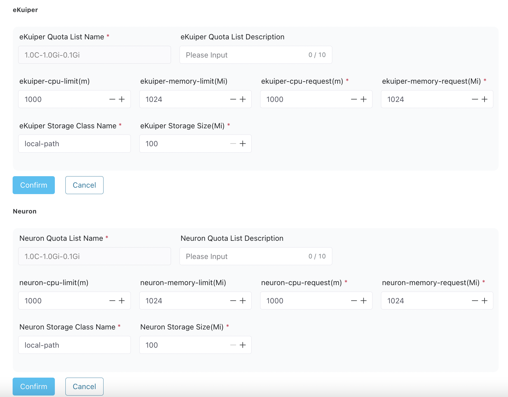

For a detailed explanation of each field, see [Resource Setting - EMQX Cluster Quota](../system_admin/resource_config.md#configure-edge-cluster-quota)


## Use ECP to Create Services
Once you have set up the underlying Kubernetes environment, you can start experiencing the various features of ECP.

|     Feature     | Description                                             |
| :----------| :-------------------------------------------------------|
| [Create Organization/Project](#create-organization-and-project) | ECP follows a multi-tenant, multi-project management approach, before officially starting with ECP to manage your EMQX Clusters and edge services, the first step is to create an organization and a project. |
| [Install and Manage EMQX Clusters](#install-and-manage-emqx-clusters) | Experience creating and managing EMQX clusters using ECP.    |
| [Install and Manage Edge Service Instance](#install-and-manage-edge-services) | Experience creating and managing edge services using ECP.    |


### Create Organization and Project

ECP follows a multi-tenant, multi-project management approach, where building EMQX clusters and installing Neuron and eKuiper services are based on specific projects. Therefore, the first step is to create an organization and a project.

1. Log in as a system admin and click to switch to the **Administration** page.

2. Click on **Organizations** in the left sidebar.

3. On the **Organizations** page, click **Create Organization**.

4. In the popup dialog box, set as follows:

   - Enter the **Organization Name**, for example, **EMQ**.
   - Click to select the organization members in the **Candidates** panel, and assign one or multiple organization members as organization admin in the **Member** panel.

5. Click **Create** to save the input.

   

Then on the **Projects** page, repeat the same step to create your project. 

After you have created your organization and project, you can click the **Workspace** icon to switch to the Workspace page and start using EMQX to manage your EMQX clusters and edge services. 

### Install and Manage EMQX Clusters
Once the organization and project are ready, you can proceed to create EMQX clusters using ECP. Switch to the **Workspace** interface and select the **EMQ** organization and **ECP** project you just created. You will be directed to the **Cluster** page. 

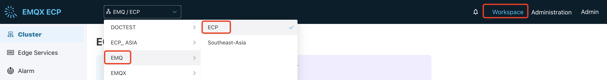

On the Clusters page, click **Add Cluster** to open the cluster creation page, and set it as follows:

- Select **New Cluster** as **Cluster Type**.
- Enter a desired **Cluster Name**, such as **emqx-test**.
- Keep the default **Connection Limit** of 10.
- Choose the default **1C2G** specification.
- Under **Replicas**, select **1** for the number of nodes.
- Use the default image version.
- Click **Confirm** to create the cluster. 

The newly-created clusters will be listed in the **Cluster List** panel with the status **Creating**. Wait till the status changes to **Running**, indicating the cluster is ready for production use. 

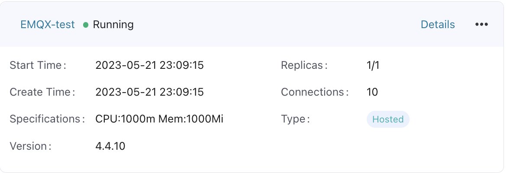

ECP provides a comprehensive suite of management and operational services for EMQX cluster management, allowing you to centrally manage and operate all EMQX clusters on ECP. You can click the more icon of a certain cluster to start/stop a cluster, upgrade/downgrade, do horizontal/vertical scaling, update network type, configure a load balancer, or transfer cluster ownership. 

Or you can click on **Enter Dashboard** in the top-right corner to enter the EMQX Enterprise Edition Dashboard. This web-based control panel provided by EMQX allows users to monitor the operational status and statistical metrics of server nodes and clusters. For details about this OM operation, see [Manage EMQX Clusters](../cluster/ops.md).

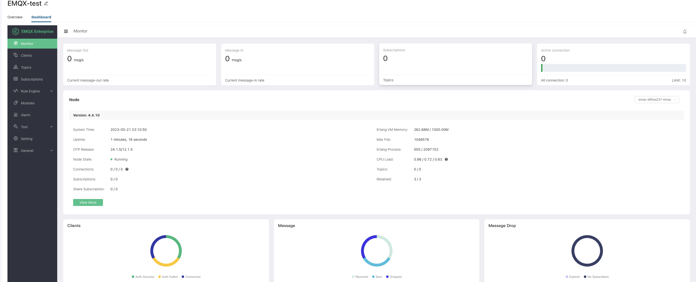

### Install and Manage Edge Services

The installation and management for edge services Neuron and eKuiper are similar, this section takes Neuron as an example to illustrate the process. 


1. Select the ECP project under organization **EMQ**, navigate to the **Edge Services** section in the left sidebar.
2. Click **Add Edge Service** to open the edge service creation page, and set it as follows:

   - Choose **Install New Services in batches** as the **Add Type**.
   - For **Category**, choose **Neuron**.
   - Choose **Direct** for the **Connection Type**;
   - In the **Name Cluster** field, give a name prefix for the edge service, for example, Neuron-test.
   - In the **Installation Quantity** field, enter the number of edge services you want to install, for example, 1
   - Use default settings for specification, Neuron image, and authentication.
   - Review the settings on the right side and click **Confirm** to proceed with the installation.


A dialog box will subsequently appear, showcasing the installation progress. Here you can observe the total count of services installed and reasons if any instances failed to be installed. 

After finishing creating the edge service instances or adding existing edge services, you can get a project-level overview of edge services. ECP provides a suite of tools to efficiently manage and maintain edge computing services, helping operators to save a substantial amount of time and resources. For detailed explanation, see [Manage Edge Services](../edge_service/edge_ops.md)

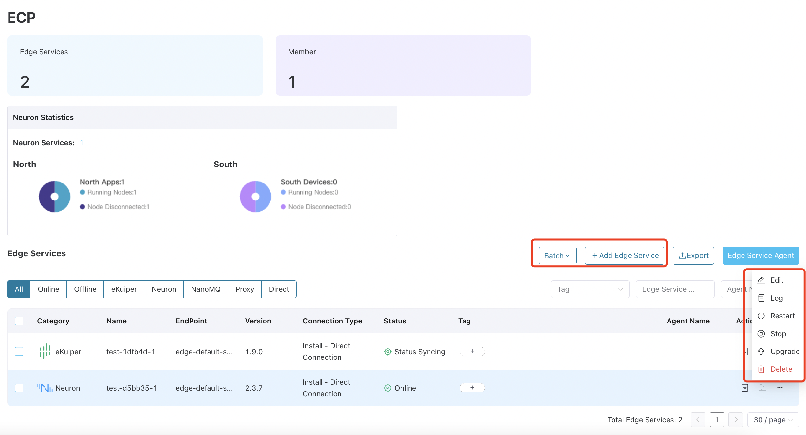
