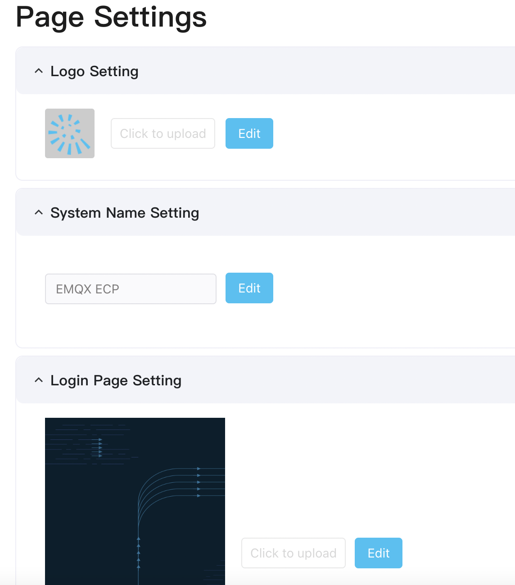

# Customize Login Page

ECP also supports customizing the login page for your ECP platform, navigate to **System Settings** -> **Page Settings**, where you can customize the logo, system name, and login page. 

