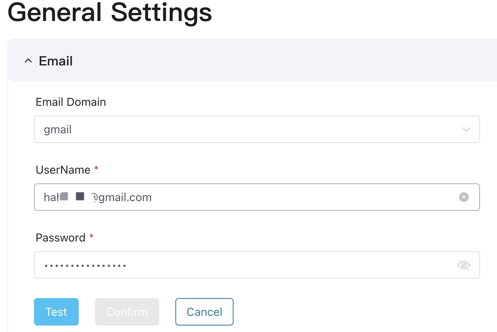
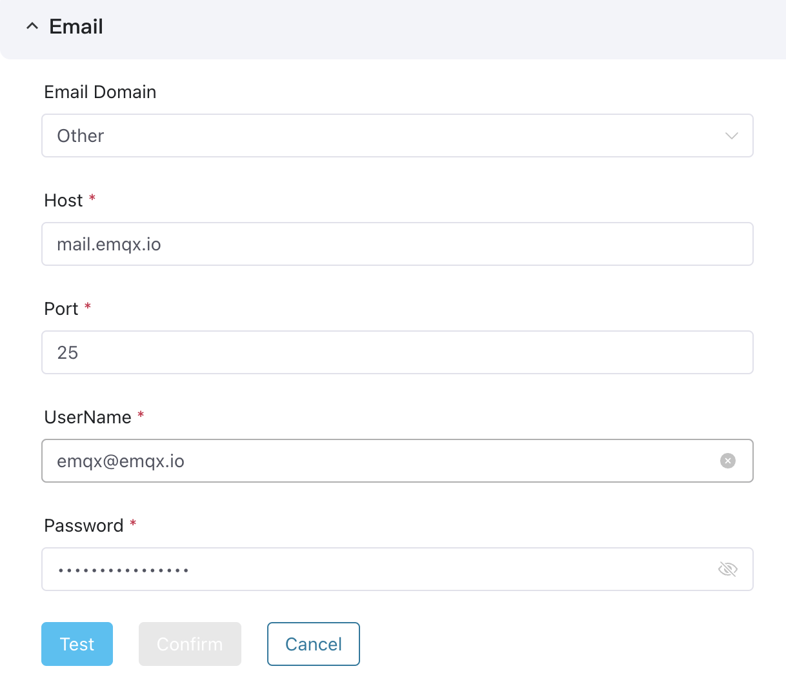
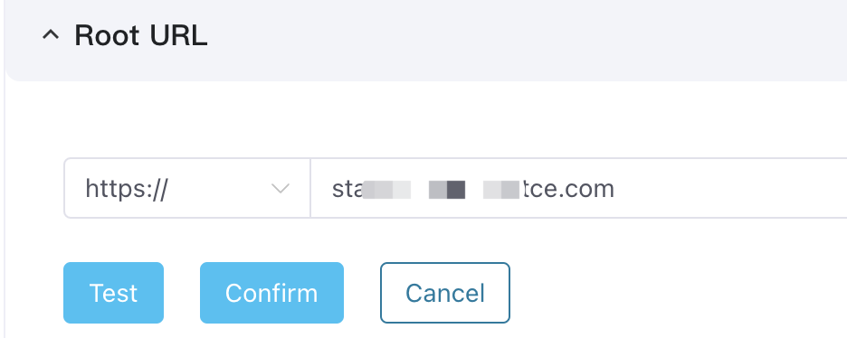
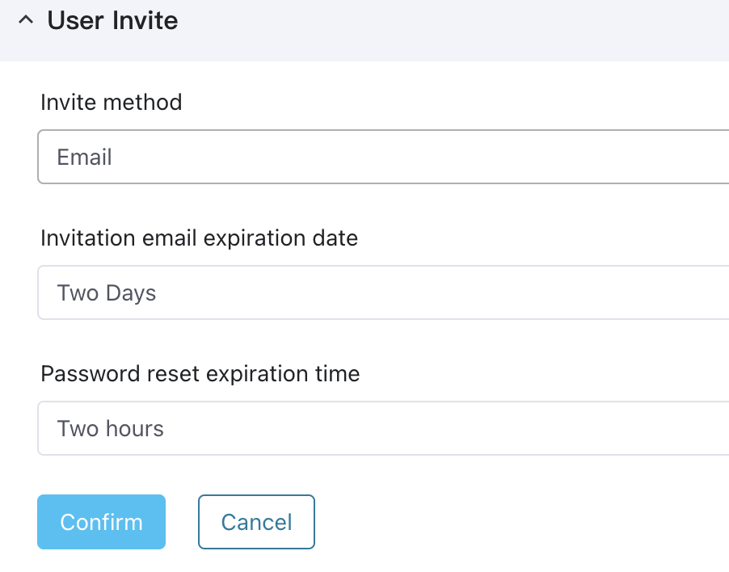
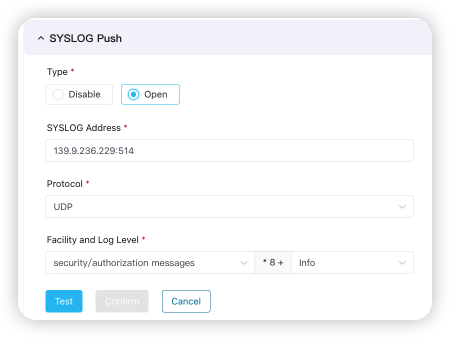
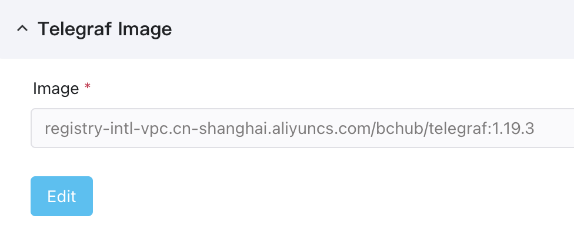
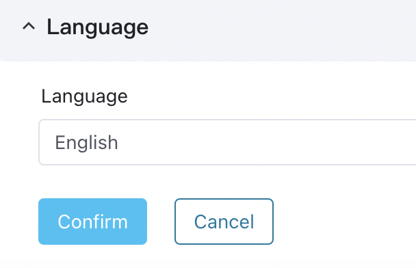

# General Settings

In **General Settings**, system admins can configure the email server, root URL for accessing ECP, user invite method, log settings, monitoring and alarm configurations, and system language settings.  

In addition to the ability to configure settings like the email server, access URL, user invitation methods, Telegraf image, and language preferences, ECP also supports configuring logs, monitoring, and alarms at the system level. For more instructions,  see [Logs and Observability](../monitor/introduction.md#system-level-configurations).

## Configure Emails

ECP uses an external mail server to send system emails, including email verification, password reset, and email alerts. ECP currently supports Gmail and other customized mail servers.<!--这里我拿掉了QQ 和 163-->

To set mail server:

1. Log in to ECP as a system admin and navigate to **System Settings** -> **General Settings**.
2. To add Gmail mail servers, simply provide the correct **Email** and **Password** to enable their usage.

2. To add your internal mail server: Select **Other** as the **Email Domain** and provide the **Host**, **Port**, **Email**, and **Password** accordingly. 

## Configure Root URL

Set up the ECP address for both external and internal accesses. This address is also cited in system emails and messages, allowing recipients to directly click on the links for quick access. ECP supports both HTTP and HTTPS protocols.

To set the root URL:

1. Log in to ECP as a system admin and navigate to **System Settings** -> **General Settings**.
2. Click **Edit** to enter the editing page.
3. Select the protocol and input the root URL.
4. Before confirming the setting, click **Test** to test the connection.
5. Click **Save** the confirm the settings. 

## Manage User Invite Method

System admins can create users directly or invite them via email to join the ECP platform. Inviting users through email is particularly useful for those with specific security requirements for usernames and passwords. It also enables efficient batch user addition. For detailed instructions on user management, see [user_management](./user_management.md).

1. Log in to ECP as system admin. 
2. In the left navigation menu, click **System Settings** -> **General Settings**. 
3. Navigate to **User Invite**, and click **Edit**. 
4. Select **Email** from the **Invite method** drop-down list. 
5. Set the **Invitation email expiration date** and **Password reset expiration time**, or you can keep the default settings. 
6. Click **Save** to confirm the setting. 

## SYSLOG Push

You can use this function to push ECP logs and audit information to a specified Syslog server to connect to a third-party log system.

## Telegraf Image

Telegraf is for the log collection of EMQX clusters. 

## Language

System admins can modify the system language in the Language panel. The available options include English and Chinese.

