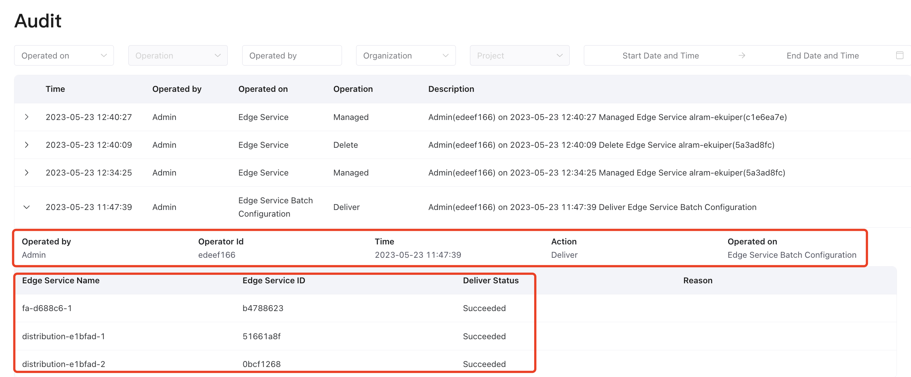
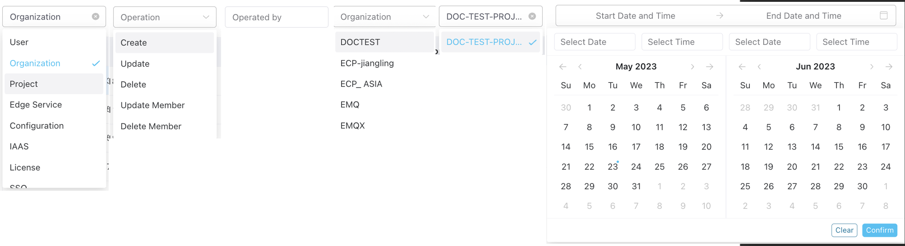

# Operation Audit

ECP's Operation Audit ensures extensive monitoring of crucial user activities in the platform. This function streamlines administrative supervision, providing swift identification and examination of user behaviors, access logs, and potential anomalies, thus ensuring prompt discovery and mitigation of security issues.

The **Audit** page is accessible for system, organization, and project admins. From the **Administration** page, navigate to **Audit** on the left menu, where you can track event details including event type, time, associated user, and description.

## Search and Filter

For fast retrieve of relevant audit records, ECP also offers the  search and filter feature:

1. **Event Type**: Select a specific event type, such as organization-level or license-related audit records, to filter results.
2. **Operation**: Further refine the search based on specific event actions like batch start, upgrade, or delete.
3. **Operated by**: Enter a user's name to find related activities.
4. **Organization**: Select a specific organization to filter its audit records.
5. **Project**: Choose a project within the selected organization to narrow down the scope of audit records.
6. **Time Range**: Specify a period to view the audit records for that duration.

