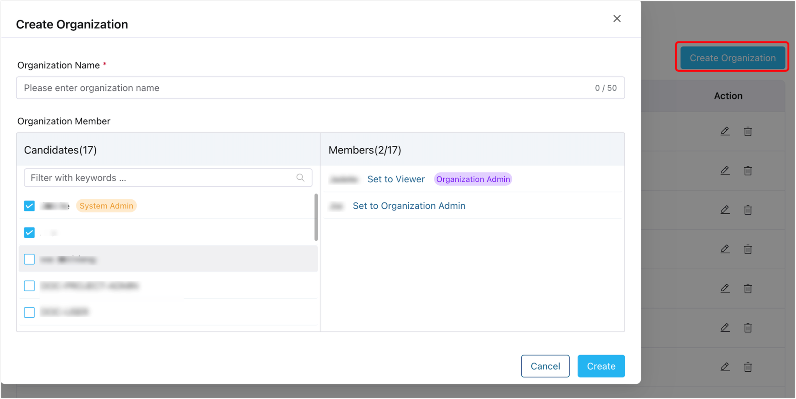
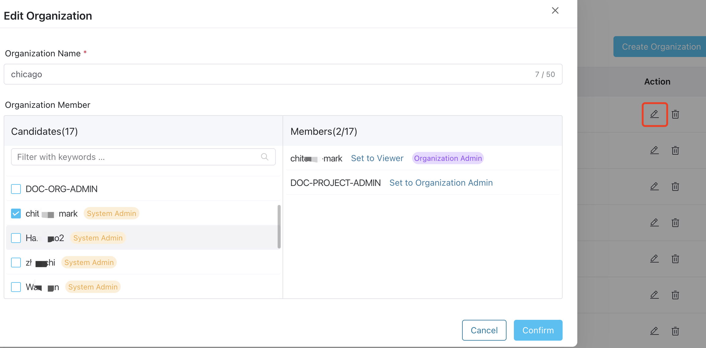

# Manage Organizations

ECP introduces the concept of organizations, providing a management system that supports multi-tenancy at the enterprise level. Multi-tenancy refers to the capability of providing cloud services to multiple enterprises within the same system, ensuring data and configuration autonomy. This system allows for resource isolation and management across organizations. 

With ECP's organization management, admins can allocate independent resources and services to each organization. **System admins** and **Organization admins** can create, modify, and delete organizations, along with their associated resources and services, while controlling their access scopes.

## Create Organization and Add Members

1. Log in to ECP as system admin. 
2. In the left navigation menu, click **Organizations**. 
3. Click **Create Organization**, then in the pop-up dialog box, set as follows:
   - **Organization Name**: Input the organization name, also support "_", "-", and blank spaces.
   - Set organization admin: Click to select one or multiple ECP users from the **Candidates** list, and in the **Members** panel, set the role for the selected candidates: **Viewer** or **Organization Admin**. 

4. Click **Confirm** to finish the setting.

Once created, the newly-added organizations will appear in the list on the **Organization** page. Here, you can view the organization list, including their names, the projects created under each organization, the number of members added, and the creation time. You can also perform actions such as editing or deleting specific organizations by clicking the icons in the **Action** column.

## Edit Organization and Members

Once the organization is created, system admins and organization admins can continue to make changes by clicking the edit icon in the **Action** column of the respective organization. This allows them to modify the organization name and manage its members.

To remove a member from the organization, simply deselect the corresponding member in the **Candidates** panel. The member will then be removed from the **Member** list, indicating that they are no longer part of the organization.

## Delete an Organization

To delete an organization, follow these steps:

1. Log in to the system as a system admin.
2. Locate the organization you want to delete.
3. In the **Action** column of the target organization, click the delete icon.
4. A pop-up dialog box will appear, asking for confirmation.
5. Confirm the deletion to permanently remove the organization from the system.

:::tip
All projects nested under the organization should be deleted before you can delete the organization. 
:::
