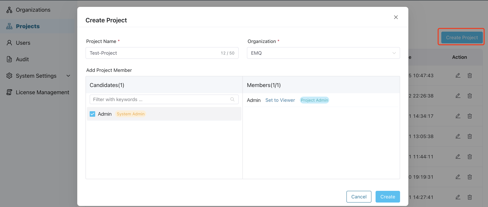

# Manage Projects

The project feature of ECP empowers users to fine-tune resource management within their organizations. System admins, organization admins, and project admins are granted permission to create and manage projects, enabling them to optimize resource allocation and ensure seamless operations within their specific projects. 

## Create Projects and Add Members

1. Log in to ECP as system admin or organization admin. 
2. In the left navigation menu, click **Projects**. 
3. Click **Create Project**, then in the pop-up dialog box, set as follows:
   - **Project Name**: Input the organization name, also support "_", "-", and blank spaces.
   - **Organization**: Select the organization that this project will be nested under
   - **Add Project Member**: Click to select one or multiple ECP users from the **Candidates** list, and in the **Members** panel, set the role for the selected candidates: **Viewer** or **Project Admin**. 
4. Click **Create** to finish the setting.

::: tip

To add a user as a project member, they must first be added to the organization of the project.

:::

Once created, the newly-added projects will appear in the list on the **Projects** page. Here, you can view the project lists, including their names, the clusters created under each project, project admin, the organizations it belongs to, and the creation time. You can also perform actions such as editing or deleting specific projects by clicking the icons in the **Action** column.

## Edit Projects and Members

Once the project is created, system admins, organization admins, and project admins can continue to make changes by clicking the edit icon in the **Action** column of the respective project. This allows them to modify the organization name and manage its members.

To remove a member from the project, simply deselect the corresponding member in the **Candidates** panel. The member will then be removed from the **Member** list, indicating that they are no longer part of the project.

## Delete a Project

To delete an organization, follow these steps:

1. Log in to the system as a system admin, organization admin or project admin.
2. Locate the project you want to delete.
3. In the **Action** column of the target project, click the delete icon.
4. A pop-up dialog box will appear, asking for confirmation.
5. Confirm the deletion to permanently remove the organization from the system.

:::tip
All clusters nested under the organization should be deleted before you can delete the project. 
:::