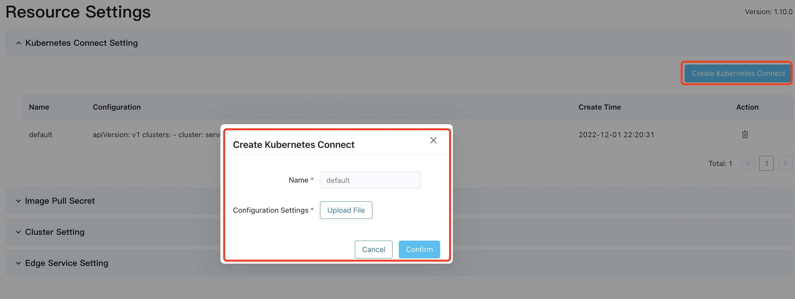
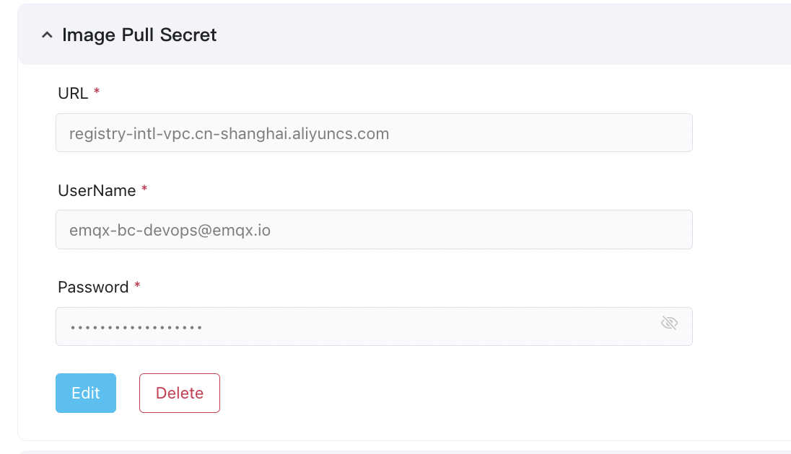
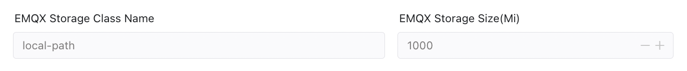
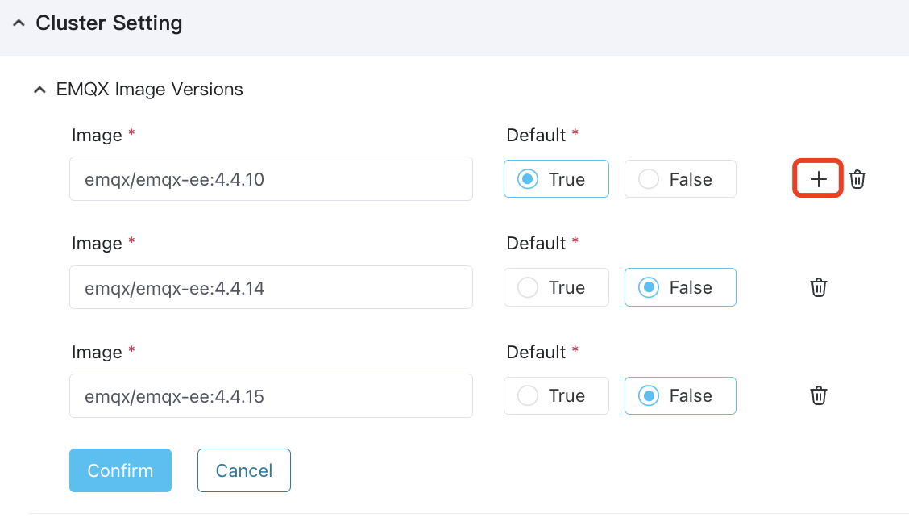
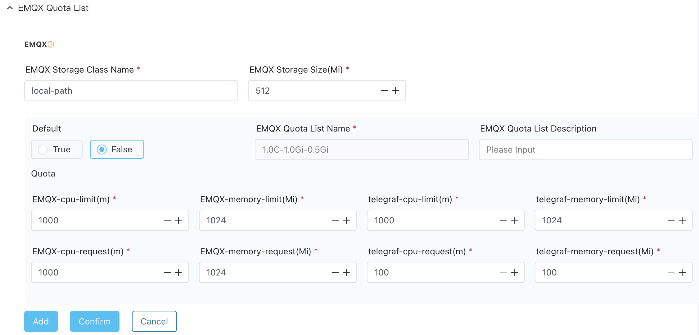
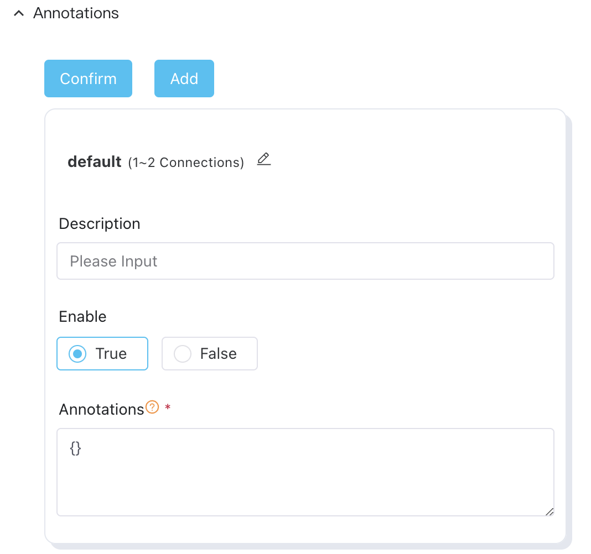
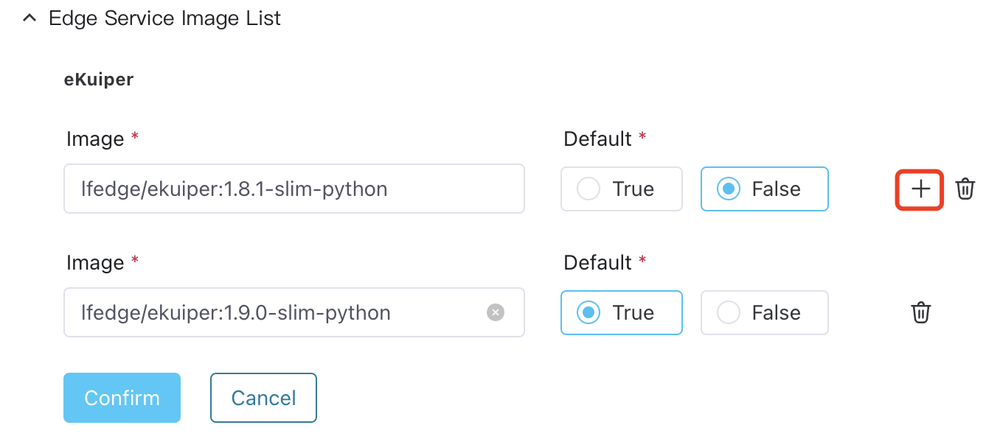
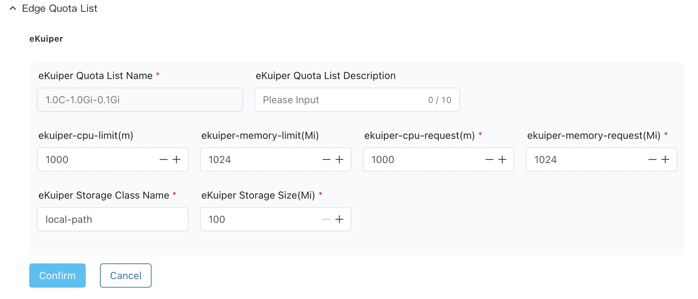
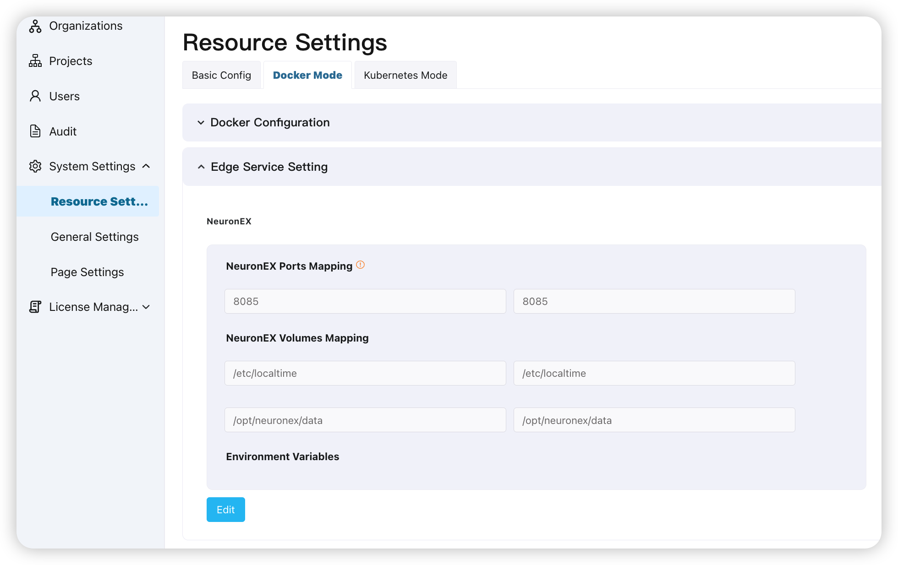
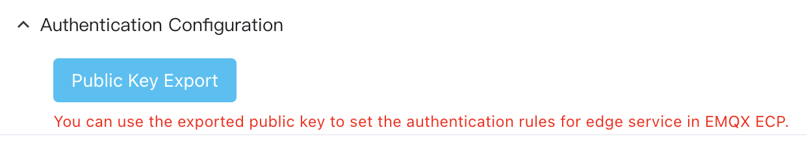

# Resource Settings

In **Resource Settings**, system admins can configure the Kubernetes connection, image versions, and storage class, as well as customize the specifications for EMQX clusters and edge services, like Neuron and eKuiper. 

## Configure **Kubernetes Connection**

Before ECP can manage, control or authenticate Kubernetes resources, system admins must first finish the Kubernetes Connection settings for ECP. 

### Obtain `kuberconfig` File from Kubernetes

Download the  `kubeconfig`  from the Kubernetes master cluster, which is usually located in `~/.kube/config`

ECP does not support accessing external files within your `kubeconfig` for authentication. Therefore if the `certificate-authority-data`, `client-certificate-data`, and `client-key-data` fields are file paths rather than base64-encoded strings, you need to convert the certificate file to a base64-encoded string before uploading them:

**macOS & Linux**

```bash
cat "certificate file" | base64
```

**Windows**

```bash
certutil -f -encode "certificate file" "output file"
```

Then update the `kubeconfig` file 

1. Change `certificate-authority` to `certificate-authority-data`, and enter the base64-encoded string of the `*/ca.crt` certificate file.
2. Change `client-certificate` to `client-certificate-data`, and enter the base64-encoded string of the `*/client.crt` certificate file.
3. Change `client-key` to `client-key-data`, and enter the base64-encoded string of the `*/client.key` certificate file.

### Upload `kuberconfig` to ECP

1. Log in to ECP as a system admin and navigate to **System Settings** -> **Resource Settings**.
2. Expand the **Create Kubernetes Connect** panel.
3. Click **Create Kubernetes Connect** and select the certificate file to upload in the dialog box. The changes will take effect immediately without requiring a restart of ECP.



:::warning
Once connected to Kubernetes and with active running clusters, it is recommended to avoid modifying the settings. Modifying the settings can result in the disruption of all active clusters.
:::


## Configure Image Server

ECP supports connecting to the internal private image registry. To configure the connection to an internal private image registry in ECP, follow these steps:

1. Log in to ECP as a system admin and navigate to **System Settings** -> **Resource Settings**.
2. Expand the **Image Pull Secret** panel.
3. Click **Edit** to enter the editing page.
4. Enter the repository URL, and the Email and password to access this repository.
5. Before confirming the setting, click **Test** to test the connection.
6. Click **Save** to complete the configuration.



## Configure Storage Class

A Storage Class provides a way for administrators to describe the "classes" of storage they offer. In ECP, StorageClass is used to specify the provisioning PVs for storage. 

### Obtain the Storage Class from Kubernetes

1. Log in to the Kubernetes environment using the command line interface (CLI).

2. Execute the following command to view the list of storage classes:

   ```bash
   kubectl get sc
   
   NAME                    PROVISIONER                      RECLAIMPOLICY  VOLUMEBINDINGMODE     ALLOWVOLUMEEXPANSION        AGE
   alicloud-disk-ssd       diskplugin.csi.alibabacloud.com  Delete         Immediate             true                        170d
   alicloud-disk-topology  diskplugin.csi.alibabacloud.com  Delete         WaitForFirstConsumer  true                        170d
   local-path              rancher.io/local-path            Delete         WaitForFirstConsumer  false                       169d
   ```

### Configure EMQX Storage Class

1. Log in to ECP as a system admin and navigate to **System Settings** -> **Resource Settings**.
2. Expand the **Cluster Setting** panel, and then the **EMQX Quota List** panel. 
3. Click **Edit** to enter the editing page.
4. Enter the **Storage Class Name** obtained from Kubernetes, the desired **Storage Size** in MiB, and indicate whether it should be set as the default Storage Class.



4. Click **Save** to complete the configuration. The changes will take effect immediately. 


## Configure EMQX Clusters

This is to configure the EMQX cluster image versions, define quota, and annotate load balancing for public cloud clients.

### Configure EMQX Image Versions

System admins can add, edit or delete EMQX image versions. If you have internet connectivity, you can use public image addresses. Additionally, you can also specify a private image registry service. On how to configure a Telegraf image, see [Configure Image List](#configure-image-server).

1. Log in to ECP as a system admin and navigate to **System Settings** -> **Resource Settings**.
2. Expand the **Cluster Setting** -> **EMQX Image Versions**.
3. Click **Edit** to enter the editing page.
1. To add a new image version, click the "+" icon and provide the image version. You can choose to set it as the default version. To delete an image version, simply click the delete icon.
1. Click **Save** to complete the configuration.



### Configure EMQX Cluster Quota

For EMQX clusters created using ECP, you have the option to customize the quota according to your specific business requirements. However, you are recommended to keep the default settings as they are verified by EMQ technical team. Modify them only if necessary.

1. Log in to ECP as a system admin and navigate to **System Settings** -> **Resource Settings**.

2. Expand the **Cluster Setting** -> **EMQX Quota List**.

3. Click **Edit** to enter the editing page, where you can modify the CPU and memory-related quota for each quota entry, delete an existing quota entry, or add a new quota entry. Note: Deleting a quota entry will not impact the currently running clusters. 

   


Below is the specification for an EMQX cluster with 1 CPU core, 1 GiB of memory, and 512 MiB of disc space:

| Item                    | Specification/Unit | Description                                                  |
| :---------------------- | :----------------- | :----------------------------------------------------------- |
| EMQX Storage Class      | `local-path`       | The Kubernetes storage class name                            |
| EMQX Storage Size       | 512Mi              | Occupied disk space size                                     |
| Default                 | `true` or `false`  | `true`: Set to default <br><br/>`false`: Not set as default  |
| EMQX Quota List Note    | 1C1G0.5G           | The specification name displayed when installing the EMQX cluster |
| EMQX-cpu-limit          | 1000m              | Maximum CPU usage limit for the cluster                      |
| EMQX-memory-limit       | 1024Mi             | Maximum memory usage limit for the cluster                   |
| EMQX-cpu-request        | 1000m              | Minimum CPU usage limit for the cluster                      |
| EMQX-memory-request     | 1024Mi             | Minimum memory usage limit for the cluster                   |
| Telegraf-cpu-limit      | 1000m              | Maximum CPU usage limit for Telegraf                         |
| Telegraf-memory-limit   | 1024Mi             | Maximum memory usage limit for Telegraf                      |
| Telegraf-cpu-request    | 100m               | Minimum CPU usage limit for Telegraf                         |
| Telegraf-memory-request | 100Mi              | Minimum memory usage limit for Telegraf                      |

### Configure Load Balancing

For public cloud clients, you can configure load balancing by adding annotations. 



You can configure the annotation feature as follows:<!--not sure what this is talking about-->

- Add configurations and set the range of connection numbers.
- Multiple configurations can be created and made effective.
- By default, configurations are matched based on business connection numbers.
- When there is an overlap in connection numbers, the earliest created configuration is selected by default.
- The maximum number of configurations is 100.

## Configure Edge Services

This is to configure the edge service image list, define quota, and configure authentications.

### Configure Edge Service Image List

System admins can configure the image list for supported edge services, just including NeuronEX.

#### Manage NeuronEX Images

System admins can add, edit or delete edge service image versions. If you have internet connectivity, you can use public image addresses. Additionally, you can also specify a private image registry service. On how to configure a Telegraf image, see [General Settings - Telegraf Image](./general_config.md#telegraf-image).

1. Log in to ECP as a system admin and navigate to **System Settings** -> **Resource Settings**.
2. Expand the **Basic Config** -> **Edge Service Image List**.
3. Click **Edit** under **NeuronEX** to enter the editing page.
4. To add a new image version, click the "+" icon and provide the image version. You can choose to set it as the default version. To delete an image version, simply click the delete icon.
5. Click **Save** to complete the configuration.




### Configure Edge Service In Docker Mode

For edge services created using ECP, you have the option to customize the docker node connect configuration. However, you are recommended to keep the default settings as they are verified by EMQ technical team. Modify them only if necessary.

1. Log in to ECP as a system admin and navigate to **System Settings** -> **Resource Settings**.
2. Expand the **Docker Mode** -> **Docker Configuration**.
3. Click **Edit** to enter the editing page, where you can modify the settings.




**Edge Service Default Setting**

1. Log in to ECP as a system admin and navigate to **System Settings** -> **Resource Settings**.
2. Expand the **Docker Mode** -> **Edge Service Setting**.
3. Click **Edit** to enter the editing page, where you can modify the settings.

3. 


### Configure Authentication

In **Authentication Configuration**, system admins can obtain the automatically generated public key file during ECP installation. This key is used for authenticating Neuron. For more information on cloud-edge authentication, see [Edge Service Authentication](../edge_service/e2c).

1. Log in to ECP as a system admin and navigate to **System Settings** -> **Resource Settings**.
2. Expand the **Edge Service Setting** -> **Authentication Configuration**.
3. Click **Public Key Export**.


