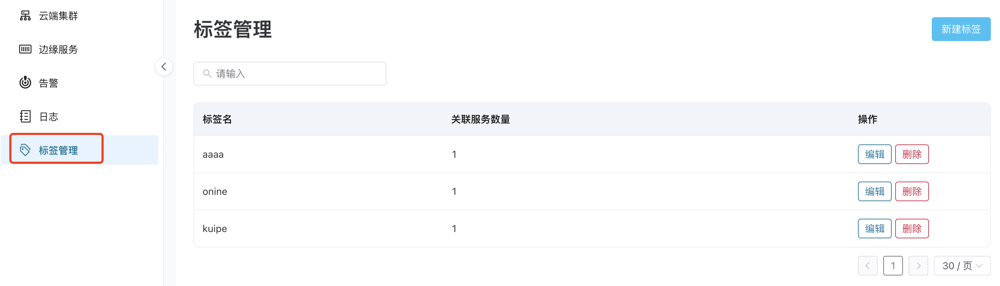
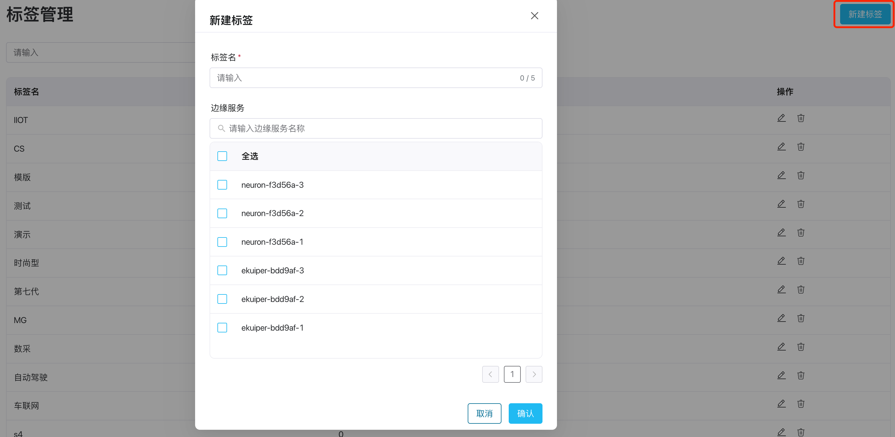
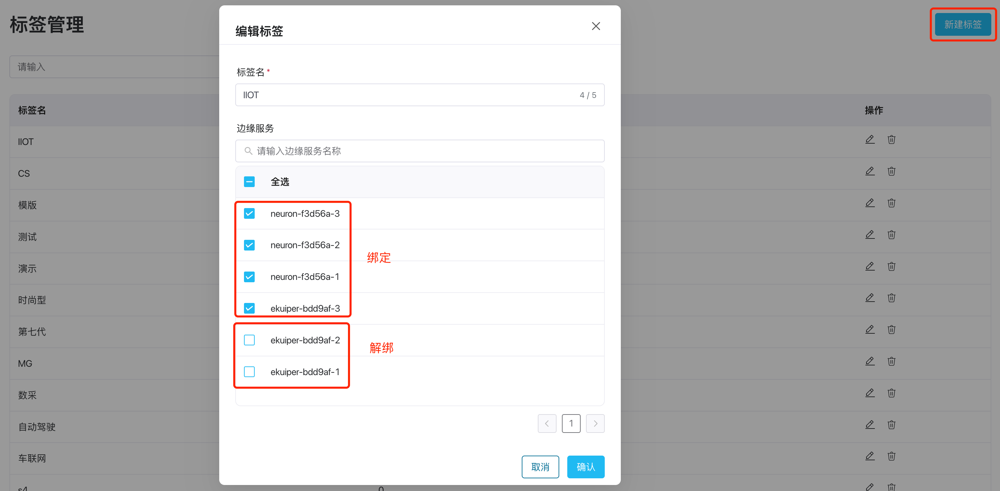

# Tags

ECP provides a tagging feature to classify, organize, and filter edge services. It allows you to group edge services for efficient management, facilitating operations such as managing edge services and batch deployment of edge configurations.

## 标签管理列表

在**工作台**界面，点击左侧**标签管理**菜单，即可进入标签列表页。标签列表显示标签的名称、已关联服务的数量和操作，并可以根据标签名称进行模糊搜索。

## 新建标签和绑定服务

1. 点击**新建标签**，弹出新建标签页；
2. 按标签命名规则填入标签名称；
3. 勾选表格中的服务，选中则表示该服务与标签绑定，反选则表示该服务与标签解绑；
4. 最后，点击**确认**按钮，保存新建标签并绑定服务；

## 编辑标签和绑定/解绑服务

在标签管理列表页，点击**编辑**按钮，弹出该标签信息，并可以对标签信息进行编辑，编辑的规则请参考**新建标签**功能。

## 删除标签

在标签管理列表页，点击**删除**按钮，弹出确认对话框，点击确认按钮，删除该标签信息且不可恢复。

:::tip
说明：如果该标签下已绑定服务，需要先删除该标签下的服务之后，才能正常删除该标签，否则点击确认后，会弹出删除失败提示框。
:::

## 在边缘服务管理中使用标签

请参考[标签分组](../edge_service/batch_tag)

:::tip
标签系统的具体使用限制请参考[系统使用限制](../others/known_limitations)。
:::