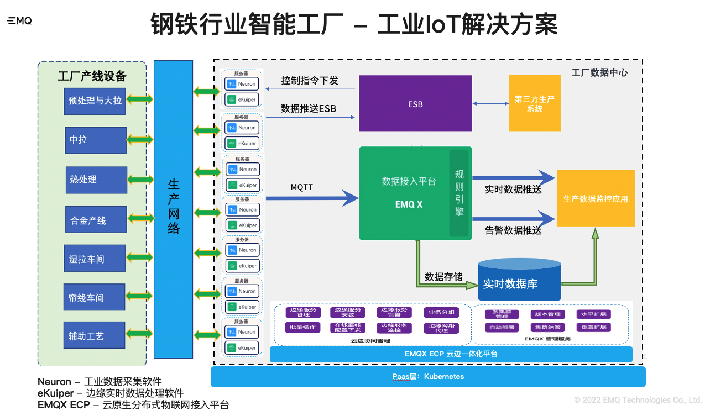
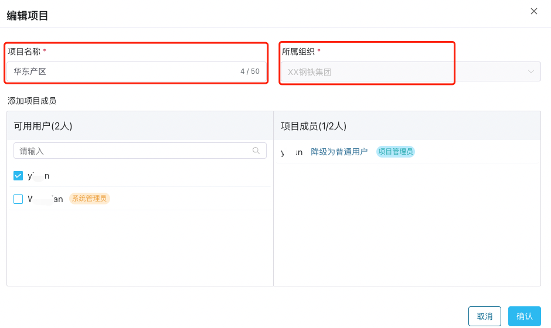
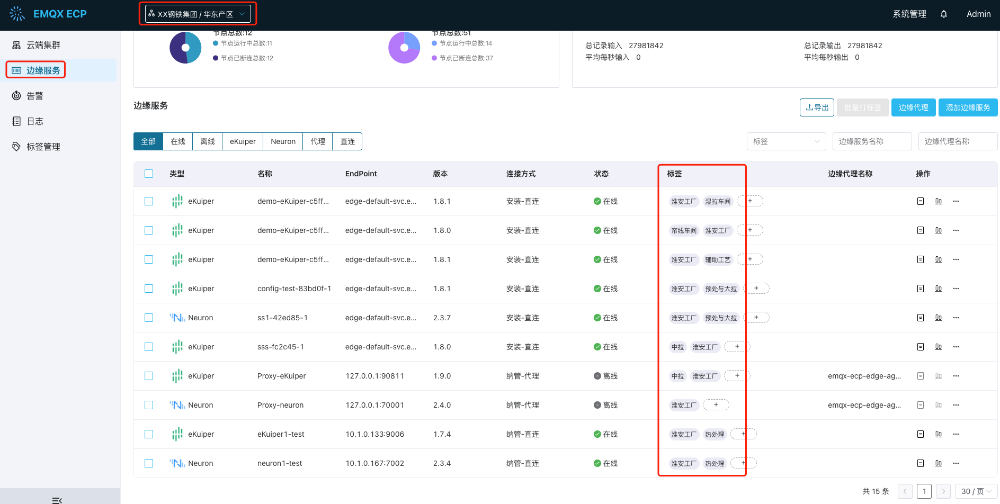
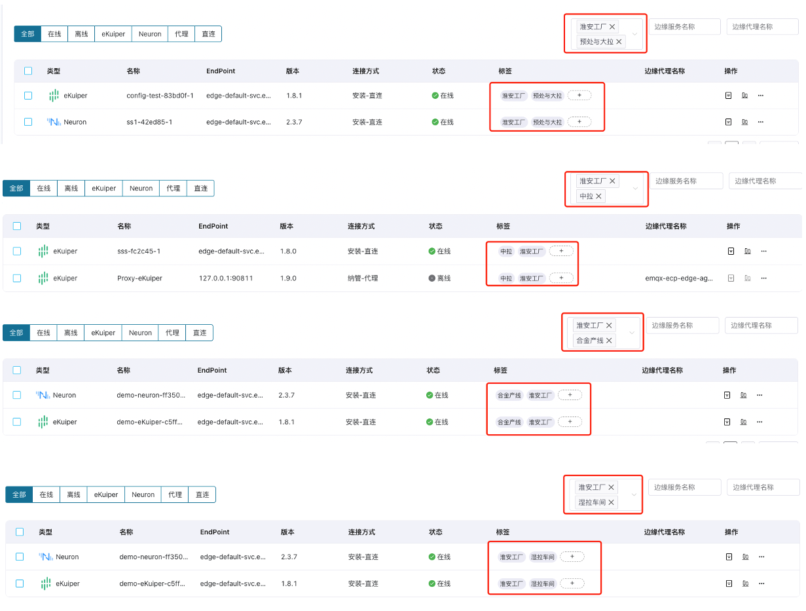

# 标签系统最佳实践

我们以钢铁厂为例，通过 ECP 的项目和标签进行业务分类。

XX 钢铁集团需要通过 EMQX 产品套件落地 IIoT 智能工厂方案，实现对各厂区、工厂和车间的每个生产流程的实时监控。首先，要对生产车间、工艺等生产设备进行数采。然后，边缘设备的数据实时的通过 MQTT 协议传输到云端 EMQX 集群，并写入 TDEngine 数据库中，生产应用监控系统展示各个生产车间和工艺的数据展示、分析、故障报告和预警。最后，需要满足企业级的多租户、多项目和业务分组功能。

## 根据钢铁厂智慧工厂实现如下解决方案

 

## 通过 ECP 的组织、项目和标签系统我们实现了如下企业级多租户、多项目和业务分组能力

 1. 设置组织名为**XX 钢铁集团**；
 
 2. 设置组织下的**华东产区**；

  

 3. 切换到工作台，进入**XX 钢铁集团**的**华东产区**项目；
 
 4. 按照生产流程的数采要求创建7个 Neuron 和7个 eKuiper，一个 Neuron 和 eKuiper 为一组，进行数采连接；

 5. 为所有边缘服务批量打标签为**淮安工厂**；

 6. 按照生产流程和工艺，预处理与大拉、中拉、热处理、合金产线、湿拉车间、帘线车间、辅助工艺共7个流程分别为每组 Neuron 和 eKuiper 打标签；

   

 7. 按标签筛选实现每个生产流程和工艺的数采设备对接；

   