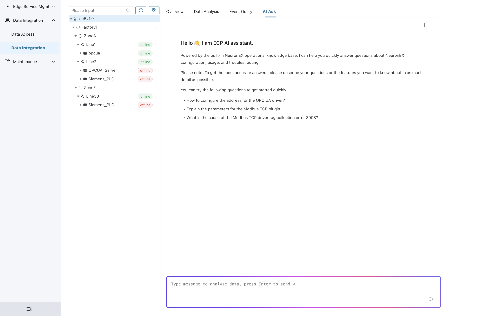
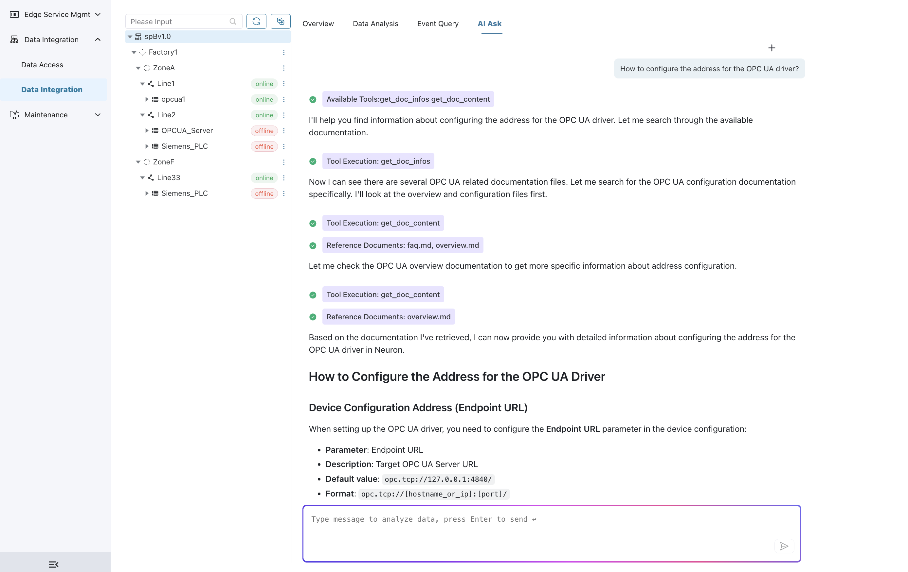

# AI Assistant

The ECP AI Assistant functionality is an intelligent technical support and question-answering assistant based on the built-in NeuronEX operations knowledge base, providing professional guidance on NeuronEX configuration, usage, and troubleshooting. Through natural language interaction, you can quickly obtain accurate technical answers and operational recommendations.

## Functionality Overview

The AI Assistant integrates rich NeuronEX technical documentation and operational knowledge, capable of understanding user technical questions and providing detailed answers. Whether you're a beginner or working on advanced configurations, the AI Assistant can provide professional technical support.

### Core Capabilities

- **Intelligent Q&A**: Based on natural language understanding, accurately identifies user questions and provides professional answers
- **Knowledge Retrieval**: Quickly locates relevant information from massive technical documentation
- **Context Understanding**: Provides personalized recommendations based on the user's specific environment and needs
- **Real-time Learning**: Continuously updates the knowledge base to ensure information accuracy and timeliness

## Interface Introduction

### Welcome Interface

The AI Assistant welcomes users in a friendly manner and provides clear functionality descriptions:

**Welcome Message**:
- Greeting: `Hello 👋, I'm ECP's AI Assistant.`
- Capability Introduction: Based on the built-in NeuronEX operations knowledge base, helps answer configuration, usage, and troubleshooting questions
- Usage Suggestions: For the most accurate answers, please describe your problem or the functionality you want to understand as specifically as possible

### Suggested Questions

The AI Assistant provides three typical example questions to help users get started quickly:

1. **How to configure OPC UA driver addresses?**
   - Applicable to: OPC UA protocol configuration questions
   - Covers: Connection parameters, address format, authentication configuration, etc.

2. **Explain Modbus TCP plugin parameters**
   - Applicable to: Modbus TCP protocol learning
   - Covers: Parameter descriptions, configuration methods, best practices, etc.

3. **What causes Modbus TCP driver tag collection error 3008?**
   - Applicable to: Troubleshooting and error diagnosis
   - Covers: Error code explanation, solutions, preventive measures, etc.

### Interaction Interface

**Input Area**:
- Placeholder text: `Enter message to analyze data, press Enter to send`
- Send button: Paper plane icon, supports click to send
- Quick operation: Enter key for quick message sending

**Conversation Area**:
- Message bubbles: User questions and AI answers are displayed separately
- Tool calls: Shows document retrieval tools used by AI
- Reference documentation: Displays specific document sources cited by AI

## Intelligent Features

### 1. Document Retrieval

The AI Assistant can intelligently retrieve relevant technical documentation:

**Retrieval Tools**:
- `get_doc_infos`: Get document list and basic information
- `get_doc_content`: Get specific document content
- Intelligent filtering: Match relevant documents based on question keywords

**Retrieval Process**:
1. Analyze user questions and extract keywords
2. Search related documents in the knowledge base
3. Retrieve document content and analyze
4. Synthesize information to generate answers

## Usage Methods

### 1. Direct Questions

Enter your question directly in the input box, and the AI Assistant will automatically understand and search relevant knowledge base content.

**Example Questions**:
- "How to configure OPC UA driver addresses?"
- "What to do when Modbus TCP driver connection fails?"
- "How to optimize data collection performance?"

### 2. Select Suggested Questions

Click on the suggested questions provided by the AI Assistant to quickly start a conversation and get relevant answers.

### 3. New Conversation

Click the "+" button in the upper right corner to start a new conversation topic and clear previous conversation history.

### 4. Multi-turn Conversations

The AI Assistant supports context understanding and can have in-depth discussions based on previous conversation content.

## Usage Recommendations

To get the most accurate answers, we recommend you:

- **Describe problems specifically**: Explain in detail the problems encountered, error messages, or abnormal phenomena
- **Provide context**: Explain the current version being used, configuration information, and environment situation
- **Ask step-by-step**: Break down complex problems into multiple simple questions for gradual in-depth discussion

## Knowledge Base Scope

The AI Assistant is based on the built-in NeuronEX operations knowledge base, covering the following areas:

- **Driver Configuration**: OPC UA, Modbus TCP, Siemens S7, and other industrial protocol configurations
- **Troubleshooting**: Connection issues, data collection anomalies, performance optimization, etc.
- **Best Practices**: Configuration optimization, security settings, deployment recommendations, etc.

Through the ECP AI Assistant functionality, you can quickly obtain professional technical support, solve various problems in NeuronEX configuration and usage, and improve work efficiency.
